---

# AWS IAM: The Comprehensive Guide

---

## Table of Contents

1. What is AWS IAM?
2. Why IAM Matters
3. Core IAM Components
   - 3.1 Users
   - 3.2 Groups
   - 3.3 IAM Roles
   - 3.4 Types Of IAM Roles (Service, EC2, Lambda, Cross-Account, Federated, Web Identity, Roles Anywhere)
   - 3.5 IAM Policies
   - 3.6 Types Of IAM Policies
   - 3.7 IAM Permission Evaluation Logic
   - 3.8 IAM Identity Center
   - 3.9 IAM Access Keys
   - 3.10 MFA & Passkeys
   - 3.11 IAM Tags & ABAC
   - 3.12 IAM Access Analyzer
   - 3.13 Common IAM Use Cases
   - 3.14 IAM Best Practices
   - 3.15 IAM Troubleshooting Checklist
   - 3.16 Summary

---

## 1. What is AWS IAM?

**AWS Identity and Access Management (IAM)** is a global, free AWS service that controls **who** (identity) can do **what** (actions) on **which** AWS resources — under **what conditions**.

It is the central security layer for every AWS account.

```
┌────────────────────────────────────────────────────────┐
│                      AWS Account                       │
│                                                        │
│   ┌──────────┐   makes request   ┌──────────────────┐  │
│   │ Principal│ ─────────────────▶│  AWS Service API │  │
│   │ (who?)   │                   │  (S3, EC2, RDS…) │  │
│   └──────────┘                   └────────┬─────────┘  │
│                                           │             │
│                                  IAM evaluates          │
│                                  attached policies      │
│                                           │             │
│                                  ┌────────▼──────────┐  │
│                                  │  Allow / Deny ?   │  │
│                                  └───────────────────┘  │
└────────────────────────────────────────────────────────┘
```

**Key facts:**
- IAM is **global** (not region-scoped) — policies, users, and roles apply across all regions.
- It is **free** — no additional cost for IAM itself.
- Every API call to AWS goes through IAM evaluation.
- IAM uses the **least-privilege** security model.

---

## 2. Why IAM Matters

| Risk Without IAM | Mitigation With IAM |
|---|---|
| Anyone with AWS creds has full access | Granular permission scoping per identity |
| Root account used for all operations | Separate roles/users for each function |
| Credentials leaked = full account compromise | Short-lived roles + MFA + permission boundaries |
| Auditing who did what is impossible | CloudTrail + IAM identity tracking |
| Third-party tools need permanent keys | IAM Roles with STS (no long-lived keys) |
| Cross-account access is risky | Trusted role delegation with conditions |

The principle: **Zero Trust** — never assume trust, always verify with the minimum required permissions.

---

## 3. Core IAM Components

### 3.1 IAM Users

**What:** A permanent identity representing a person or application that interacts with AWS.

**When to use:** Human operators (DevOps, developers) who need direct AWS Console or CLI access. For machines/services, prefer **Roles** instead.

**Credentials a User can have:**
```
IAM User
├── Console Password (for AWS Management Console)
├── Access Key ID + Secret Access Key (for CLI/SDK/API)
└── MFA Device (virtual or hardware token)
```

**Anatomy:**
```
{
  "UserName": "alice",
  "UserId": "AIDAIOSFODNN7EXAMPLE",
  "Arn": "arn:aws:iam::123456789012:user/alice",
  "Path": "/engineering/",
  "CreateDate": "2024-01-15T10:30:00Z",
  "PasswordLastUsed": "2024-06-01T08:00:00Z"
}
```

**ARN pattern:** `arn:aws:iam::<account-id>:user/<username>`

**When NOT to use Users:**
- EC2 instances accessing S3 → use an **Instance Profile (Role)**
- Lambda accessing DynamoDB → use a **Lambda Execution Role**
- CI/CD pipelines → use **OIDC Identity Provider + Role** (GitHub Actions, GitLab)

---

### 3.2 IAM Groups

**What:** A logical collection of IAM Users. Groups do NOT have credentials — they exist purely to attach policies to multiple users at once.

**When to use:** Whenever you have 2+ users that share the same permissions profile.

```
                    ┌─────────────────────────────────┐
                    │          IAM Group               │
                    │         "Developers"             │
                    │                                  │
                    │  ┌────────┐  ┌────────┐          │
                    │  │ Alice  │  │  Bob   │  ...     │
                    │  └────────┘  └────────┘          │
                    │                                  │
                    │  Attached Policies:              │
                    │  ✓ ReadOnlyAccess                │
                    │  ✓ S3-Dev-Bucket-WritePolicy     │
                    └─────────────────────────────────┘
```

**Key limits:**
- A user can belong to **up to 10 groups**.
- Groups **cannot be nested** (no group of groups).
- A group is NOT a principal — you cannot reference a group in a resource-based policy.

**Common group patterns:**

| Group | Typical Policies |
|---|---|
| `Administrators` | `AdministratorAccess` |
| `Developers` | `PowerUserAccess`, custom dev policies |
| `ReadOnly` | `ReadOnlyAccess` |
| `Billing` | `Billing`, `AWSBillingReadOnlyAccess` |
| `SecurityAudit` | `SecurityAudit`, `IAMReadOnlyAccess` |

---


### 3.3 IAM Roles

An **IAM Role** is an AWS identity with permissions, but unlike an IAM user, it is not permanently attached to one person or one application. A role is meant to be **assumed temporarily** by trusted entities such as AWS services, users, applications, federated identities, or accounts.

IAM roles are one of the most important IAM components because they enable secure, temporary, and auditable access without long-term credentials.

#### What Is an IAM Role?

An IAM role contains two major parts:

1. **Trust policy**
   Defines **who or what can assume the role**.

2. **Permissions policy**
   Defines **what the role can do after it is assumed**.

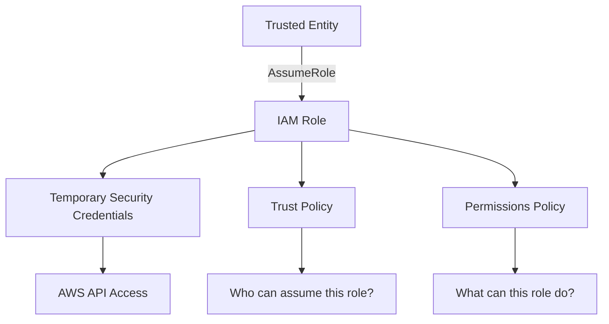

#### Why IAM Roles Are Important

IAM roles solve several security and operational problems:

- They avoid long-term access keys.
- They provide temporary credentials.
- They support least privilege access.
- They allow AWS services to access other AWS services securely.
- They enable cross-account access.
- They support federation with corporate identity providers.
- They make access easier to audit through AWS CloudTrail.

Without roles, applications and services often rely on static access keys, which are harder to rotate and more dangerous if exposed.

#### When To Use IAM Roles

Use IAM roles when:

- An EC2 instance needs to access S3, DynamoDB, SSM, CloudWatch, or Secrets Manager.
- A Lambda function needs to call another AWS service.
- A CI/CD system needs deployment permissions.
- A user from one AWS account needs access to another account.
- An application uses temporary credentials.
- Users authenticate through SSO, Active Directory, Okta, Azure AD, or another identity provider.
- Kubernetes workloads need AWS permissions using IAM Roles for Service Accounts.

#### How IAM Roles Work

When a trusted entity assumes a role, AWS Security Token Service, or **STS**, issues temporary credentials.

Temporary credentials include:

- Access key ID
- Secret access key
- Session token
- Expiration time

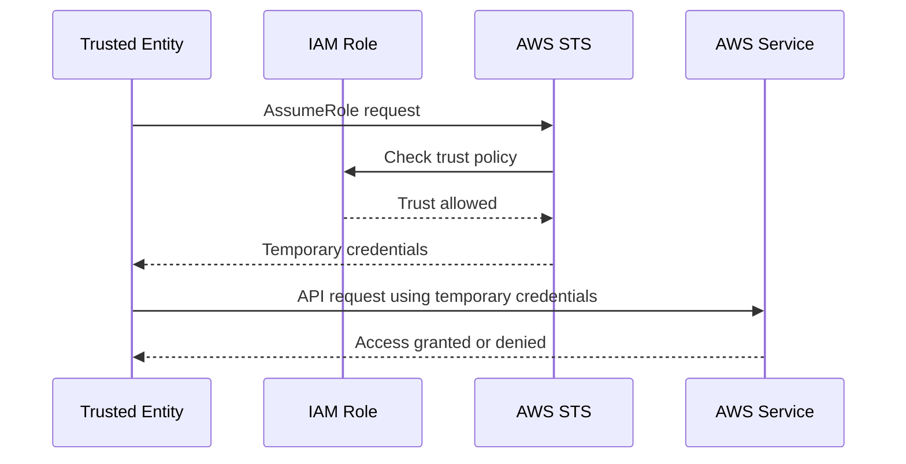

#### IAM Role Trust Policy

A trust policy controls who can assume the role.

Example: allow EC2 to assume a role.

```json
{
  "Version": "2012-10-17",
  "Statement": [
    {
      "Effect": "Allow",
      "Principal": {
        "Service": "ec2.amazonaws.com"
      },
      "Action": "sts:AssumeRole"
    }
  ]
}
```

In this example:

- `Principal` is the trusted entity.
- `Service` means the trusted entity is an AWS service.
- `sts:AssumeRole` allows that entity to assume the role.

#### IAM Role Permissions Policy

A permissions policy defines what the role can do.

Example: allow read-only access to one S3 bucket.

```json
{
  "Version": "2012-10-17",
  "Statement": [
    {
      "Effect": "Allow",
      "Action": [
        "s3:GetObject",
        "s3:ListBucket"
      ],
      "Resource": [
        "arn:aws:s3:::example-bucket",
        "arn:aws:s3:::example-bucket/*"
      ]
    }
  ]
}
```

The trust policy answers:

> Who can use this role?

The permissions policy answers:

> What can this role do?

---

### 3.4 Types Of IAM Roles

IAM roles are commonly used in several patterns.

#### 3.4.1 AWS Service Roles

A service role is assumed by an AWS service so that the service can perform actions on your behalf.

Examples:

- EC2 instance role
- Lambda execution role
- ECS task role
- CodeBuild service role
- CloudFormation execution role
- Glue service role

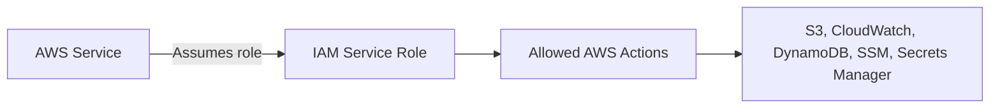

Example use case:

A Lambda function needs to write logs to CloudWatch and read secrets from Secrets Manager. Instead of embedding credentials in the function code, attach an execution role to the Lambda function.

#### 3.4.2 EC2 Instance Roles

An EC2 instance role allows applications running on EC2 to access AWS services securely.

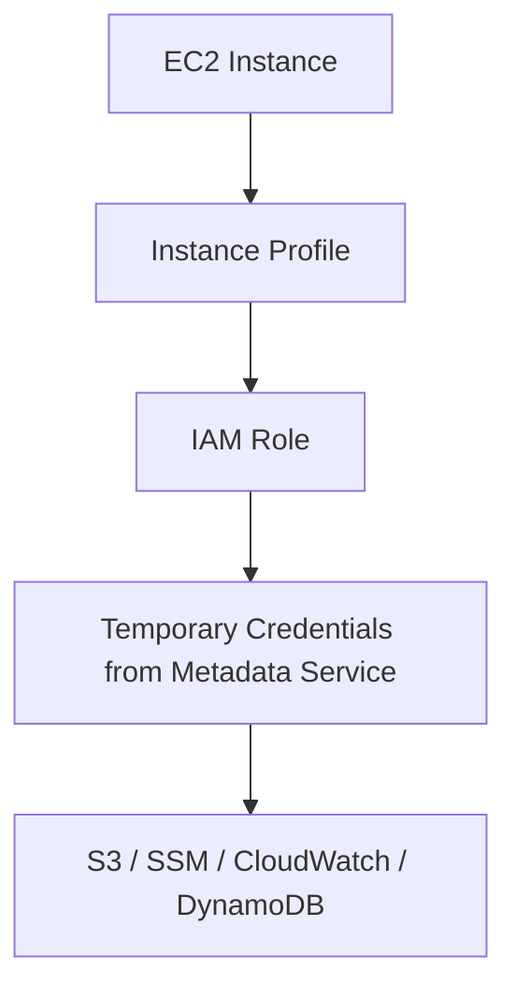

Important concept:

EC2 does not attach a role directly. It uses an **instance profile**, which is a container for the IAM role.

Common EC2 role use cases:

- Send logs to CloudWatch.
- Read application configuration from SSM Parameter Store.
- Download artifacts from S3.
- Access Secrets Manager.
- Register with AWS Systems Manager Session Manager.
- Pull container images from Amazon ECR.

#### 3.4.3 Lambda Execution Roles

A Lambda execution role gives a Lambda function permissions to call AWS services.

Example permissions:

- Write logs to CloudWatch Logs.
- Read objects from S3.
- Query DynamoDB.
- Publish messages to SNS.
- Send messages to SQS.
- Retrieve credentials from Secrets Manager.

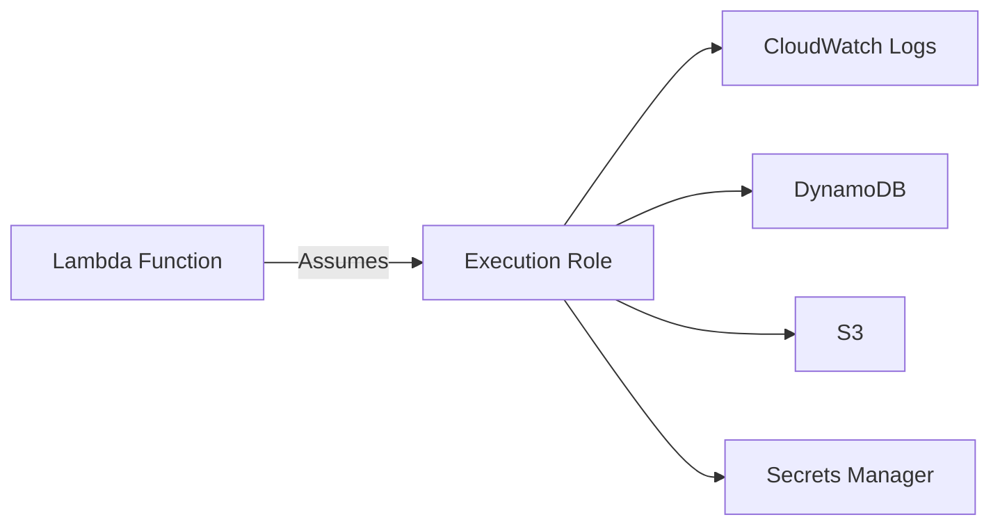

Best practice:

Give each Lambda function its own execution role when permissions differ. Avoid reusing one broad role for many functions.

#### 3.4.4 Cross-Account Roles

A cross-account role allows identities in one AWS account to access resources in another AWS account.

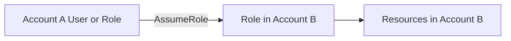

Example use cases:

- A central security account audits multiple AWS accounts.
- A CI/CD account deploys infrastructure into workload accounts.
- A shared operations team manages production resources.
- A logging account reads CloudTrail or S3 logs from other accounts.

Cross-account access usually requires:

- A trust policy in the target account.
- A permissions policy in the target account.
- Permission in the source account to call `sts:AssumeRole`.

#### 3.4.5 Federated Roles

Federated roles allow external identities to access AWS without creating IAM users.

Common identity providers:

- AWS IAM Identity Center
- Active Directory
- Okta
- Azure AD
- Google Workspace
- SAML 2.0 providers
- OpenID Connect providers

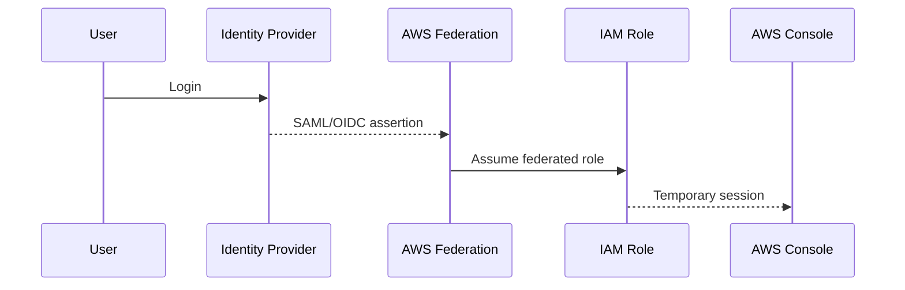

Use federation when:

- Users already exist in a corporate identity provider.
- You want centralized authentication.
- You need MFA and conditional access.
- You want to avoid creating IAM users for humans.

#### 3.4.6 Web Identity Roles

Web identity roles are assumed using identity tokens from OIDC providers.

Common use cases:

- Amazon EKS IAM Roles for Service Accounts
- GitHub Actions OIDC deployments
- Mobile or web applications using Cognito
- External CI/CD platforms

Example: GitHub Actions assumes an AWS role using OIDC instead of storing AWS access keys as repository secrets.

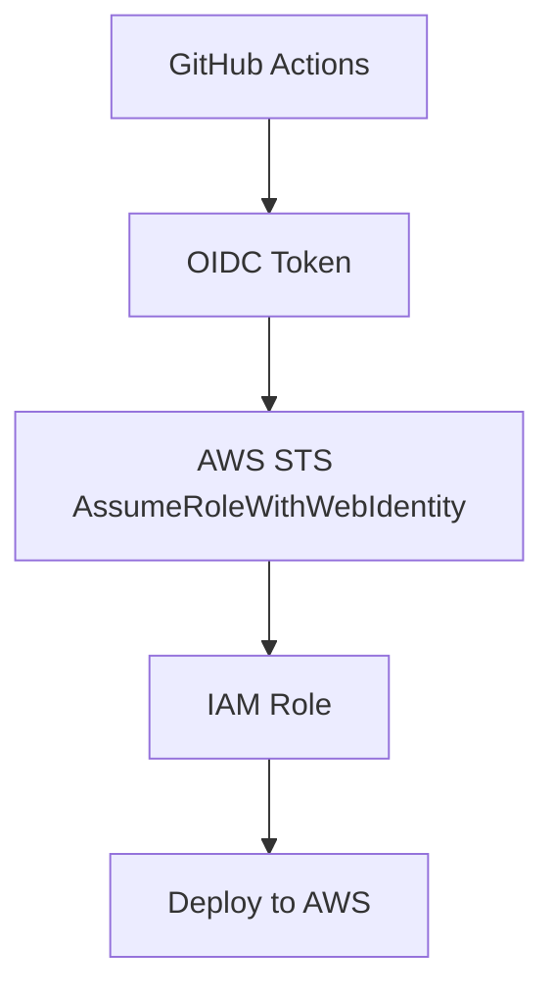

#### 3.4.7 IAM Roles Anywhere

IAM Roles Anywhere allows workloads running **outside of AWS** — on-premises servers, hybrid environments, CI/CD agents, and IoT devices — to obtain temporary AWS credentials using X.509 certificates, without storing long-term access keys.

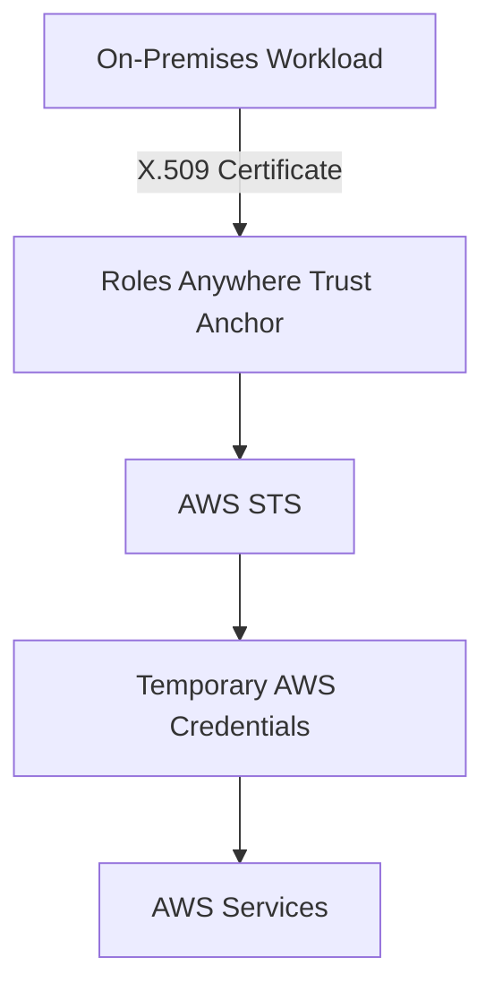

Key components:

- **Trust Anchor** — references a certificate authority (AWS Private CA or an external CA) that you control.
- **Profile** — maps authenticated sessions to IAM roles and defines session policies.
- **Credential Helper** (`aws_signing_helper`) — exchanges a certificate for temporary STS credentials.

Common use cases:

- On-premises applications needing to read from S3 or write to CloudWatch.
- Hybrid workloads requiring AWS access from data centers.
- CI/CD agents that cannot use OIDC federation.
- IoT or edge devices that interact with AWS services.

---

### 3.5 IAM Policies

An **IAM policy** is a JSON document that defines permissions. Policies determine whether a request is allowed or denied.

IAM policies are attached to:

- Users
- Groups
- Roles
- AWS resources

#### What IAM Policies Control

A policy controls:

- Who is affected
- Which actions are allowed or denied
- Which resources are affected
- Which conditions must be true

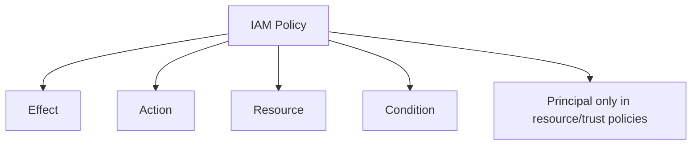

#### IAM Policy Structure

```json
{
  "Version": "2012-10-17",
  "Statement": [
    {
      "Sid": "AllowReadFromSpecificBucket",
      "Effect": "Allow",
      "Action": "s3:GetObject",
      "Resource": "arn:aws:s3:::example-bucket/*",
      "Condition": {
        "StringEquals": {
          "aws:PrincipalTag/Department": "Engineering"
        }
      }
    }
  ]
}
```

Key fields:

- `Version`: Policy language version.
- `Statement`: One or more permission rules.
- `Sid`: Optional statement identifier.
- `Effect`: `Allow` or `Deny`.
- `Action`: AWS API operation.
- `Resource`: AWS resource ARN.
- `Condition`: Optional access constraint.
- `Principal`: Used in resource-based and trust policies.

---

### 3.6 Types Of IAM Policies

#### 3.6.1 AWS Managed Policies

AWS managed policies are created and maintained by AWS.

Examples:

- `AmazonS3ReadOnlyAccess`
- `CloudWatchReadOnlyAccess`
- `AWSLambdaBasicExecutionRole`
- `AmazonEC2ReadOnlyAccess`

When to use:

- For quick setup.
- For common read-only access.
- For experimentation or temporary access.

Be careful because AWS managed policies may be broader than your application actually needs.

#### 3.6.2 Customer Managed Policies

Customer managed policies are created and controlled by you.

Use them when:

- You need least privilege.
- You want reusable policies.
- You want version control over permission changes.
- You need environment-specific access boundaries.

Example:

```json
{
  "Version": "2012-10-17",
  "Statement": [
    {
      "Effect": "Allow",
      "Action": [
        "dynamodb:GetItem",
        "dynamodb:PutItem",
        "dynamodb:UpdateItem"
      ],
      "Resource": "arn:aws:dynamodb:us-east-1:111122223333:table/orders"
    }
  ]
}
```

#### 3.6.3 Inline Policies

Inline policies are embedded directly into a single user, group, or role.

Use inline policies when:

- The permission must belong to only one identity.
- The policy should be deleted when the identity is deleted.
- You need a tightly coupled one-off permission.

Avoid inline policies for common permissions because they are harder to reuse and audit.

#### 3.6.4 Resource-Based Policies

Resource-based policies are attached directly to AWS resources.

Common examples:

- S3 bucket policies
- KMS key policies
- SQS queue policies
- SNS topic policies
- Lambda resource policies
- Secrets Manager resource policies
- ECR repository policies

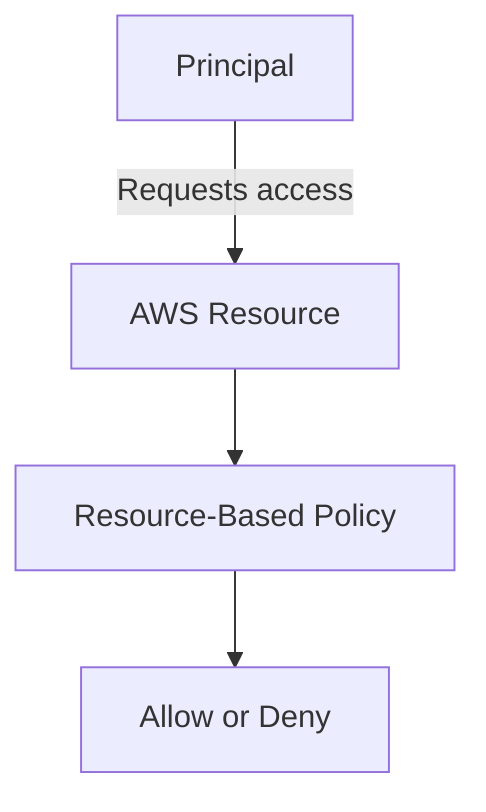

Resource-based policies are useful when the resource owner wants to directly control who can access the resource.

#### 3.6.5 Permissions Boundaries

A permissions boundary sets the maximum permissions an IAM user or role can receive.

It does not grant permissions by itself.

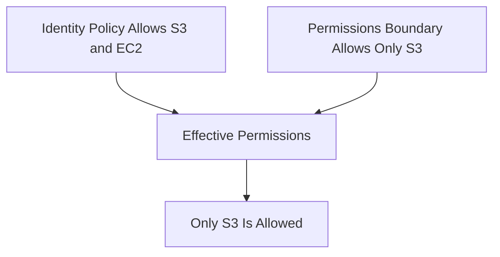

Use permissions boundaries when:

- Delegating IAM creation to developers.
- Preventing privilege escalation.
- Allowing teams to create roles within approved limits.
- Managing multi-team AWS accounts.

#### 3.6.6 Service Control Policies

Service Control Policies, or SCPs, are AWS Organizations policies that set maximum permissions for accounts or organizational units.

SCPs do not grant permissions. They only limit what can be allowed.

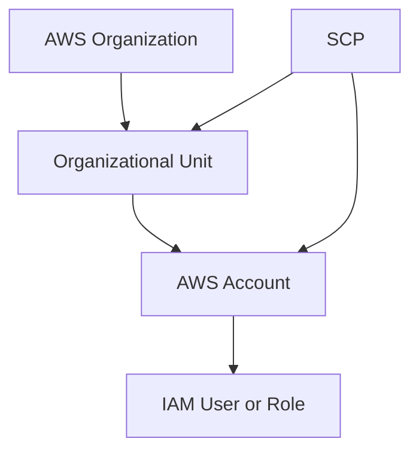

Use SCPs to:

- Block use of unapproved regions.
- Prevent disabling CloudTrail.
- Prevent deleting security logs.
- Restrict root account actions.
- Enforce organization-wide guardrails.

**Declarative Policies** (AWS Organizations, launched 2024) are a complementary governance feature. Unlike SCPs which deny specific API calls, Declarative Policies enforce a desired baseline resource configuration state across all accounts in an OU — for example, enforcing S3 Block Public Access, disabling EC2 IMDSv1, or requiring VPC flow logs. They proactively detect and report drift rather than just blocking actions.

---

### 3.7 IAM Permission Evaluation Logic

AWS evaluates permissions using a layered decision process.

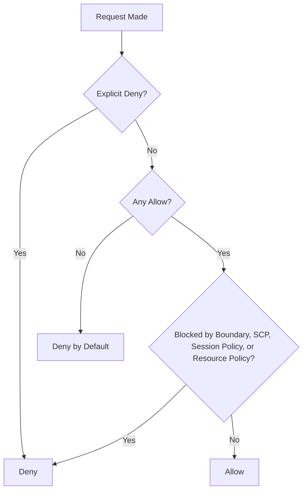

Important rules:

- Default is deny.
- Explicit deny always wins.
- An allow is required for access.
- SCPs and permissions boundaries limit permissions.
- Resource-based policies can grant access directly in some cases.
- Conditions can allow or deny access based on context.

Common condition keys:

- `aws:MultiFactorAuthPresent`
- `aws:SourceIp`
- `aws:RequestedRegion`
- `aws:PrincipalArn`
- `aws:PrincipalTag`
- `aws:ResourceTag`
- `aws:SourceVpc`
- `aws:SourceVpce`

---

### 3.8 IAM Identity Center

IAM Identity Center is the recommended service for managing workforce access to AWS accounts and applications. It provides centralized SSO, enforced MFA, and short-lived credentials without requiring IAM users for employees.

It allows users to sign in through a central access portal and access multiple AWS accounts and applications.

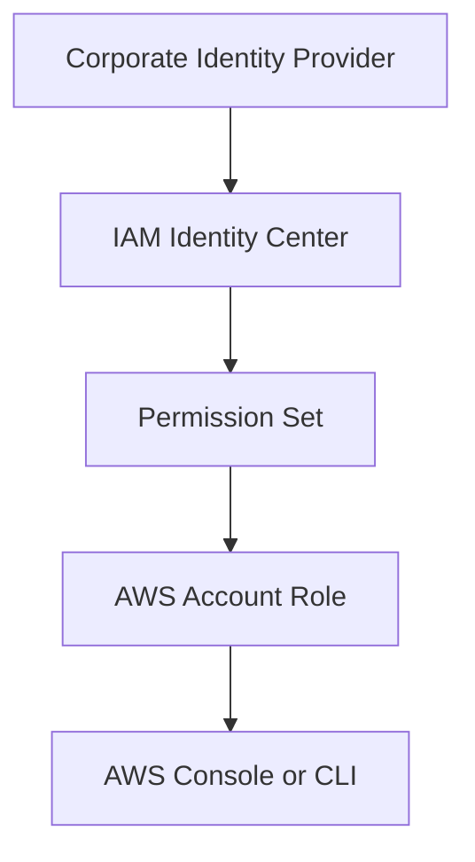

Core components:

- Users and groups
- Identity source (internal directory, Active Directory, or external IdP via SAML/OIDC)
- Permission sets
- AWS account assignments
- Application assignments
- **Trusted Identity Propagation** — passes the original end-user identity from an Identity Center session through to AWS data services (Amazon S3 Access Grants, Amazon Redshift, Amazon QuickSight), enabling fine-grained, per-user data access control and auditing.

Use IAM Identity Center when:

- You manage multiple AWS accounts and need centralized access.
- You want SSO with a central access portal for employees.
- You need phishing-resistant MFA and conditional access.
- You want short-lived credentials without managing IAM users.
- You need to federate with Okta, Azure AD, Active Directory, or another SAML/OIDC IdP.
- You want per-user data service auditing using Trusted Identity Propagation.

---

### 3.9 IAM Access Keys

Access keys are long-term credentials used for programmatic access.

An access key has:

- Access key ID
- Secret access key

Access keys are risky because they can be leaked in:

- Git repositories
- CI/CD logs
- Local machines
- Application configuration files
- Container images
- Chat messages or tickets

Use access keys only when role-based access is not possible.

Best practices:

- Do not create access keys for root.
- Rotate keys regularly.
- Remove unused keys.
- Store secrets in a secrets manager.
- Prefer OIDC or roles for CI/CD.
- Use IAM Access Analyzer and credential reports.

---

### 3.10 IAM MFA & Passkeys

Multi-factor authentication adds an additional verification step during login or sensitive operations.

> **Note (2024+):** AWS mandates MFA for the root user of all AWS Organizations member accounts. Root MFA enforcement is now applied at the organizational level and cannot be disabled by member accounts.

MFA factors supported by AWS IAM:

- **Passkeys and FIDO2 security keys** (hardware, e.g. YubiKey) — phishing-resistant, *recommended*
- **Virtual authenticator apps** (TOTP, e.g. Authy, Google Authenticator)
- **Hardware OTP tokens** (time-based, dedicated device)

FIDO2-based passkeys and hardware security keys are the most phishing-resistant MFA options and are preferred over TOTP apps.

Use MFA for:

- Root account (mandatory in AWS Organizations)
- IAM users with console access
- Administrator and break-glass users
- Privileged role assumption conditions
- Sensitive or destructive operations

Example condition requiring MFA:

```json
{
  "Effect": "Deny",
  "Action": "*",
  "Resource": "*",
  "Condition": {
    "BoolIfExists": {
      "aws:MultiFactorAuthPresent": "false"
    }
  }
}
```

---

### 3.11 IAM Tags & Attribute-Based Access Control

IAM supports tags on users, roles, and resources. Tags can be used for Attribute-Based Access Control, or ABAC.

ABAC grants access based on matching attributes instead of hardcoding every resource ARN.

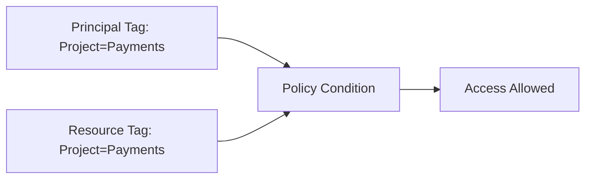

Example use cases:

- Developers can access only resources tagged with their project.
- Teams can manage only resources tagged with their department.
- Environments can be separated using `Environment=Dev`, `Test`, or `Prod`.
- Cost ownership and access ownership can align.

Example ABAC policy condition:

```json
{
  "Effect": "Allow",
  "Action": "ec2:*",
  "Resource": "*",
  "Condition": {
    "StringEquals": {
      "aws:ResourceTag/Project": "${aws:PrincipalTag/Project}"
    }
  }
}
```

---

### 3.12 IAM Access Analyzer

IAM Access Analyzer helps identify unintended access and over-provisioned permissions. It operates through three distinct analyzer capabilities.

**External Access Analyzer** — identifies resources shared outside your account or organization zone of trust:

- Public S3 buckets, SNS topics, SQS queues, KMS keys, Lambda functions, ECR repositories
- Cross-account resource access via resource-based policies
- Generates actionable findings per exposed resource

**Unused Access Analyzer** — identifies over-provisioned IAM identities using CloudTrail activity data:

- Unused IAM roles (not assumed within the analysis window)
- Unused access keys
- Unused IAM user passwords
- Service actions granted but never invoked

**Policy validation** — validates new or existing policies before deployment, flagging errors, security warnings, and improvement suggestions. Can also generate least-privilege policies based on CloudTrail activity.

Use IAM Access Analyzer to:

- Detect public or cross-account resource exposure.
- Validate policies before deployment.
- Right-size roles using unused access findings.
- Improve least privilege continuously over time.

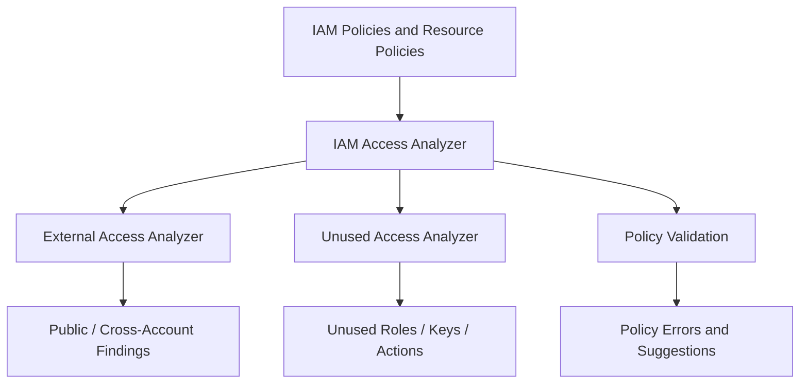

---

### 3.13 Common IAM Use Cases

#### Use Case 1: EC2 Access To S3

Problem:

An application running on EC2 needs to read files from S3.

Best solution:

Use an EC2 instance role with S3 read permissions.

Why:

- No access keys on the server.
- Temporary credentials are rotated automatically.
- Access is auditable.

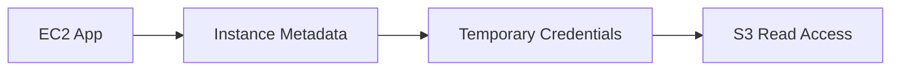

#### Use Case 2: Lambda Writes To DynamoDB

Problem:

A Lambda function needs to store order records in DynamoDB.

Best solution:

Attach a Lambda execution role with limited DynamoDB permissions.

Permissions should allow only the required table and actions.

#### Use Case 3: GitHub Actions Deploys To AWS

Problem:

A CI/CD pipeline needs AWS deployment access.

Best solution:

Use GitHub OIDC with an IAM role.

Why:

- No long-term AWS keys in GitHub secrets.
- Trust can be limited to a repository, branch, or environment.
- Sessions are temporary.

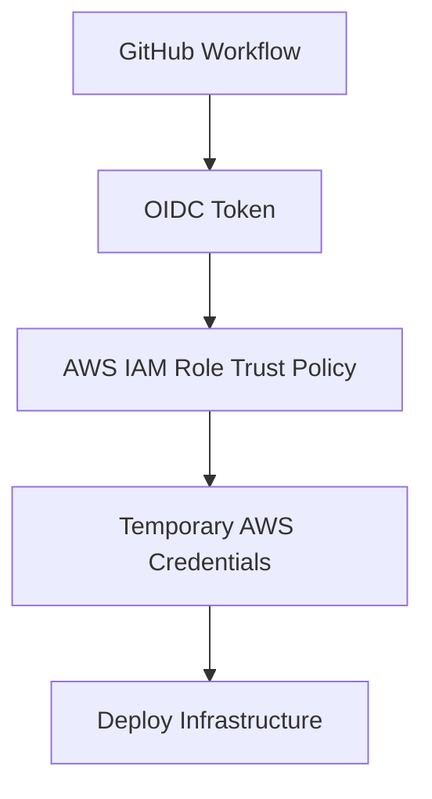

#### Use Case 4: Central Security Account Audits Workload Accounts

Problem:

Security engineers need read-only access across many AWS accounts.

Best solution:

Create audit roles in workload accounts and allow the security account to assume them.

#### Use Case 5: Developers Manage Only Dev Resources

Problem:

Developers should manage development resources but not production resources.

Best solution:

Use tags, permission boundaries, and SCPs.

Possible controls:

- Allow access only when `Environment=Dev`.
- Deny destructive actions in production.
- Use SCPs to block risky actions.
- Use permission boundaries for developer-created roles.

#### Use Case 6: On-Premises Workload Accesses AWS Without Long-Term Keys

Problem:

An application running in a data center needs to read from S3 and write metrics to CloudWatch. Storing long-term IAM access keys on-premises is a security and rotation burden.

Best solution:

Use IAM Roles Anywhere with a certificate authority (AWS Private CA or your own external CA).

Why:

- No long-term access keys stored on-premises.
- Temporary credentials are automatically rotated by the credential helper.
- Certificate-based trust is auditable and revocable through the CA.

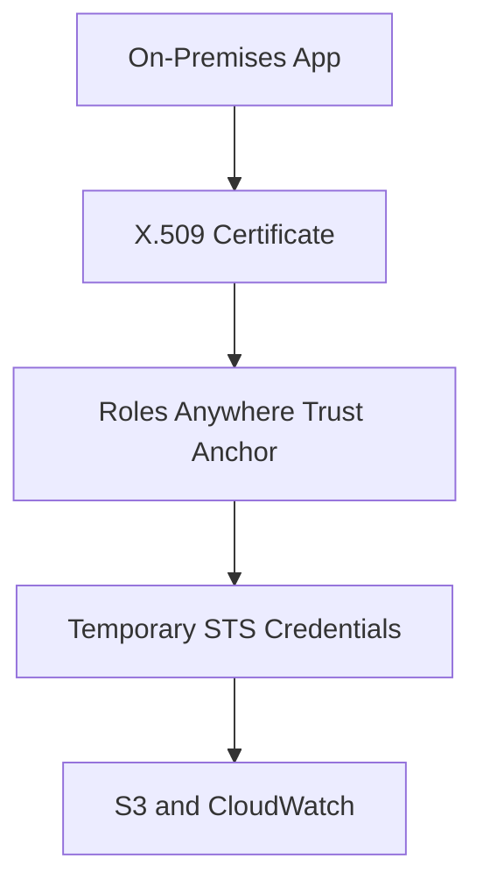

---

### 3.14 IAM Best Practices

Use these IAM practices as a 2026 baseline:

**Identity & Authentication:**
- Use the root account only for tasks that require root. Enable MFA — in AWS Organizations, root MFA is now mandatory.
- Prefer IAM Identity Center for all human access — avoid creating IAM users for employees.
- Use passkeys or FIDO2 hardware keys for MFA wherever possible.
- Enforce MFA with IAM conditions for all privileged and destructive operations.

**Permissions:**
- Apply least privilege — start with no permissions and add only what is necessary.
- Use customer managed policies for reusable, version-controlled permissions.
- Prefer ABAC with IAM tags to scale access control without per-resource policy updates.
- Use explicit deny statements as security guardrails.
- Use resource-based policies carefully and audit them with IAM Access Analyzer.

**Workloads:**
- Prefer IAM roles over access keys for all AWS workloads.
- Use IAM Roles Anywhere for on-premises or hybrid workloads that need AWS access.
- Use OIDC roles (not stored access keys) for CI/CD pipelines (GitHub Actions, GitLab, etc.).
- Give each Lambda function or ECS task its own dedicated execution role.

**Multi-Account Governance:**
- Use SCPs to enforce organization-wide permission guardrails.
- Use Declarative Policies to enforce baseline resource configurations across all accounts.
- Use permissions boundaries when delegating IAM role creation to development teams.

**Visibility & Hygiene:**
- Monitor all IAM activity with AWS CloudTrail.
- Use IAM Access Analyzer (External Access + Unused Access) to detect over-permissive access.
- Review credential reports and service last-accessed data regularly.
- Remove unused users, roles, access keys, and policies promptly.
- Validate all policies with IAM Access Analyzer before deployment.

---

### 3.15 IAM Troubleshooting Checklist

When access is denied, check:

1. Is there an explicit deny?
2. Does the identity have an allow policy?
3. Is the resource ARN correct?
4. Is the action correct?
5. Does the resource-based policy allow access?
6. Is an SCP blocking the action?
7. Is a permissions boundary limiting access?
8. Is a session policy limiting access?
9. Are policy conditions failing?
10. Is the request using the expected role or user?
11. Is the AWS region correct?
12. Is MFA required?
13. Are tags required for ABAC?
14. Is the role trust policy correct?
15. Is the STS session expired?
16. If using IAM Roles Anywhere: is the trust anchor active, the certificate valid, and the profile configured correctly?

```mermaid
flowchart TD
    A[Access Denied] --> B[Check Explicit Deny]
    B --> C[Check Identity Policy]
    C --> D[Check Resource Policy]
    D --> E[Check SCP]
    E --> F[Check Permissions Boundary]
    F --> G[Check Conditions]
    G --> H[Check Trust Policy]
    H --> I[Check CloudTrail Event]
```

---

### 3.16 Summary

AWS IAM controls authentication and authorization across AWS. Its main components are users, groups, roles (including Roles Anywhere for hybrid workloads), policies, permissions boundaries, resource-based policies, IAM Identity Center, MFA with passkey support, access keys, tags, Access Analyzer, and Declarative Policies.

The most secure IAM designs usually follow this pattern:

```mermaid
flowchart TD
    A[Humans] --> B[IAM Identity Center]
    B --> C[Permission Sets]
    C --> D[Temporary Role Sessions]

    E[Applications] --> F[IAM Roles]
    F --> G[Temporary Credentials]

    H[Organizations] --> I[SCP Guardrails]
    J[Teams] --> K[Permissions Boundaries]
    L[Resources] --> M[Resource Policies]

    D --> N[AWS Access]
    G --> N
    I --> N
    K --> N
    M --> N
```

In practical terms:

- Use **IAM Identity Center** for people.
- Use **IAM roles** for AWS workloads; use **IAM Roles Anywhere** for hybrid and on-premises workloads.
- Use **least-privilege policies** and ABAC for scalable permissions management.
- Use **SCPs, Declarative Policies, and permissions boundaries** for multi-account governance.
- Use **CloudTrail and IAM Access Analyzer** (External + Unused Access) for visibility and hygiene.
- Avoid long-term credentials wherever possible.
