## Table of Contents

1. What Is a VPC?
2. Why VPC Is Used
3. Where VPC Fits in AWS Architecture
4. Core Design Principles
5. VPC Core Components
   - 5.1 CIDR Block & AWS IPAM
   - 5.2 Subnets
   - 5.3 Route Tables
   - 5.4 Internet Gateway
   - 5.5 Egress-Only Internet Gateway
   - 5.6 NAT Gateway
   - 5.7 NAT Instance (legacy)
   - 5.8 Security Groups
   - 5.9 Network ACLs
   - 5.10 Elastic Network Interface
   - 5.11 Elastic IP
   - 5.12 DHCP Option Set
   - 5.13 DNS in VPC
   - 5.14 VPC Flow Logs
   - 5.15 Prefix Lists
   - 5.16 VPC Endpoints
6. VPC Connectivity Components
   - 6.1 VPC Peering
   - 6.2 Transit Gateway
   - 6.3 Site-to-Site VPN
   - 6.4 Virtual Private Gateway
   - 6.5 Direct Connect
   - 6.6 Direct Connect Gateway
   - 6.7 AWS Client VPN
   - 6.8 AWS PrivateLink
   - 6.9 VPC Lattice *(new 2024-2026)*
   - 6.10 AWS Cloud WAN
   - 6.11 Inter-Region VPC Peering
   - 6.12 TGW Inter-Region Peering
   - 6.13 AWS Verified Access *(new)*
   - 6.14 AWS Network Access Analyzer *(new)*
7. Key Architectural Patterns
8. Core Use Cases
9. Security Deep Dive
10. Routing Deep Dive
11. DNS Deep Dive
12. IPv6 in VPC
13. Observability and Troubleshooting
14. Cost Considerations 2026
15. High Availability and Resilience
16. Compliance and Governance
17. What to Know as an Architect or Infra Engineer
18. Decision Matrix
19. Sample Reference Architectures
20. Interview and Review Questions
21. Quick Revision Summary
22. Final Architect Checklist

---

## 1. What Is a VPC?

A **VPC (Virtual Private Cloud)** is a logically isolated, software-defined network inside an AWS Region where you launch and control cloud resources: EC2 instances, load balancers, RDS databases, EKS worker nodes, Lambda functions with VPC networking, PrivateLink endpoints, Fargate tasks, and more.

> Think of a VPC as your **private data center network inside AWS** — but with API-driven control, infinite scale, and zero physical hardware to manage.

You define:
- IP address ranges (IPv4 and/or IPv6)
- Subnet topology per Availability Zone
- Routing behavior
- Internet and private connectivity
- Security policies
- Traffic inspection and logging

**VPC is the foundational networking construct for most AWS workloads.**

---

## 2. Why VPC Is Used

| Requirement | How VPC Addresses It |
|---|---|
| Isolation | Logically separated from other AWS customers and your own environments |
| Network control | Define subnets, routes, ingress/egress, SGs, NACLs |
| Connectivity | Internet, on-premises, other VPCs, AWS services, SaaS |
| Segmentation | Web, app, database, management, shared services tiers |
| Compliance | Private paths, inspection, logging, segmentation, audit trails |
| Scalability | Multi-account, multi-region, hybrid at enterprise scale |
| Zero-trust readiness | PrivateLink, Verified Access, Lattice enable service-scope access |

---

## 3. Where VPC Fits in AWS Architecture

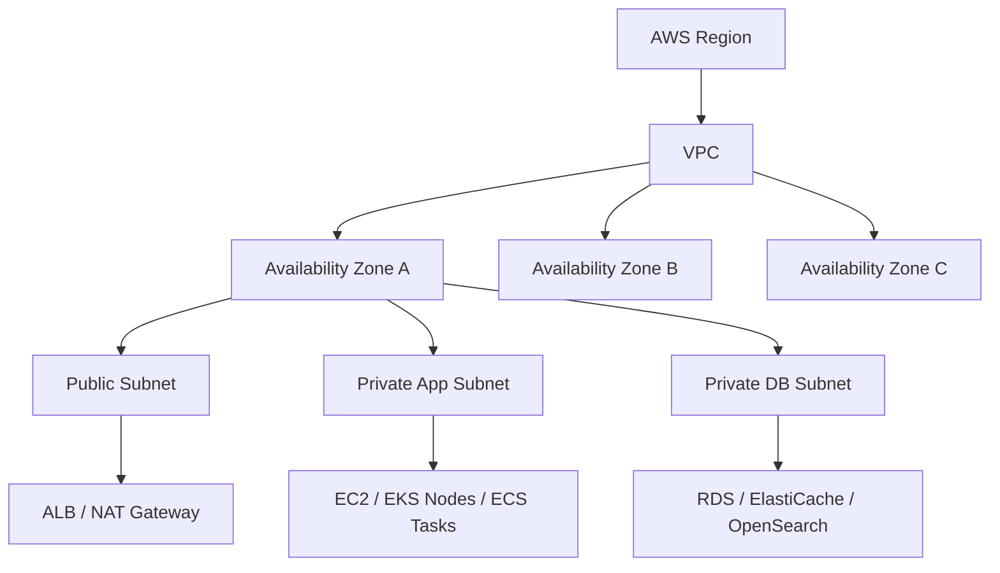

**Key facts:**
- VPC is **regional** — it spans all AZs in a region
- Subnets are **AZ-scoped** — one subnet lives in exactly one AZ
- A VPC can span multiple AZs by having subnets in each
- Resources in different AZs within the same VPC communicate via the **local route** (no cost, no latency overhead)

---

## 4. Core Design Principles

Before drawing a single subnet, answer these:

| Question | Why it matters |
|---|---|
| Which environments need isolation? | Determines VPC and account count |
| What connectivity is required? | Drives IGW, NAT, endpoints, peering, TGW, DX choices |
| Which resources must stay private? | Drives subnet type and route design |
| What traffic must be inspected? | Drives inspection VPC and firewall placement |
| How many IPs are required now and in 3 years? | Drives CIDR sizing — can't easily resize later |
| Will the design scale to multi-account? | Drives TGW vs peering, IPAM, RAM sharing |
| Who owns routing, DNS, egress? | Drives account structure and shared networking |
| What are the compliance constraints? | Drives segmentation, logging, private-only patterns |

---

# 5. VPC Core Components

---

## 5.1 VPC CIDR Block and AWS IPAM

### What it is
A **CIDR block** defines the private IP address range of the VPC.

Supported primary ranges (RFC 1918):
- `10.0.0.0/8` → subnets typically `10.x.0.0/16`
- `172.16.0.0/12` → subnets typically `172.16-31.x.0/16`
- `192.168.0.0/16` → small envs only

AWS allows `/16` to `/28` VPC prefix lengths for IPv4. You can add up to 4 secondary CIDRs.

### AWS IPAM (2026 update)

**AWS IP Address Manager (IPAM)** is now the standard for enterprise CIDR governance. As of 2025-2026:
- Supports **cross-account and cross-region** CIDR pools
- Integrates with **AWS Organizations** to enforce CIDR allocation policies
- Tracks utilization and flags overlaps
- Supports **private IPv4 and IPv6 pools**
- Can auto-assign CIDRs to VPCs from an approved pool
- IPAM v2 adds **public IP insights** — tracks all public IPs across accounts

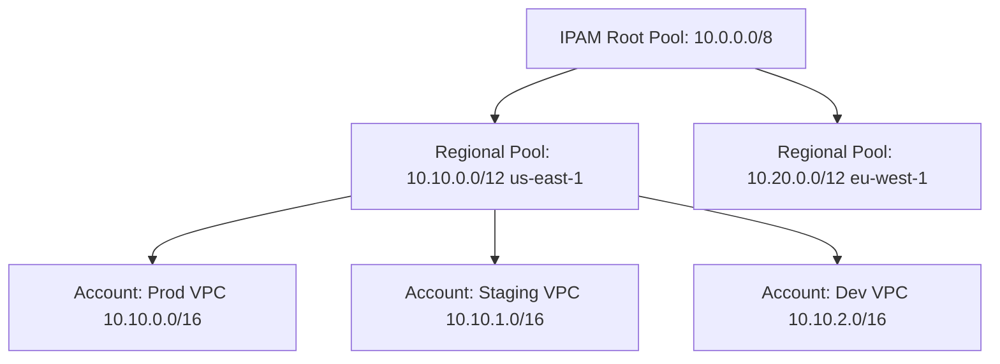

### Why it matters
Overlapping CIDRs are **the #1 cause of failed peering, TGW, and DX connectivity** in multi-account environments. Plan before you provision.

### CIDR sizing guide

| Environment | Recommended Size | Reasoning |
|---|---|---|
| Production VPC | `/16` (65,534 IPs) | Growth for EKS, endpoints, multi-AZ |
| Staging VPC | `/17` or `/18` | Half prod or smaller |
| Dev/Test VPC | `/20` | Small, replaceable |
| Shared Services VPC | `/22` to `/20` | Typically few large services |
| Inspection/Egress VPC | `/24` to `/26` | Few appliances, tightly controlled |

### Common mistakes
- Picking `192.168.x.x` — overlaps with home/office networks and breaks Client VPN split-tunnel
- Under-sizing for EKS (VPC CNI allocates IPs per pod, not per node)
- Forgetting secondary CIDR needs when primary is exhausted

---

## 5.2 Subnets

### What it is
A **subnet** is a contiguous IP range within a single AZ, carved from the VPC CIDR.

AWS reserves **5 IPs per subnet**:
- `.0` — Network address
- `.1` — VPC router
- `.2` — DNS resolver
- `.3` — Reserved future use
- `.255` — Broadcast

So a `/24` = 256 − 5 = **251 usable IPs**.

### Subnet types and their roles

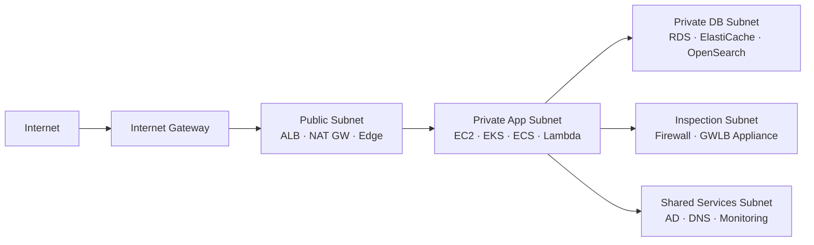

| Subnet Type | Route to Internet | Use for |
|---|---|---|
| Public | `0.0.0.0/0 → IGW` | ALB, NAT GW, edge devices |
| Private with egress | `0.0.0.0/0 → NAT GW` | App servers, workers, EKS nodes |
| Private isolated | No internet route | DBs, internal APIs, regulated data |
| Inspection | Routes via GWLBE/Firewall | IDS/IPS, next-gen firewall |
| Ingress | Edge-routed | Internet-facing ALB in some designs |
| Shared services | Internal only | AD, DNS, CI/CD, monitoring |

### High-availability subnet design

For production, always deploy across **at least 2 AZs**, ideally 3:

```
VPC 10.0.0.0/16
├── Public AZ-a   10.0.1.0/24
├── Public AZ-b   10.0.2.0/24
├── Public AZ-c   10.0.3.0/24
├── App AZ-a      10.0.11.0/24
├── App AZ-b      10.0.12.0/24
├── App AZ-c      10.0.13.0/24
├── DB AZ-a       10.0.21.0/24
├── DB AZ-b       10.0.22.0/24
└── DB AZ-c       10.0.23.0/24
```

### EKS IP planning (critical 2026 note)

With **VPC CNI**, every pod gets a real VPC IP. A node with 30 pods consumes 31 IPs.

For 100 nodes × 30 pods = **3,100 IPs just for pods**. Size accordingly or use:
- **VPC CNI custom networking** to use secondary subnets for pods
- **Prefix delegation mode** to carve `/28` blocks per node (more efficient)

### Common mistakes
- Single-AZ subnet design — AZ failure takes down everything
- `/27` public subnets — enough for today, breaks when endpoints and NAT are added
- Mixing app and DB tiers in the same subnet — loses security boundary

---

## 5.3 Route Tables

### What it is
A **route table** is the forwarding policy for a subnet or gateway. Every subnet must be associated with exactly one route table.

### How route evaluation works

AWS matches routes using **longest prefix match (most specific wins)**:

```
Route Table — Private App Subnet
┌─────────────────┬──────────────────────┬──────────────────────────┐
│ Destination     │ Target               │ Comment                  │
├─────────────────┼──────────────────────┼──────────────────────────┤
│ 10.0.0.0/16     │ local                │ VPC-local always first   │
│ 10.1.0.0/16     │ tgw-0abc123          │ Shared services via TGW  │
│ 172.16.0.0/16   │ tgw-0abc123          │ On-prem via TGW+DX       │
│ pl-xxxxxxxx     │ vpce-s3              │ S3 gateway endpoint      │
│ 0.0.0.0/0       │ nat-0xyz789          │ Default: outbound via NAT│
└─────────────────┴──────────────────────┴──────────────────────────┘
```

Traffic to `10.1.5.10` → matches `/16` TGW route (more specific than default).
Traffic to `8.8.8.8` → no specific match → default route → NAT.

### Route table types

| Type | Assigned to | Purpose |
|---|---|---|
| Subnet route table | Subnet | Controls subnet-level forwarding |
| Gateway route table | IGW or VGW | Ingress routing (GWLB/firewall insertion) |
| TGW route table | TGW attachment | Segment/isolate VPC groups in TGW |

### Ingress routing (2024+ pattern)

You can now attach a route table to an **Internet Gateway** to redirect inbound traffic through a firewall before it reaches your VPC:

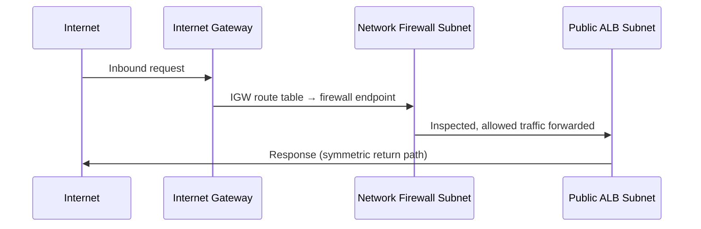

### Common mistakes
- Not documenting route intent — debugging becomes painful at scale
- Forgetting return-path routes on inspection appliances
- One route table for all subnet types — no segmentation

---

## 5.4 Internet Gateway (IGW)

### What it is
An **IGW** is a horizontally scaled, redundant, highly available VPC component that performs NAT between public IPs and private IPs for resources with public IPs assigned.

### How it works — the full flow

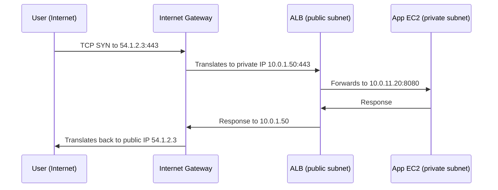

### Three conditions required for public access

All three must be true simultaneously:

1. Subnet has a route `0.0.0.0/0 → igw-xxxxx`
2. Resource has a **public IPv4 or EIP** assigned
3. Security group and NACL **allow the traffic**

### When to use
- Internet-facing ALB/NLB
- Public-facing NAT Gateway placement
- Rare: public EC2 with justified exposure

### 2026 note: public IPv4 pricing
AWS now charges **$0.005/hr per public IPv4 address** — this incentivizes using private resources with ALB/NLB in front rather than public IPs directly.

---

## 5.5 Egress-Only Internet Gateway (EIGW)

### What it is
An **Egress-Only Internet Gateway** provides **outbound-only IPv6 internet access** from private IPv6 resources, equivalent to NAT Gateway for IPv4.

### When to use
- Dual-stack VPCs where private resources need IPv6 outbound access
- Modern IPv6-native architectures without public inbound IPv6

### Flow

```
Private IPv6 Instance → EIGW → Internet (outbound only)
Internet → EIGW → BLOCKED (no unsolicited inbound)
```

---

## 5.6 NAT Gateway

### What it is
A **managed, scalable NAT service** in a public subnet that allows private resources to initiate outbound connections to the internet, while blocking inbound connections initiated from the internet.

### How it works — full flow

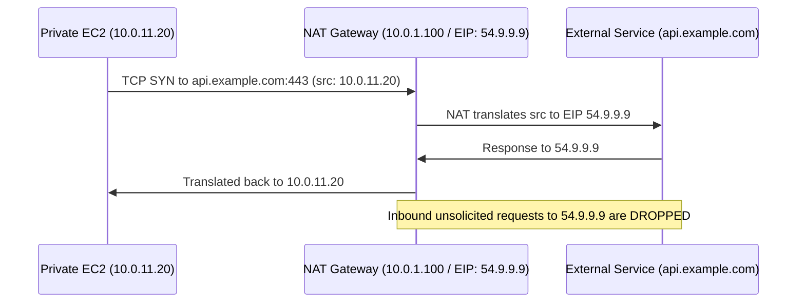

### High availability design — one NAT per AZ

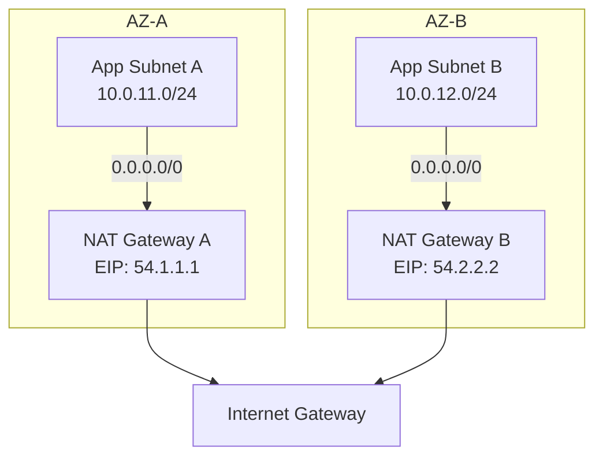

**Critical**: Route each AZ's private subnets to the NAT in the **same AZ**. Cross-AZ NAT adds ~$0.01/GB transfer cost and creates AZ-level blast radius.

### NAT Gateway vs Gateway Endpoint decision

```
Q: Is the traffic destined for S3 or DynamoDB?
├── YES → Use Gateway Endpoint (FREE, no NAT needed)
└── NO  → Use NAT Gateway (for all other internet traffic)
```

### 2026 NAT Gateway notes
- Now supports **Private NAT Gateway** — translates between overlapping CIDRs within AWS (no internet involved), useful in migrations and shared-services patterns
- Bandwidth: up to 100 Gbps per NAT Gateway (auto-scales)
- Cost: $0.045/hr + $0.045/GB processed (us-east-1) — large clusters should audit heavily

---

## 5.7 NAT Instance (legacy)

A self-managed EC2 doing NAT. Source/destination check must be disabled. Only use for:
- Custom packet manipulation
- Ultra-low-cost lab environments
- Specialized filtering not possible with managed NAT

**For all production workloads, use NAT Gateway.**

---

## 5.8 Security Groups

### What it is
A **stateful virtual firewall** applied at the ENI level (attached to individual resources).

**Stateful** means: if you allow inbound TCP port 443, the return traffic (outbound ephemeral port) is automatically allowed — you don't need a matching outbound rule.

### Rule anatomy

```
Direction: Inbound
Protocol:  TCP
Port:      443
Source:    sg-0alb123 (ALB security group)
Action:    ALLOW (implicit — SGs only allow, never explicitly deny)
```

SGs have **no explicit deny** — any traffic not matched by an allow rule is **implicitly denied**.

### Layered security group architecture

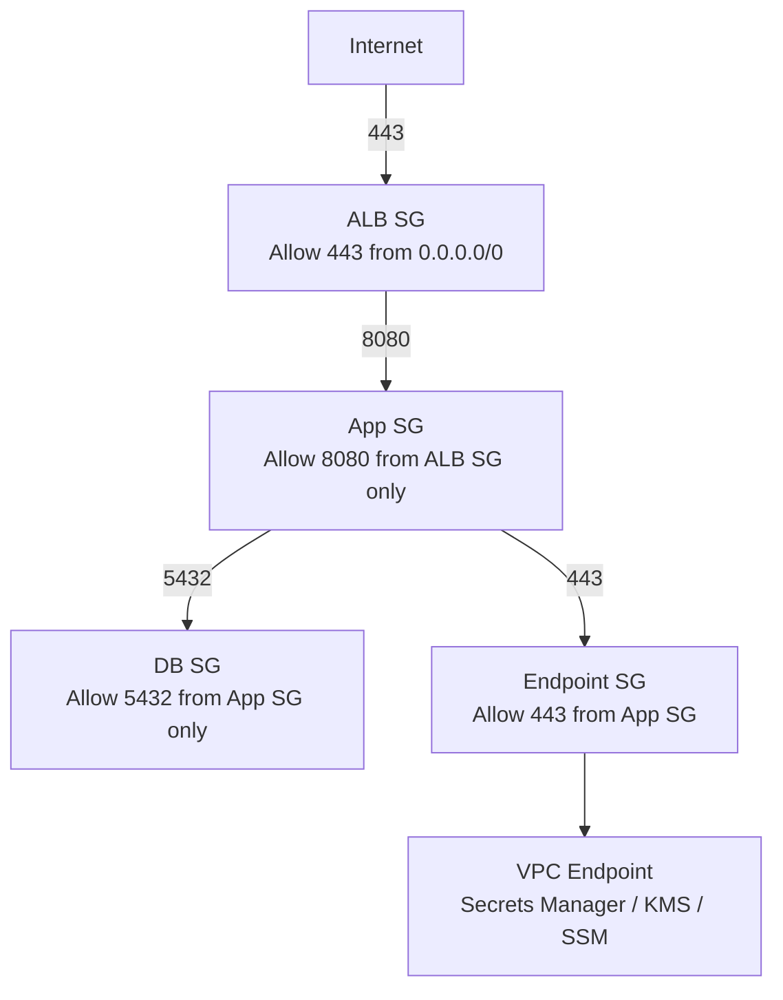

### Security group referencing vs CIDR

| Approach | Use when |
|---|---|
| Reference another SG | Same VPC, dynamic scaling (preferred) |
| CIDR | Specific IP ranges, on-prem, external known IPs |
| Prefix list | Multiple CIDRs managed as a group |

### 2026: SG referencing across VPCs via Lattice
With **VPC Lattice**, security group referencing now works across VPC boundaries for service-to-service communication without full network-level peering.

### Common mistakes
- `0.0.0.0/0` on port 22 or 3389 — exposed admin ports
- One shared SG for all resources — no meaningful segmentation
- Never reviewing outbound rules on locked-down environments

---

## 5.9 Network ACLs (NACLs)

### What it is
A **stateless packet filter** at the subnet boundary. Unlike SGs, NACLs are **stateless** — return traffic must be explicitly allowed.

### SG vs NACL comparison

| Feature | Security Group | NACL |
|---|---|---|
| Level | ENI / resource | Subnet |
| Stateful | Yes | No |
| Rule type | Allow only | Allow and Deny |
| Rule evaluation | All rules evaluated | Ordered (lowest number first) |
| Default | Deny all inbound | Allow all |
| Use case | Primary workload control | Subnet guardrails, explicit deny |

### NACL rule ordering example

```
Inbound NACL — Public Subnet
Rule 100: ALLOW  TCP  443  0.0.0.0/0
Rule 110: ALLOW  TCP  80   0.0.0.0/0
Rule 120: ALLOW  TCP  1024-65535  0.0.0.0/0  ← ephemeral ports for return traffic
Rule 200: DENY   ALL  ALL  10.5.0.0/16       ← block specific bad range
Rule *:   DENY   ALL  ALL  ALL                ← default deny
```

**Ephemeral ports (1024–65535) must be allowed** for return traffic because NACLs are stateless.

### When to use NACLs
- Explicit deny of known malicious ranges
- Subnet-level compliance guardrails
- Broad isolation between subnet tiers
- Do **not** use as a replacement for SGs

---

## 5.10 Elastic Network Interface (ENI)

### What it is
An **ENI** is a virtual network card — the actual attachment point between a resource and the VPC network.

Every ENI has:
- Primary private IPv4 (optional secondary IPs)
- Optional public IP or EIP
- One or more security groups
- A MAC address
- Subnet assignment (and therefore AZ assignment)

### Where ENIs appear implicitly

Many AWS services create ENIs **behind the scenes** in your subnets:

| Service | ENIs created in your VPC |
|---|---|
| EC2 | One per instance (minimum) |
| RDS | One per DB instance |
| ALB/NLB | One per AZ (minimum) |
| Lambda (VPC mode) | Shared ENIs via HyperPlane |
| EKS | Per pod (VPC CNI), plus per node |
| Interface endpoints | One per AZ per endpoint |
| Network Firewall | One per AZ |
| ECS Fargate | One per task |

### Why this matters operationally
- Subnet **IP exhaustion** = ENI creation failures = deployment failures
- ENI quotas per instance type vary (affects multi-ENI patterns)
- Lambda in VPC used to exhaust ENIs — fixed in 2020 via HyperPlane, but subnet sizing still matters

### Failover with ENI reassignment

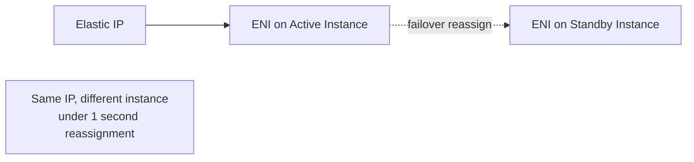

---

## 5.11 Elastic IP (EIP)

### What it is
A **static public IPv4** address allocated to your AWS account, independent of any specific resource.

### 2026 pricing change
All **public IPv4 addresses** (not just unattached EIPs) cost **$0.005/hr (~$3.60/month)**. This applies to:
- EIPs attached to running instances
- Public IPs auto-assigned at launch
- Public IPs on NAT Gateways
- Public IPs on load balancers

### When to still use EIPs
- NAT Gateways (must have EIP)
- Partner allowlisting requiring fixed egress IPs
- Legacy systems expecting a static source IP
- Controlled failover / IP remapping

### When to avoid
- Direct public EC2 access — use ALB instead
- Any resource that can use a load balancer or private endpoint

---

## 5.12 DHCP Option Set

### What it is
Defines OS-level network configuration pushed to instances via DHCP.

Options you can set:
- `domain-name`: Internal DNS domain (e.g., `internal.corp.com`)
- `domain-name-servers`: Custom DNS servers (e.g., Active Directory DNS, Route 53 Resolver inbound endpoint IP)
- `ntp-servers`: NTP sources
- `netbios-name-servers` / `netbios-node-type`: For Windows AD

### When to configure
- Joining instances to Active Directory
- Using custom internal DNS instead of Route 53
- Hybrid environments where on-prem DNS handles name resolution

---

## 5.13 DNS in VPC

### Built-in VPC DNS

Every VPC gets a **VPC resolver** at `VPC_CIDR_base + 2` (e.g., `10.0.0.2`).

Two VPC-level settings that must be enabled for DNS to work:
- `enableDnsSupport = true` — enables resolver
- `enableDnsHostnames = true` — assigns DNS names to EC2 public IPs

### Route 53 Private Hosted Zones

Create internal DNS names resolvable only within your VPC(s).

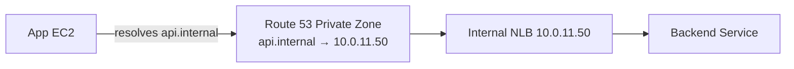

Associate the same zone with multiple VPCs for shared resolution.

### Hybrid DNS — full pattern

This is one of the most complex areas of VPC networking. The full hybrid DNS flow:

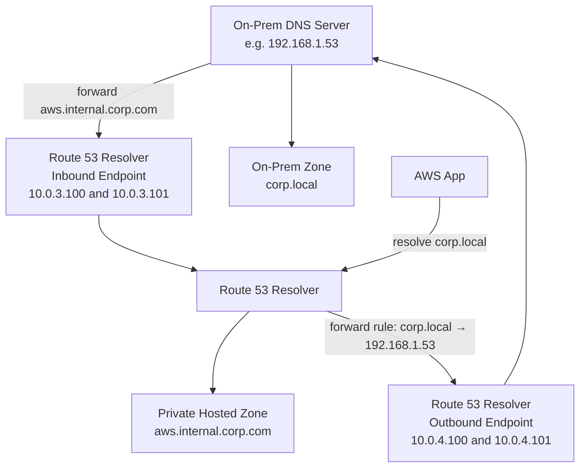

**Inbound endpoints**: On-prem systems can resolve AWS private zones
**Outbound endpoints**: AWS resources can resolve on-prem zones via forwarding rules

### Split-horizon DNS

Same domain name resolves differently depending on the resolver:
- Public internet: `api.company.com` → CloudFront or public ALB IP
- Inside VPC: `api.company.com` → internal ALB IP (via private hosted zone)

Requires private hosted zone with the same domain name associated with your VPC.

### 2026: DNS Firewall (Route 53 Resolver DNS Firewall)

Inspect and block DNS queries from VPC resources before they leave:
- Block outbound queries to known malicious domains
- Enforce allowlist for approved external services
- Log all DNS queries for security analysis

---

## 5.14 VPC Flow Logs

### What it is
**VPC Flow Logs** capture metadata about IP traffic flowing to and from network interfaces in your VPC. They do **not** capture packet payloads — only the header-level metadata.

As of 2026, Flow Logs support an extended format that includes:
- `traffic-path` field (identifies path through NAT, TGW, etc.)
- `pkt-src-aws-service` and `pkt-dst-aws-service` for AWS-to-AWS traffic
- `sublocation-type` and `sublocation-id` for Wavelength/Outposts
- Per-ENI, per-subnet, or per-VPC capture scope

### Why it is used
- Connectivity troubleshooting (ACCEPT vs REJECT records)
- Security investigations and forensics
- Compliance evidence
- Cost analysis (understand traffic flows to optimize endpoints and NAT)
- Anomaly and lateral movement detection
- SIEM feed

### How it is used
Flow logs are published to:
- **CloudWatch Logs** — for real-time alerting and metric filters
- **S3** — for long-term storage, Athena queries, cost analysis
- **Kinesis Data Firehose** — for streaming to Splunk, OpenSearch, third-party SIEMs

#### Flow Log Record Example
```
2 123456789012 eni-abc12345 10.0.1.5 10.0.2.15 443 52314 6 10 840 1700000000 1700000060 ACCEPT OK
```

Fields: `version account-id interface-id srcaddr dstaddr srcport dstport protocol packets bytes start end action log-status`

#### Flow Diagram — Traffic Path Through VPC
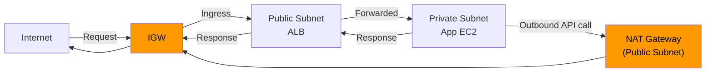

Flow logs record each hop's ENI independently — so you see the same session logged multiple times (at ALB ENI, app ENI, etc.).

### When to use
Enable in **all production environments** by default. For non-prod, enable at minimum on sensitive subnets.

### Use cases
| Scenario | Flow Log Action |
|---|---|
| App can't reach DB | Filter for `REJECT` from app ENI to DB private IP |
| Unexpected internet traffic | Filter egress to `0.0.0.0/0` outside expected endpoints |
| Compliance audit | Retain ACCEPT+REJECT logs for required retention period |
| Cost optimization | Identify high-volume cross-AZ flows going through NAT unnecessarily |
| Incident response | Trace lateral movement by source/destination pairs |

### Architect notes
- Flow logs have ~1–2 minute aggregation delay
- Use **custom format** (not default) to get `traffic-path`, `pkt-src-aws-service` and other enriched fields
- Combine with:
  - **Route 53 Resolver DNS query logs** for DNS-level visibility
  - **CloudTrail** for API-level changes
  - **ALB/NLB access logs** for application-layer detail
  - **Network Firewall logs** for deep packet inspection alerts
- In 2026, **Amazon Security Lake** is the recommended destination for centralising flow logs, CloudTrail, and Route 53 logs into OCSF format for SIEM integration

---

## 5.15 Prefix Lists

### What it is
A **Managed Prefix List** is a reusable, named set of CIDR blocks that can be referenced in security group rules and route tables — instead of duplicating individual CIDRs everywhere.

Two types:
- **Customer-managed prefix lists** — you define and maintain
- **AWS-managed prefix lists** — AWS maintains (e.g., `com.amazonaws.global.cloudfront.origin-facing`)

### Why it is used
- Reduces rule sprawl in SGs and route tables
- Single update point: change the prefix list, all referencing rules update automatically
- Enables consistent governance across accounts via AWS RAM sharing

### How it is used
**Create a customer-managed prefix list:**
```
Name: corp-office-cidrs
CIDRs:
  203.0.113.0/24   # London office
  198.51.100.0/24  # Singapore office
  192.0.2.0/24     # NYC office
```

**Reference in a Security Group:**
```
Inbound rule: port 443 from pl-xxxxxxxx (corp-office-cidrs)
```

**Reference in a Route Table:**
```
172.16.0.0/12 -> tgw-xxxxx   (via prefix list entry)
```

### When to use
- Any time the same set of CIDRs appears in more than one rule
- Corporate egress IPs for admin access
- On-premises CIDR ranges across multiple SGs
- Partner network ranges
- Approved egress destinations

### Use cases
| Prefix List | Used In |
|---|---|
| `corp-office-cidrs` | Admin SG inbound rules across all VPCs |
| `on-prem-ranges` | TGW route tables + VPN SGs |
| `partner-abc-ranges` | Specific app SG allowing partner API access |
| `com.amazonaws.region.s3` (AWS-managed) | Route table gateway endpoint association |
| `com.amazonaws.global.cloudfront.origin-facing` (AWS-managed) | ALB SG to allow only CloudFront IPs |

### Architect notes
- Share prefix lists across accounts using **AWS RAM** (Resource Access Manager)
- AWS-managed prefix lists for CloudFront are critical for correctly locking ALB SGs to CloudFront only
- Max entries per prefix list is a service quota — plan for growth

---

## 5.16 VPC Endpoints

VPC endpoints allow private access to AWS services and partner services without traffic leaving the AWS network or requiring IGW, NAT Gateway, or public IPs.

### Why this matters
Without endpoints, every call to `s3.amazonaws.com` or `ssm.amazonaws.com` from a private instance goes through NAT Gateway, incurring NAT data-processing charges and adding latency. Endpoints eliminate this.

### Types at a glance

| Type | Mechanism | Supports | Cost |
|---|---|---|---|
| Gateway Endpoint | Route table entry | S3, DynamoDB only | Free |
| Interface Endpoint | ENI in subnet | 100+ AWS services + custom | Hourly + data |
| Gateway Load Balancer Endpoint | GWLBE routing | Virtual appliances | Per GWLB pricing |

---

### 5.16.1 Gateway Endpoint

#### What it is
A **Gateway Endpoint** injects a route into your route table that directs S3 or DynamoDB traffic to AWS's internal network instead of the internet. No ENI is created.

#### Flow — Without vs With Gateway Endpoint
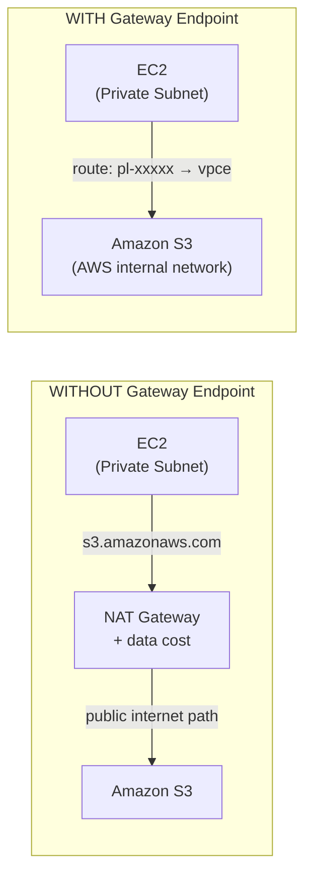

#### How it is used
1. Create gateway endpoint for S3 or DynamoDB in the VPC
2. Select route tables to associate (the route is injected automatically)
3. Optionally attach an **endpoint policy** to restrict which S3 buckets or DynamoDB tables are accessible

#### Endpoint Policy Example (restrict to own account's buckets only)
```json
{
  "Statement": [{
    "Effect": "Allow",
    "Principal": "*",
    "Action": "s3:*",
    "Resource": [
      "arn:aws:s3:::my-company-*",
      "arn:aws:s3:::my-company-*/*"
    ]
  }]
}
```

#### When to use
Always. There is no reason to route S3 or DynamoDB traffic through NAT Gateway.

#### Use cases
- EC2, ECS, EKS workloads reading/writing S3
- Lambda functions accessing S3 (when in VPC)
- Backup agents writing to S3
- Analytics pipelines (Glue, EMR) accessing S3
- DynamoDB-backed applications in private subnets

#### Architect notes
- Gateway endpoints are **free** — always use them
- Endpoint policies provide an additional data-exfiltration control layer
- Works across all subnets in the VPC when the route table is associated
- Does not work for cross-region S3 by default

---

### 5.16.2 Interface Endpoint (AWS PrivateLink)

#### What it is
An **Interface Endpoint** creates one or more **ENIs** in your chosen subnets. These ENIs have private IPs and DNS hostnames that resolve to the private IP, routing API calls to AWS services entirely within the AWS network.

#### Flow — Private API Call via Interface Endpoint
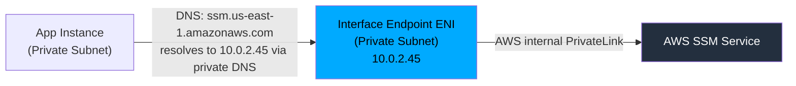

When **private DNS** is enabled (default), the standard AWS service hostname automatically resolves to the endpoint's private IP inside the VPC. No code changes required.

#### How it is used
1. Create interface endpoint for the target service
2. Choose subnets (creates one ENI per AZ chosen)
3. Assign a security group to the endpoint ENI
4. Enable private DNS (recommended)
5. Test: `aws ssm describe-sessions --region us-east-1` from a private instance should resolve privately

#### Security Group on the Endpoint ENI
The endpoint ENI itself has a security group. You must allow **inbound 443** from the resources that will call it:
```
Endpoint SG inbound:
  port 443 from app-sg
  port 443 from lambda-sg
```

#### 2026 updates
- **Endpoint policies** are now strongly recommended and enforced in high-security environments via SCPs
- **AWS PrivateLink for S3** (interface endpoint) now available alongside the gateway endpoint — use it when you need a specific private IP for S3 (e.g., firewall allow-listing by IP)
- Over **170 AWS services** support interface endpoints as of 2026
- **Multi-region endpoints** (preview → GA in some regions) allow a single endpoint to serve multiple regions

#### When to use
Use for any AWS API or SaaS service that private workloads call, especially when:
- NAT cost is significant
- Compliance requires traffic to stay off the internet
- The service supports it and call frequency justifies the endpoint hourly cost

#### Commonly deployed interface endpoints

| Service | Why |
|---|---|
| `ssm`, `ssmmessages`, `ec2messages` | SSM Session Manager (replaces bastion) |
| `ecr.api`, `ecr.dkr` | Container image pulls (ECS/EKS) |
| `secretsmanager` | Secret fetching at runtime |
| `kms` | Envelope encryption calls |
| `logs` | CloudWatch Logs agent |
| `monitoring` | CloudWatch metrics |
| `sts` | IAM role assumption |
| `execute-api` | Private API Gateway |
| `bedrock`, `bedrock-runtime` | AI/ML API calls (new as of 2025-2026) |
| `lambda` | Invoke Lambda privately |

#### Architect notes
- Each ENI per AZ per endpoint costs ~$0.01/hr + data — audit regularly for unused endpoints
- Endpoint ENI consumes IPs from your subnet — account for this in CIDR planning
- For EKS, you often need 10+ endpoints — plan subnet capacity accordingly

---

### 5.16.3 Gateway Load Balancer Endpoint (GWLBE)

#### What it is
A **GWLBE** steers traffic through a fleet of virtual network appliances (firewalls, IDS/IPS, DLP) using **GENEVE tunnelling (port 6081)**. The appliance receives the original packet, inspects it, and returns it. The GWLBE is transparent to the original source and destination.

#### Flow — North-South Inspection (Internet → App)
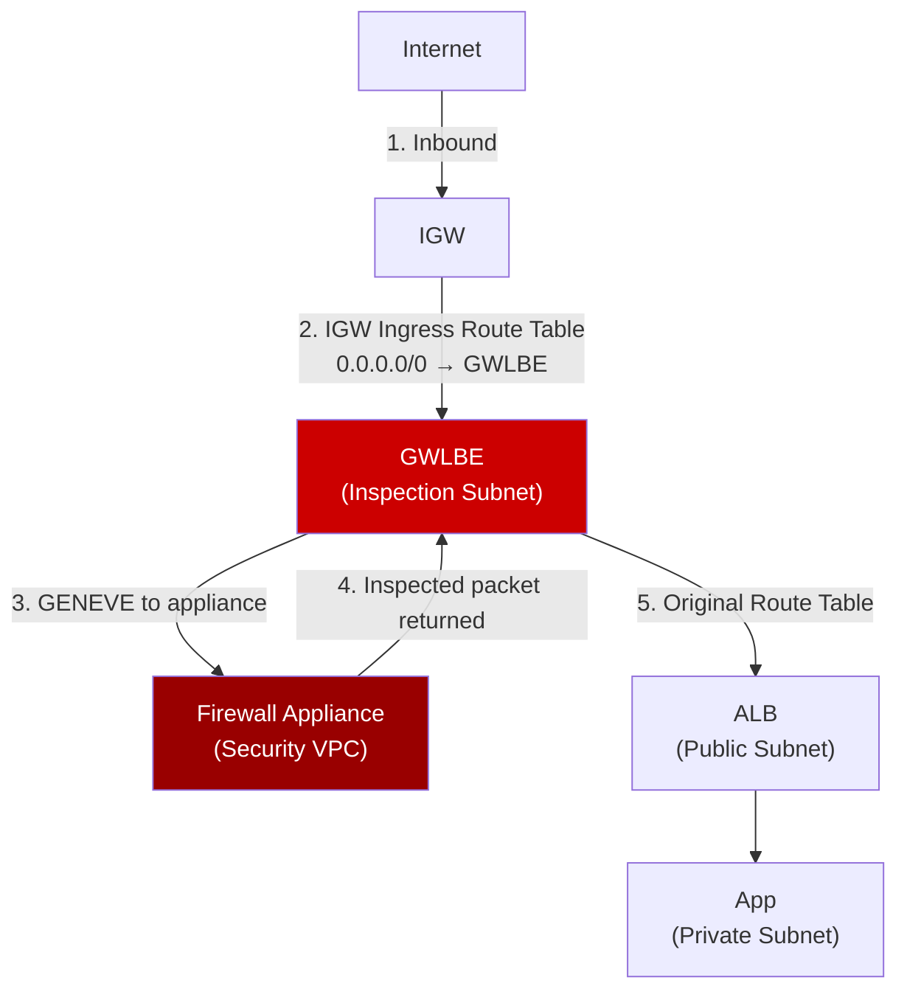

#### Flow — East-West Inspection (VPC-to-VPC via TGW)
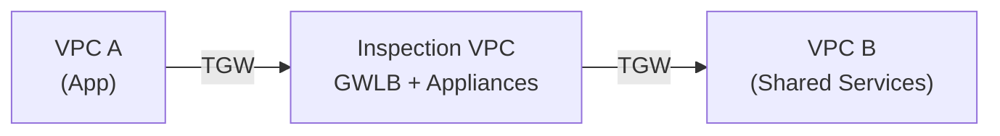

#### When to use
- Regulated environments requiring deep packet inspection
- When a third-party firewall vendor (Palo Alto, Fortinet, CheckPoint) is mandated
- Centralized north-south and east-west security inspection
- PCI-DSS, HIPAA, government environments

#### Architect notes
- Use **appliance mode** on TGW attachments to prevent flow symmetry issues
- GWLB health-checks must pass before the endpoint routes traffic
- Scale appliance fleet with GWLB target groups — GWLB handles distribution

---

## 5.17 AWS Network Firewall

> **New section — 2026 essential component**

### What it is
**AWS Network Firewall** is a managed, stateful, Layer 3–7 network firewall service deployed inside a dedicated subnet in your VPC. It is the AWS-native alternative to deploying third-party virtual firewalls.

### Why it is used
- Managed, scales automatically
- Supports stateful rules, stateless rules, and **Suricata-compatible IPS rules**
- Deep packet inspection including TLS (with decryption) as of 2025-2026
- No appliance fleet to manage

### How it is used
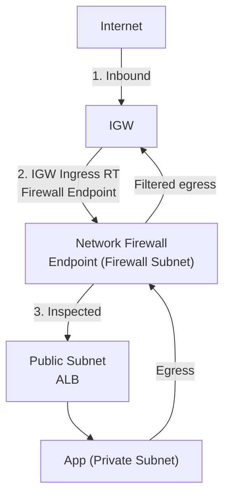

You create:
1. **Firewall** in a dedicated `/28` subnet per AZ
2. **Firewall Policy** containing rule groups
3. **Rule groups**: stateless (packet header) + stateful (flow-level, Suricata rules)
4. Route traffic to the firewall endpoint via route table

### When to use
- You need AWS-native Layer 7 inspection without managing appliance VMs
- Block known malicious domains or IPs (AWS Threat Intelligence feeds)
- Enforce egress domain allow/deny lists
- Meet compliance requiring network-level IPS/IDS

### Use cases
| Rule Type | Example |
|---|---|
| Stateless | Block all traffic on port 23 (Telnet) |
| Stateful domain list | Allow only `*.amazonaws.com`, deny rest |
| Suricata IPS | Block known CVE exploit patterns |
| TLS inspection (2026) | Inspect HTTPS egress for data exfiltration |

### Architect notes
- Network Firewall is **AZ-scoped** — deploy one per AZ for HA
- Combine with **AWS Firewall Manager** for centralised policy across accounts/OUs
- TLS inspection requires certificate authority setup
- Logging: alerts and flow records go to S3, CloudWatch, or Kinesis Firehose

---

# 6. VPC Connectivity Components

## 6.1 VPC Peering

### What it is
A **VPC Peering connection** is a private, direct Layer 3 connection between two VPCs. Traffic stays on the AWS backbone and never traverses the public internet.

### Flow
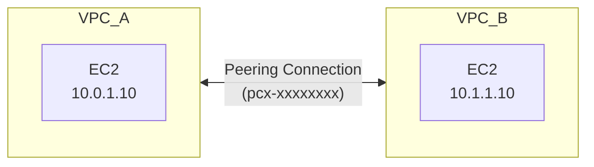

**Required on BOTH sides:**
- Route: `10.1.0.0/16 → pcx-xxxxx` (in VPC A)
- Route: `10.0.0.0/16 → pcx-xxxxx` (in VPC B)
- SG rule allowing traffic from the peer CIDR or SG

### Why transitive routing does NOT work
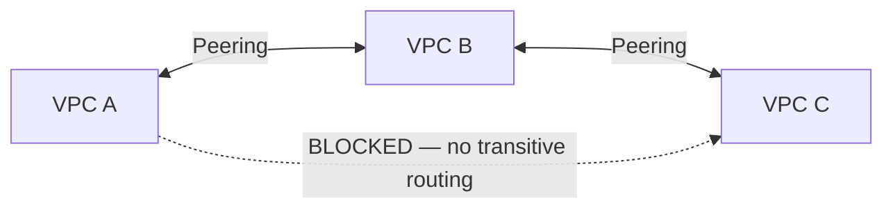

VPC A cannot reach VPC C via VPC B in a peering model. You must create a direct A↔C peering or use Transit Gateway.

### When to use vs not
| Use Peering | Use Transit Gateway Instead |
|---|---|
| 2–5 VPCs max | 6+ VPCs |
| Simple connectivity | Hub-and-spoke needed |
| No shared services routing | Central shared services |
| Dev/test environments | Production enterprise |

### Architect notes
- No bandwidth limit on peering
- Peering is free; you pay only data transfer charges
- Intra-region peering is lower cost than inter-region
- Cross-account peering requires explicit accept from the peer account

---

## 6.2 Transit Gateway (TGW)

### What it is
A **Transit Gateway** is a regional, managed network hub that connects VPCs, VPNs, and Direct Connect in a hub-and-spoke model. Up to 5,000 VPC attachments per TGW.

### Hub-and-Spoke Topology
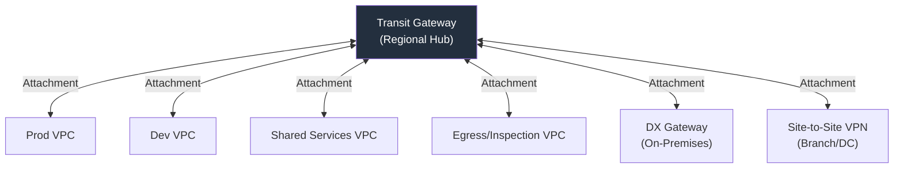

### TGW Route Table Segmentation
This is the most important TGW design concept. Use **multiple route tables** to enforce isolation.

```mermaid
flowchart LR
    subgraph "TGW Route Table: PROD"
        RT_PROD["Routes:\nSharedVPC CIDR\nEgressVPC CIDR\nDX CIDR"]
    end
    subgraph "TGW Route Table: DEV"
        RT_DEV["Routes:\nSharedVPC CIDR\nEgressVPC CIDR\n(NO prod routes)"]
    end
    subgraph "TGW Route Table: SHARED"
        RT_SHARED["Routes:\nProdVPC CIDR\nDevVPC CIDR"]
    end

    ProdVPC -->|Associated to| RT_PROD
    DevVPC -->|Associated to| RT_DEV
    SharedVPC -->|Associated to| RT_SHARED
```

This prevents Dev from routing to Prod even though both attach to the same TGW.

### How it is used — step by step
1. Create TGW in the network account
2. Share via **AWS RAM** to application accounts
3. Each VPC owner creates a TGW **attachment** from their account
4. Accept attachments in the network account
5. Associate attachments to correct **TGW route tables**
6. Enable **route propagation** or add static routes
7. Update VPC route tables to point to `tgw-xxxxx` for cross-VPC CIDRs

### 2026 updates
- **TGW Connect** (GRE-based) for SD-WAN and high-throughput appliance integration
- **TGW Network Manager** provides global visibility and topology maps
- **Centralized inspection with GWLB** via appliance-mode TGW attachments is the standard pattern in 2026 enterprise designs
- **Inter-region TGW peering** supports up to 10 Gbps per peering attachment

### Common mistakes
- **Flat single route table** — all VPCs can reach all others (zero segmentation)
- Not enabling **appliance mode** when inspection VPC is in the path (causes flow asymmetry)
- Forgetting that TGW data processing charges apply per GB

---

## 6.3 Site-to-Site VPN

### What it is
A managed IPsec VPN service connecting your on-premises network to AWS over the public internet. Each connection has **two tunnels** for redundancy (active/active BGP or active/passive static).

### Flow
```mermaid
flowchart LR
    DC["On-Premises\nData Center\nCustomer Gateway (CGW)"]
    
    DC <-->|"Tunnel 1 (IPsec/IKEv2)\nPublic IP: 52.x.x.x"| TGW_VPN["TGW VPN Attachment\nor VGW"]
    DC <-->|"Tunnel 2 (IPsec/IKEv2)\nPublic IP: 54.x.x.x"| TGW_VPN

    TGW_VPN <--> TGW["Transit Gateway"]
    TGW <--> VPC["VPCs"]
```

### Redundancy design
For maximum resilience, use two separate **customer gateway devices** — one per physical circuit or ISP:

```mermaid
flowchart LR
    CGW1["CGW Device 1\n(ISP A)"] <-->|Tunnels 1+2| TGW
    CGW2["CGW Device 2\n(ISP B)"] <-->|Tunnels 3+4| TGW
```

### When to use
| Scenario | Recommendation |
|---|---|
| Primary hybrid connectivity | Direct Connect preferred; VPN for backup |
| Fast initial setup (<1 hour) | VPN wins |
| Branch offices | VPN (Accelerated VPN for global branches) |
| DR connectivity | VPN as failover |
| Budget-constrained small sites | VPN |

### 2026 notes
- **Accelerated Site-to-Site VPN** uses AWS Global Accelerator anycast IPs — improves performance for geographically distant sites by routing through the nearest AWS edge POP
- VPN throughput limit is **1.25 Gbps per tunnel** — use ECMP over multiple tunnels for higher throughput via TGW
- IKEv2 is now the default and recommended; IKEv1 is being deprecated

---

## 6.4 Virtual Private Gateway (VGW)

### What it is
The AWS-side termination point for a Site-to-Site VPN or Direct Connect **attached to a single VPC**. It was the original hybrid connectivity model before Transit Gateway.

### VGW vs TGW for VPN
```mermaid
flowchart LR
    subgraph "Legacy: VGW Model"
        DC1["On-Prem"] <-->|VPN| VGW1["VGW"]
        VGW1 <--> VPC1["VPC A\n(single VPC only)"]
    end

    subgraph "Modern: TGW Model"
        DC2["On-Prem"] <-->|VPN| TGW2["TGW"]
        TGW2 <--> VPC2A["VPC A"]
        TGW2 <--> VPC2B["VPC B"]
        TGW2 <--> VPC2C["VPC C"]
    end
```

### When to use
- Single-VPC designs (simple/legacy)
- When you don't need hybrid-to-multi-VPC routing
- Cost-conscious small deployments (VGW itself is free; TGW has hourly cost)

---

## 6.5 Direct Connect (DX)

### What it is
A **dedicated private network connection** between your premises/colocation and an AWS Direct Connect location. Bypasses the public internet entirely.

### Connection types
| Type | Speed | Use |
|---|---|---|
| Dedicated connection | 1, 10, 100 Gbps | Large enterprise, own fiber |
| Hosted connection | 50 Mbps–10 Gbps | Smaller sites, via DX partner |

### Virtual Interface types
```mermaid
flowchart TD
    DX["Direct Connect Connection\n(Physical Port at DX Location)"]
    DX -->|"Private VIF\n(private AWS resources)"| DXGW["DX Gateway\n→ VGW or TGW"]
    DX -->|"Public VIF\n(AWS public services: S3, DynamoDB endpoints)"| PublicServices["AWS Public Endpoints"]
    DX -->|"Transit VIF\n(connects to TGW)"| TGW["Transit Gateway"]
```

### Enterprise DX Architecture (2026 standard)
```mermaid
flowchart TD
    DC["Data Center / Colo"] 
    DC <-->|"DX Port A\n(Primary)"| DXLoc1["DX Location 1\n(e.g., Equinix NY5)"]
    DC <-->|"DX Port B\n(Secondary)"| DXLoc2["DX Location 2\n(e.g., CoreSite NY1)"]

    DXLoc1 <-->|Transit VIF| DXGW["DX Gateway\n(global)"]
    DXLoc2 <-->|Transit VIF| DXGW

    DXGW <-->|TGW Association| TGW_US_EAST["TGW\nus-east-1"]
    DXGW <-->|TGW Association| TGW_EU_WEST["TGW\neu-west-1"]

    TGW_US_EAST <--> ProdVPCs["Prod VPCs\nus-east-1"]
    TGW_EU_WEST <--> EUVPCs["Prod VPCs\neu-west-1"]
```

### Encryption on DX
DX is **not encrypted by default**. For encryption:
- **Option 1**: Run IPsec VPN over the DX Private VIF (MACsec not required, works on all connection types)
- **Option 2**: **MACsec (MAC Security)** — Layer 2 encryption on 10 Gbps/100 Gbps dedicated connections — 2026 strongly recommended for regulated workloads

### When to use
| Need | Recommendation |
|---|---|
| Consistent sub-10ms latency | DX |
| >1 Gbps sustained throughput | DX (VPN limited to 1.25 Gbps) |
| PCI, HIPAA, regulated private path | DX + MACsec or VPN-over-DX |
| Quick setup (<1 day) | VPN instead |
| DR/backup path | VPN over internet |

---

## 6.6 Direct Connect Gateway (DXGW)

### What it is
A **global** (not regional) AWS resource that connects one or more DX connections to one or more VGWs or TGWs across multiple regions. A single DXGW can bridge on-premises to multiple AWS regions from a single DX connection.

### Flow
```mermaid
flowchart LR
    OnPrem["On-Premises"]
    OnPrem <-->|DX Connection| DXGW["DX Gateway\n(global resource)"]
    DXGW <-->|VPC Association| TGW1["TGW us-east-1\n+ attached VPCs"]
    DXGW <-->|VPC Association| TGW2["TGW ap-southeast-1\n+ attached VPCs"]
    DXGW <-->|VPC Association| TGW3["TGW eu-west-1\n+ attached VPCs"]
```

### Key constraints
- A DXGW cannot route **between two VPCs** — it only connects on-premises to VPCs
- No transitive routing through DXGW between two TGWs
- One DXGW can associate with up to 10 TGWs

---

## 6.7 AWS Client VPN

### What it is
A managed, elastic TLS-based VPN service for **individual user devices** (laptops, mobile) to securely access AWS VPCs and on-premises networks.

### Flow
```mermaid
flowchart LR
    User["Remote User\nOpenVPN Client"] <-->|"TLS over internet\n(mutual certificate auth\nor SAML/SSO)"| CVPN["Client VPN Endpoint\n(ENI in VPC subnet)"]
    CVPN -->|Assigned VPN IP from client CIDR| PrivateSubnet["Private Subnet\nApp / RDS / Tools"]
    CVPN -->|Split tunnel: on-prem traffic| TGW["TGW → On-Prem"]
```

### Auth methods (2026)
| Method | Use case |
|---|---|
| Mutual certificate (ACM) | Simple, non-federated |
| Active Directory (AWS Managed AD / self-managed) | Enterprise domain auth |
| SAML 2.0 (Okta, Azure AD, Ping) | SSO/MFA — recommended 2026 |

### Split tunnel vs full tunnel
- **Split tunnel**: only VPC-destined traffic goes through VPN; internet traffic exits locally. Reduces VPN load and is the 2026 default recommendation.
- **Full tunnel**: all traffic routed through VPN. Required for compliance where all internet access must be filtered centrally.

### When to use
| Scenario | Recommendation |
|---|---|
| Engineers need private subnet access | Client VPN |
| Temporary vendor/contractor access | Client VPN with time-limited cert |
| SSM Session Manager covers all access needs | Client VPN optional |
| Batch/service-to-service | Use Site-to-Site VPN instead |

---

## 6.8 AWS PrivateLink

### What it is
**PrivateLink** is the underlying technology that powers Interface Endpoints and Endpoint Services. It lets you expose a service (your own or a partner's) to consumers privately, **without VPC peering, internet, or exposing the entire network**.

### Provider → Consumer model
```mermaid
flowchart LR
    subgraph "Provider Account (Service VPC)"
        NLB["Network Load Balancer"]
        EPS["Endpoint Service\n(com.amazonaws.vpce.us-east-1.vpce-svc-xxx)"]
        NLB --> EPS
    end

    subgraph "Consumer Account (Consumer VPC)"
        IFACE["Interface Endpoint\nENI: 10.1.0.45"]
        App["Consumer App"]
        App -->|calls service via private DNS| IFACE
    end

    IFACE <-->|"PrivateLink\n(AWS backbone)"| EPS
```

### Key properties
- Consumer sees only **one private IP** (the ENI) — they cannot reach anything else in the provider VPC
- Works across accounts and across VPCs with overlapping CIDRs
- Provider must accept endpoint connection requests (or configure auto-accept)
- Traffic never traverses the internet

### PrivateLink vs VPC Peering
| | PrivateLink | VPC Peering |
|---|---|---|
| Granularity | Single service | Entire VPC network |
| Overlapping CIDRs | Allowed | Blocked |
| Transitive routing | N/A (point-to-point) | Not supported |
| Security | Service-scoped | Full network access |
| Best for | Service publishing | General VPC-to-VPC |

### When to use
- You are a platform team publishing a shared API or service to 10+ consumer VPCs/accounts
- SaaS provider offering private access to enterprise customers
- Replacing overly-permissive peering with scoped service access
- Zero-trust network patterns (expose only what is needed)

---

## 6.9 AWS Cloud WAN

### What it is
**AWS Cloud WAN** is a managed global WAN service introduced in 2022 and significantly matured by 2026. It provides a **central dashboard** and **policy-based** global network connecting AWS regions, on-premises sites, and branches through a single managed core network.

### Architecture
```mermaid
flowchart TD
    CW["Cloud WAN\nCore Network\n(Global Policy)"]

    CW <-->|"Segment: PROD"| TGW_USE1["TGW/Direct Attach\nus-east-1"]
    CW <-->|"Segment: PROD"| TGW_EUW1["TGW/Direct Attach\neu-west-1"]
    CW <-->|"Segment: DEV"| TGW_USE2["TGW/Direct Attach\nus-west-2"]
    CW <-->|"Via Site-to-Site VPN"| Branch["Branch Offices\nSD-WAN Devices"]
    CW <-->|"Via DX"| DC["Data Centers"]

    style CW fill:#232f3e,color:#fff
```

### Key concepts
- **Core network**: the global managed backbone
- **Network segments**: equivalent to TGW route tables — define which attachments can communicate
- **Attachment policies**: JSON-defined rules that automatically assign attachments to segments based on tags
- **Peering**: Cloud WAN peers with TGWs in each region

### When to use vs TGW
| | Cloud WAN | Transit Gateway |
|---|---|---|
| Scope | Multi-region, global | Single region |
| Management | Central policy | Per-TGW config |
| Branch connectivity | Built-in SD-WAN support | Manual VPN |
| Maturity | GA, growing adoption | Battle-tested, ubiquitous |
| When to choose | New global enterprise buildout | Existing regional architecture |

---

## 6.10 Inter-Region VPC Peering

### What it is
A peering connection between VPCs in **different AWS regions**. Traffic travels over the AWS global backbone (not the internet).

### Flow
```mermaid
flowchart LR
    VPC_USE1["VPC\nus-east-1\n10.0.0.0/16"] <-->|"Inter-region peering\n(AWS backbone)"| VPC_EUW1["VPC\neu-west-1\n10.2.0.0/16"]
```

### Key differences from intra-region peering
- Higher data transfer cost (inter-region rates apply)
- Still no transitive routing
- DNS resolution for peered VPC requires explicit enablement per peering connection

### When to use
- Simple cross-region service communication with 2 VPCs
- When TGW inter-region peering cost is not justified
- Dev/test cross-region setups

---

## 6.11 Transit Gateway Inter-Region Peering

### What it is
A peering connection between two **Transit Gateways** in different regions. Enables routing between all VPCs attached to each TGW across regions, over the AWS private backbone.

### Flow
```mermaid
flowchart LR
    TGW1["TGW\nus-east-1"]
    TGW2["TGW\neu-west-1"]

    TGW1 <-->|"TGW peering\n(AWS backbone, up to 10 Gbps)"| TGW2

    TGW1 --- VPC_A["Prod VPC A\nus-east-1"]
    TGW1 --- VPC_B["Dev VPC B\nus-east-1"]
    TGW2 --- VPC_C["Prod VPC C\neu-west-1"]
```

Routing is **static** on TGW peering — you manually add routes in each TGW's route table pointing to the peering attachment.

### When to use
- Enterprise multi-region: all regions need interconnectivity
- DR strategies with active-active cross-region apps
- Shared services access from multiple regions
- As a stepping stone before full Cloud WAN adoption

---

# 7. Key VPC Architectural Patterns

## 7.1 Single VPC, Multi-Tier (3-Tier)

### Diagram
```mermaid
flowchart TD
    Internet -->|HTTPS| IGW["Internet Gateway"]
    IGW --> ALB["Application Load Balancer\n(Public Subnet AZ-a, AZ-b)"]
    ALB -->|port 8080| AppEC2["App Tier EC2 / ECS\n(Private App Subnet)"]
    AppEC2 -->|port 5432| RDS["RDS PostgreSQL\n(Private DB Subnet)"]
    AppEC2 -->|outbound| NATGW["NAT Gateway\n(Public Subnet)"]
    NATGW --> IGW
    AppEC2 -->|S3 API| GWEP["S3 Gateway Endpoint"]
    AppEC2 -->|SSM/Secrets| IFEP["Interface Endpoints\n(SSM, Secrets Manager)"]
```

### Use when
- Single application team
- Startup or MVP
- Simple compliance needs

---

## 7.2 Multi-VPC per Environment

### Diagram
```mermaid
flowchart LR
    TGW["Transit Gateway"]
    TGW <--> ProdVPC["Prod VPC\n10.0.0.0/16"]
    TGW <--> StagingVPC["Staging VPC\n10.1.0.0/16"]
    TGW <--> DevVPC["Dev VPC\n10.2.0.0/16"]
    TGW <--> SharedVPC["Shared Services VPC\n10.10.0.0/16\n(AD, DNS, CI/CD)"]
```

TGW route tables isolate prod from dev/staging, while all environments can reach shared services.

---

## 7.3 Enterprise Multi-Account Landing Zone

### Diagram
```mermaid
flowchart TD
    Org["AWS Organization\n(Management Account)"]

    Org --> NetAccount["Network Account\nTGW + DX Gateway + VPN"]
    Org --> SecAccount["Security Account\nInspection VPC + SIEM\nCloudTrail org trail"]
    Org --> SharedAccount["Shared Services Account\nDNS, AD, ECR, Artifact"]
    Org --> ProdAccount["Prod Account\nApp VPCs"]
    Org --> NonProdAccount["Non-Prod Account\nDev/Test VPCs"]

    NetAccount <-->|RAM-shared TGW| ProdAccount
    NetAccount <-->|RAM-shared TGW| NonProdAccount
    NetAccount <-->|RAM-shared TGW| SharedAccount
    NetAccount <-->|DX| OnPrem["Data Center"]
```

This is the **AWS recommended enterprise target state** as of 2026, aligned with AWS Control Tower and the AWS Security Reference Architecture (SRA).

---

## 7.4 Centralized Egress with Inspection

### Flow — Centralized Egress
```mermaid
flowchart LR
    AppVPC["App VPC\n0.0.0.0/0 → TGW"] -->|TGW| EgressVPC["Egress VPC\nNetwork Firewall\nNAT Gateway\nIGW"]
    EgressVPC -->|Filtered + NATted| Internet
```

All spoke VPCs have a default route to TGW. The TGW routes default to the egress VPC. The egress VPC runs AWS Network Firewall (domain filtering) then NAT Gateway.

Route table logic:
```
Spoke VPC:       0.0.0.0/0 → tgw-xxx
TGW RT (spoke):  0.0.0.0/0 → Egress VPC attachment
TGW RT (egress): 10.0.0.0/8 → Spoke VPC attachments (for return)
Egress VPC RT:   0.0.0.0/0 → Firewall endpoint → NAT → IGW
```

---

## 7.5 Inspection VPC (East-West + North-South)

### Flow
```mermaid
flowchart TD
    Internet -->|North-South inbound| InspVPC["Inspection VPC\nGWLB + Firewall Appliances"]
    InspVPC -->|Inspected| AppVPC["App VPC"]
    AppVPC -->|East-West via TGW| InspVPC
    InspVPC -->|Inspected| DBVPC["DB/Backend VPC"]
```

---

# 8. Core Use Cases — What to Use and Why

## 8.1 Public Web Application (2026 standard)
```mermaid
flowchart TD
    User -->|HTTPS| CF["CloudFront\n(optional WAF)"]
    CF -->|Origin| ALB["ALB\n(Public Subnet, SG: allow CF prefix list)"]
    ALB --> App["App ECS/EKS\n(Private Subnet)"]
    App --> RDS["RDS Aurora\n(Isolated Subnet)"]
    App -->|S3| GWEP["S3 Gateway Endpoint"]
    App -->|Secrets| IFEP["Interface Endpoint\nSecrets Manager"]
    App -->|Outbound 3rd-party| NATGW["NAT Gateway"]
```

2026 update: ALB security group should reference the **CloudFront managed prefix list** (`com.amazonaws.global.cloudfront.origin-facing`) to block direct public access bypassing WAF.

---

## 8.2 EKS in VPC (2026)
Critical EKS-specific VPC considerations:

| Consideration | Detail |
|---|---|
| Node subnet size | Worker nodes need IPs for pods (VPC CNI assigns pod IPs from subnet) |
| Pod IP planning | `/24` per AZ is often insufficient — use `/19` or larger per AZ |
| Control plane access | Private endpoint recommended; no public endpoint in production |
| Interface endpoints needed | `ecr.api`, `ecr.dkr`, `s3` (gateway), `sts`, `logs`, `ssm`, `eks` |
| IPv6 / prefix delegation | Reduces IP exhaustion — one `/80` per node covers 2^48 pod IPs |
| EKS managed node groups | Require subnet tags: `kubernetes.io/role/internal-elb: 1` |

### EKS VPC CNI IP flow
```mermaid
flowchart LR
    Node["EC2 Worker Node\n/25 subnet\n(e.g. 10.0.1.0/25)"] -->|"ENI 1: 10.0.1.5 (node)\nENI 2: 10.0.1.20–10.0.1.35 (pods)"| PodA["Pod A\n10.0.1.20"]
    Node --> PodB["Pod B\n10.0.1.21"]
```

Each ENI attached to the node carries a pool of secondary IPs — each assigned to a pod. This is why EKS consumes subnet IPs rapidly.

---

## 8.3 AI/ML Workloads (new in 2026)
With the growth of Bedrock, SageMaker, and GPU-intensive workloads, VPC design for AI/ML has specific considerations:

| Component | VPC Design |
|---|---|
| SageMaker Training | Private subnets, VPC mode on, S3 gateway endpoint |
| SageMaker Endpoints | PrivateLink-based VPC endpoint for inference |
| Amazon Bedrock | Interface endpoint `bedrock` + `bedrock-runtime` in private subnets |
| GPU instances (p3/p4/p5) | Placement groups within single AZ for network locality |
| EFA (Elastic Fabric Adapter) | Requires placement group, single AZ, specific instance types |
| FSx for Lustre (training data) | Deployed in same AZ as training instances |

---

# 9. Security Deep Dive

## 9.1 Defense-in-Depth Model

```mermaid
flowchart TD
    Internet --> Shield["AWS Shield / WAF\n(Edge)"]
    Shield --> CloudFront["CloudFront\n(Edge filtering)"]
    CloudFront --> NF["Network Firewall / GWLB Appliance\n(L3-L7 inspection)"]
    NF --> NACL["NACL\n(Subnet-level stateless)"]
    NACL --> SG["Security Group\n(Resource-level stateful)"]
    SG --> App["Application\n(Instance / Container)"]
    App --> IAM["IAM / Resource Policy\n(API-level)"]
```

Each layer provides independent control. A failure or misconfiguration at one layer is caught by the next.

## 9.2 Security Group vs NACL Comparison

| | Security Group | NACL |
|---|---|---|
| Applies to | ENI / resource | Subnet |
| Stateful | Yes (return auto-allowed) | No (return must be explicit) |
| Rules | Allow only | Allow + Deny |
| Evaluation | All rules evaluated | In order, first match wins |
| Default | All inbound denied, all outbound allowed | All traffic allowed |
| Use for | Primary workload control | Subnet-level guardrails, explicit deny |

## 9.3 Zero Trust Network in VPC (2026)

Zero trust in VPC context means:
- No implicit trust based on subnet or VPC membership
- Every connection is explicitly authorized
- Use PrivateLink instead of peering for service access
- IAM + resource policies in addition to SGs
- All traffic logged
- Lateral movement blocked via east-west SG rules

```mermaid
flowchart LR
    ServiceA["Service A\nSG: allow out to B only"] -->|"Explicit SG rule\nTCP 8080"| ServiceB["Service B\nSG: allow in from A only"]
    ServiceB -. "BLOCKED — no SG rule" .-> ServiceC["Service C"]
```

---

# 10. Routing Deep Dive

## 10.1 Route Evaluation and Longest Prefix Match

AWS always selects the **most specific (longest prefix)** matching route.

```
Route Table:
  10.0.0.0/8   → tgw-xxx        (least specific)
  10.1.0.0/16  → pcx-yyy        (more specific)
  10.1.2.0/24  → eni-zzz        (most specific)

Packet to 10.1.2.50:
  Matches all three — uses 10.1.2.0/24 → eni-zzz  ✓
```

## 10.2 Asymmetric Routing — The Silent Killer

Asymmetric routing is the #1 cause of mysterious connectivity failures in complex VPC designs.

```mermaid
flowchart LR
    Client -->|"Request:\nPath A"| FirewallA["Firewall\nAZ-a\n(sees SYN)"]
    FirewallA --> Server

    Server -->|"Response:\nPath B (different AZ)"| FirewallB["Firewall\nAZ-b\n(no SYN state)"]
    FirewallB -. "DROPS packet\n(no matching flow)" .-> Client
```

**Fix**: enable **appliance mode** on TGW attachments for inspection VPCs. This pins all flows from the same source/destination pair to the same AZ's attachment, preserving stateful inspection.

## 10.3 Gateway Route Tables (Ingress Routing)

Introduced to enable inspection of inbound internet traffic. An **ingress route table** is associated with the IGW itself (not a subnet), and steers incoming traffic to a firewall before it reaches the destination subnet.

```mermaid
flowchart TD
    Internet -->|to ALB public IP| IGW
    IGW -->|"IGW Route Table:\nALB subnet CIDR → GWLBE/Firewall endpoint"| FWEndpoint["Firewall Endpoint\n(Firewall Subnet)"]
    FWEndpoint -->|"Firewall RT:\nALB subnet CIDR → local"| ALB["ALB\n(Public Subnet)"]
```

Without the IGW route table, inbound traffic would skip inspection.

---

# 11. DNS Deep Dive

## 11.1 VPC DNS Resolution Flow

```mermaid
flowchart LR
    EC2["EC2 Instance"] -->|"DNS query to 169.254.169.253\n(VPC +2 resolver)"| Resolver["Route 53 Resolver\n(VPC DNS)"]
    Resolver -->|"Private hosted zone match?\napi.internal → 10.0.1.50"| PHZ["Private Hosted Zone\n(Route 53)"]
    Resolver -->|"No match → forward"| Internet53["Route 53 Public DNS\nor Forwarding Rules"]
```

The VPC DNS resolver is always at the **VPC base CIDR + 2** (e.g., `10.0.0.2` for a `10.0.0.0/16` VPC) or the link-local address `169.254.169.253`.

## 11.2 Hybrid DNS — Bidirectional Resolution

```mermaid
flowchart LR
    subgraph AWS
        R53_OUT["Route 53 Resolver\nOutbound Endpoint\n(ENI: 10.0.10.5, 10.0.10.6)"]
        R53_IN["Route 53 Resolver\nInbound Endpoint\n(ENI: 10.0.11.5, 10.0.11.6)"]
        PHZ["Private Hosted Zone\napp.aws.corp.local"]
    end
    subgraph OnPrem
        DNS_ONPREM["On-Prem DNS\n(Windows AD / BIND)"]
    end

    EC2["AWS EC2"] -->|"query: db.corp.local"| R53_OUT
    R53_OUT -->|"forwarding rule: *.corp.local → 192.168.1.10"| DNS_ONPREM
    DNS_ONPREM -->|"query: api.aws.corp.local"| R53_IN
    R53_IN --> PHZ
```

**Outbound endpoint**: AWS → On-Prem DNS forwarding
**Inbound endpoint**: On-Prem → AWS private zone resolution

## 11.3 Split-Horizon DNS
The same domain name resolves differently depending on whether the query comes from inside or outside VPC:

| Source | `api.myapp.com` resolves to |
|---|---|
| Public internet | ALB public DNS name (via Route 53 public zone) |
| Inside VPC | Internal ALB DNS name or private IP (via private hosted zone) |

This avoids hairpinning through public DNS/internet from within the VPC.

---

# 12. IPv6 in VPC (2026)

## Current State
IPv6 is increasingly common in 2026, driven by:
- IPv4 cost ($0.005/hr per public IPv4 since Feb 2024)
- EKS IPv6 mode for pod networking (eliminates IP exhaustion)
- Internet-facing services needing IPv6

## Key components
| Component | IPv6 Behavior |
|---|---|
| VPC CIDR | AWS assigns a `/56` from Amazon's pool |
| Subnet CIDR | `/64` per subnet (auto-assigned or custom) |
| IGW | Handles both IPv4 and IPv6 |
| Egress-Only IGW | IPv6 outbound-only (equivalent of NAT Gateway for IPv6) |
| NAT Gateway | **Does not support IPv6** — use Egress-Only IGW |
| Security Groups | Support both `0.0.0.0/0` (IPv4) and `::/0` (IPv6) rules |

## Flow — IPv6 Public and Outbound-Only
```mermaid
flowchart LR
    subgraph "IPv6 Public (bidirectional)"
        IGW6["IGW"] <-->|"::/0"| PubEC2["Public EC2\n(IPv6 assigned)"]
    end
    subgraph "IPv6 Outbound-Only"
        EIGW["Egress-Only IGW"] -->|"::/0 outbound"| PrivEC2["Private EC2\n(IPv6 assigned)"]
        PrivEC2 -. "No inbound IPv6 allowed" .-> EIGW
    end
```

## EKS IPv6 Mode
In EKS IPv6 mode, **pods get IPv6 addresses** from the subnet's `/64`. Nodes still communicate with the control plane over IPv4. This eliminates the pod IP exhaustion problem that plagues VPC CNI in IPv4 mode.

---

# 13. Observability and Troubleshooting

## 13.1 Observability Stack (2026)

```mermaid
flowchart LR
    VPC["VPC Traffic"] -->|Flow Logs| SL["Amazon Security Lake\n(OCSF format)"]
    DNS["Route 53 Resolver\nQuery Logs"] --> SL
    FW["Network Firewall\nAlert Logs"] --> SL
    CT["CloudTrail\n(API changes)"] --> SL
    SL -->|Query| Athena["Athena / OpenSearch"]
    SL -->|Forward| SIEM["3rd-party SIEM\n(Splunk, Sentinel)"]
```

**Amazon Security Lake** (GA 2023, widely adopted by 2026) is the recommended centralisation point for network telemetry across accounts.

## 13.2 VPC Reachability Analyzer
A point-and-click tool that traces the network path between two endpoints and identifies the exact resource blocking connectivity — without sending live traffic.

Use it when:
- You cannot reach an EC2 from another
- An ALB health check fails
- A new VPC endpoint appears unreachable

Output: identifies whether the block is at SG, NACL, route table, or missing IGW/NAT.

## 13.3 Systematic Troubleshooting Flow

```mermaid
flowchart TD
    Start["Connectivity Issue"] --> DNS["1. DNS OK?\nnslookup / dig from instance"]
    DNS -->|No| FixDNS["Check: private hosted zone association\nDHCP option set\nResolver rules"]
    DNS -->|Yes| SG["2. Security Group?\nCheck inbound rules on destination ENI"]
    SG -->|Blocked| FixSG["Add correct inbound rule\nor SG reference"]
    SG -->|OK| NACL["3. NACL?\nCheck subnet NACL inbound + outbound\n(remember ephemeral ports 1024-65535)"]
    NACL -->|Blocked| FixNACL["Add allow rule\n(and return rule for stateless)"]
    NACL -->|OK| Route["4. Route Table?\nCorrect next-hop for destination CIDR?"]
    Route -->|Missing| FixRoute["Add route:\nNAT / TGW / peering / endpoint"]
    Route -->|OK| EP["5. Endpoint / NAT reachable?\nGateway endpoint associated?\nInterface endpoint ENI SG allows traffic?"]
    EP -->|No| FixEP["Fix endpoint policy\nor endpoint ENI SG"]
    EP -->|OK| Hybrid["6. Hybrid path?\nVPN tunnel up? BGP routes propagated?\nOn-prem return route exists?"]
```

---

# 14. Cost Considerations (2026 Pricing Context)

## 14.1 Cost Components

| Component | Pricing Model | Typical Optimization |
|---|---|---|
| Public IPv4 address | $0.005/hr per IP (~$3.60/mo) | Eliminate unused EIPs; use IPv6 |
| NAT Gateway | $0.045/hr + $0.045/GB | Use S3/DynamoDB gateway endpoints; architect for same-AZ traffic |
| Interface Endpoint | $0.01/hr per AZ + $0.01/GB | Justify by volume of traffic avoiding NAT |
| TGW attachment | $0.05/hr per attachment | Audit orphaned attachments |
| TGW data processing | $0.02/GB | Use peering for heavy VPC-to-VPC flows |
| Direct Connect | Port fee + data transfer | Commit to 1-yr/3-yr port for discount |
| Cross-AZ data transfer | $0.01/GB each direction | Co-locate tightly coupled services in same AZ |
| Flow log storage (S3) | S3 standard pricing | Use S3 intelligent tiering; expire old logs |

## 14.2 Top 5 Cost Optimizations

1. **S3 and DynamoDB gateway endpoints** — free, immediate savings for any workload using these services
2. **Architect for same-AZ traffic** — cross-AZ data transfer at $0.01/GB adds up fast in high-throughput systems
3. **Eliminate unused public IPs** — $3.60/mo per IP; scan all accounts in the org
4. **Right-size interface endpoints** — one endpoint per service per VPC (not per subnet); evaluate whether traffic volume justifies the hourly cost
5. **TGW data processing** — for two VPCs with heavy sustained traffic, VPC peering may be cheaper (peering has no data processing fee, only data transfer)

---

# 15. High Availability and Resilience

## 15.1 Multi-AZ HA Pattern

```mermaid
flowchart TD
    subgraph AZ_A["Availability Zone A"]
        PubA["Public Subnet\nNAT-A + ALB node"]
        AppA["Private App Subnet\nEC2/ECS/EKS node"]
        DBA["Private DB Subnet\nRDS Primary"]
    end
    subgraph AZ_B["Availability Zone B"]
        PubB["Public Subnet\nNAT-B + ALB node"]
        AppB["Private App Subnet\nEC2/ECS/EKS node"]
        DBB["Private DB Subnet\nRDS Standby"]
    end

    PubA --> AppA --> DBA
    PubB --> AppB --> DBB
    DBA <-->|"Multi-AZ sync"| DBB
```

Each AZ is self-sufficient — its own NAT Gateway, its own app and DB nodes. An AZ failure does not cascade.

## 15.2 AZ Route Isolation for NAT
```
Private App Subnet AZ-a route table:
  0.0.0.0/0 → nat-gw-AZ-a   ← same AZ

Private App Subnet AZ-b route table:
  0.0.0.0/0 → nat-gw-AZ-b   ← same AZ
```

If both point to `nat-gw-AZ-a`, an AZ-a failure breaks all outbound for AZ-b instances too.

---

# 16. Compliance and Governance (2026)

## 16.1 AWS Organizations + Network Governance

```mermaid
flowchart TD
    Mgmt["Management Account\nAWS Organizations\nControl Tower"] -->|SCPs| OU_PROD["Prod OU"]
    Mgmt -->|SCPs| OU_NONPROD["Non-Prod OU"]
    Mgmt -->|SCPs| OU_INFRA["Infrastructure OU\n(Network + Security)"]

    OU_INFRA --> NetAcct["Network Account\nTGW + DX"]
    OU_INFRA --> SecAcct["Security Account\nCloudTrail org\nConfig org rules\nSecurity Hub\nSecurity Lake"]
```

## 16.2 Common SCPs for Network Governance
- Deny creation of internet gateways in non-approved accounts
- Deny VPC peering to non-org accounts
- Require VPC flow logs on all VPCs
- Deny public S3 bucket ACLs (not VPC-specific, but network-adjacent)
- Deny creation of unencrypted Direct Connect connections

## 16.3 AWS Config Rules for VPC Compliance

| Rule | What it checks |
|---|---|
| `vpc-flow-logs-enabled` | Flow logs active on all VPCs |
| `no-unrestricted-ssh` | SG inbound 22 not open to 0.0.0.0/0 |
| `restricted-common-ports` | SGs not open on 3389, 3306, 1433, etc. |
| `internet-gateway-authorized-vpc-only` | IGW not attached to unauthorized VPCs |
| `vpc-default-security-group-closed` | Default SG has no inbound/outbound |
| `nacl-no-unrestricted-ssh-rdp` | NACLs don't allow unrestricted admin ports |

## 16.4 AWS Firewall Manager (2026)
Centrally deploys and enforces:
- Security group policies (mandatory rules across all accounts)
- AWS Network Firewall policies (same policy across all VPCs in org)
- WAF policies
- Shield Advanced protections

Use Firewall Manager when you have 5+ accounts and need consistent network security without manual per-account management.

---

# 17. What to Know as an Architect or Infra Engineer

## 17.1 Must-Know Concepts
- CIDR planning and IPAM governance
- Subnet design per AZ (public/private/isolated/inspection)
- SG vs NACL (stateful vs stateless, resource vs subnet)
- Route table behavior, longest prefix match, asymmetric routing
- NAT design, cost, HA
- All three VPC endpoint types and when to use each
- VPC Peering vs TGW vs PrivateLink (and when each is right)
- Site-to-Site VPN vs Direct Connect (and when to combine)
- Hybrid DNS with Route 53 Resolver
- Multi-account network topology (landing zone pattern)
- Flow logs, Reachability Analyzer, Network Firewall
- AWS Network Firewall vs GWLB-based appliances
- Cost drivers: NAT, TGW, endpoints, cross-AZ, public IPv4

## 17.2 Must-Know Decisions
You must be able to justify:
- Why a workload is public vs private
- Why NAT is needed or can be avoided with endpoints
- Peering vs TGW at different scales
- PrivateLink vs peering for service access
- Centralized vs distributed egress/inspection tradeoffs
- VPN vs DX for a given latency/throughput/compliance requirement
- How the network design scales to 50+ accounts
- How AZ failure is contained
- How to detect and investigate network anomalies

## 17.3 Must-Know Anti-Patterns (Updated 2026)
- Flat single TGW route table (no segmentation between prod/dev)
- Single NAT Gateway for multi-AZ production
- Overlooking S3/DynamoDB gateway endpoints (leaving NAT cost on the table)
- Not planning EKS subnet sizes (pod IP exhaustion)
- Using bastion hosts instead of SSM Session Manager
- Unnecessary public IPs (now cost money)
- Peering mesh at scale (becomes unmanageable beyond 5–6 VPCs)
- No DNS design for hybrid environments
- Treating "private subnet" as equivalent to "secure"
- Deploying interface endpoints without endpoint policies (no data exfiltration control)
- No appliance mode on TGW for inspection VPC (asymmetric routing)

---

# 18. Decision Matrix (Updated 2026)

| Requirement | Use This |
|---|---|
| Bidirectional internet access | IGW + public subnet + public IP |
| Outbound-only internet for private resources | NAT Gateway (per AZ) |
| Outbound-only IPv6 internet | Egress-Only Internet Gateway |
| Private access to S3 / DynamoDB (free) | Gateway Endpoint |
| Private access to AWS APIs / SaaS | Interface Endpoint (PrivateLink) |
| Inline traffic inspection | AWS Network Firewall or GWLB + appliance |
| 2–4 VPCs need simple private connectivity | VPC Peering |
| 5+ VPCs, hybrid, shared services | Transit Gateway |
| Expose one service to many VPCs/accounts | AWS PrivateLink (Endpoint Service) |
| Fast hybrid connectivity (<1 day) | Site-to-Site VPN |
| Sustained, high-throughput, private hybrid | Direct Connect |
| DX + multiple regions from one circuit | DX Gateway + TGW Transit VIF |
| Remote user/admin access | AWS Client VPN with SAML/SSO |
| Global multi-region enterprise network | Cloud WAN |
| Consistent network security policy across org | AWS Firewall Manager |
| Network telemetry centralisation | Amazon Security Lake |

---

# 19. Reference Architecture — Enterprise Landing Zone (2026)

```mermaid
flowchart TD
    Internet

    subgraph "AWS Organization"
        subgraph "Infrastructure OU"
            NetAcct["Network Account\nTGW (us-east-1)\nDX Gateway\nSite-to-Site VPN (backup)"]
            SecAcct["Security Account\nInspection VPC\nNetwork Firewall\nSecurity Lake\nCloudTrail Org"]
        end

        subgraph "Shared Services OU"
            SharedAcct["Shared Services Account\nDNS (R53 Resolver endpoints)\nActive Directory\nECR (shared)\nCI/CD"]
        end

        subgraph "Prod OU"
            ProdAcct1["Prod Account: App A\nVPC 10.0.0.0/16"]
            ProdAcct2["Prod Account: App B\nVPC 10.1.0.0/16"]
        end

        subgraph "Non-Prod OU"
            DevAcct["Dev Account\nVPC 10.2.0.0/16"]
        end
    end

    subgraph "On-Premises"
        DC["Data Center\nCGW Devices"]
        Branch["Branch Offices"]
    end

    Internet -->|"HTTPS via CloudFront + WAF"| ALB_Prod["ALBs in Prod VPCs"]
    DC <-->|"DX (primary)"| NetAcct
    DC <-->|"S2S VPN (backup)"| NetAcct
    Branch <-->|"Accelerated VPN"| NetAcct

    NetAcct <-->|"RAM-shared TGW"| ProdAcct1
    NetAcct <-->|"RAM-shared TGW"| ProdAcct2
    NetAcct <-->|"RAM-shared TGW"| DevAcct
    NetAcct <-->|"RAM-shared TGW"| SharedAcct
    NetAcct <-->|"TGW"| SecAcct

    ProdAcct1 -->|"Egress via TGW → Inspection VPC"| SecAcct
    DevAcct -->|"Egress via TGW → Inspection VPC"| SecAcct
    SecAcct -->|"Filtered egress"| Internet
```

**Why this works in 2026:**
- Network account owns all transit (TGW, DX, VPN) — centralised, no per-account network sprawl
- Security account owns inspection and logging — separate blast radius from workloads
- All egress filtered through Network Firewall before reaching internet
- SCPs prevent rogue IGWs or peer connections outside the org
- IPAM in the Network account allocates non-overlapping CIDRs to all accounts
- RAM shares TGW to all application accounts — no per-account TGW cost

---

# 20. Interview and Review Questions

1. What makes a subnet public vs private, and can a subnet be public without an IGW?
2. Why would you use NAT Gateway over public IPs, and when might you avoid NAT altogether?
3. Explain the difference between gateway endpoint and interface endpoint. Why is the gateway endpoint free?
4. When would you choose TGW over peering, and what does TGW route table segmentation solve?
5. Explain PrivateLink — what problem does it solve that peering does not?
6. Design a VPC for an EKS cluster with 500 pods per node — what subnet sizes do you need?
7. How do you prevent prod VPCs from communicating with dev VPCs when both are on the same TGW?
8. What is asymmetric routing, when does it occur in VPC, and how do you fix it?
9. How does DNS resolution work inside a VPC? How do you extend this to on-prem?
10. Direct Connect is not encrypted by default — what are your options to add encryption?
11. How do you centralise internet egress across 30 AWS accounts?
12. What is the difference between stateful and stateless firewalling, and which AWS services provide each?
13. An EC2 in a private subnet cannot reach `secretsmanager.amazonaws.com` — walk through your troubleshooting steps.
14. What are the top three VPC cost optimisations you implement by default?
15. How do you expose one internal microservice privately to 50 consumer VPCs across multiple accounts?
16. Explain the role of appliance mode on TGW — when is it required?
17. What is AWS Network Firewall and when would you use it instead of a GWLB-based third-party appliance?
18. How does Route 53 Resolver inbound vs outbound endpoint work in hybrid DNS?
19. What is Security Lake and how does it fit into VPC observability?
20. Design the network for a new AWS landing zone — walk through account structure, CIDR strategy, connectivity, security, and DNS.

---

# 21. Quick Revision Summary

- VPC is your private network boundary — regional, subnets are AZ-scoped
- CIDR planning with IPAM is a foundational enterprise requirement
- Route tables define reachability — longest prefix match wins
- IGW = bidirectional internet; NAT = outbound-only; Egress-Only IGW = IPv6 outbound-only
- Security Groups = stateful, resource-level; NACLs = stateless, subnet-level, explicit deny
- Gateway endpoints = free, S3/DynamoDB only; Interface endpoints = paid, 170+ services
- AWS Network Firewall = managed L3-L7 inspection (2026 default for AWS-native)
- VPC Peering = simple, no transitive routing; TGW = scalable hub-and-spoke, route segmentation
- PrivateLink = service-scoped private access across accounts (not full network)
- VPN = fast, internet-based IPsec; DX = private, consistent, high-throughput; MACsec for L2 encryption on DX
- Cloud WAN = global managed WAN for multi-region enterprise (TGW at global scale)
- Hybrid DNS requires Route 53 Resolver inbound + outbound endpoints
- Security Lake centralises flow logs + DNS logs + CloudTrail for SIEM
- Firewall Manager enforces consistent SG, WAF, and Network Firewall policies org-wide
- Public IPv4 now costs money — minimise; IPv6 and PrivateLink reduce dependency

---

# 22. Final Architect Checklist

Before approving any VPC design in 2026, confirm:

**Addressing**
- [ ] CIDRs allocated via IPAM, no overlaps with any peered/connected networks
- [ ] Subnets sized for current load + 3x growth (especially EKS pod subnets)
- [ ] IPv6 considered for pod networking or internet-facing workloads

**Routing**
- [ ] Route tables reflect intended trust boundaries
- [ ] Asymmetric routing cannot occur in inspection paths
- [ ] TGW route table segmentation isolates prod from non-prod
- [ ] Appliance mode enabled on TGW inspection attachments

**Security**
- [ ] No unnecessary public IPs or IGWs
- [ ] Databases in isolated private subnets
- [ ] SGs follow least-privilege, role-based model
- [ ] NACLs used for explicit deny where compliance requires
- [ ] Network Firewall or GWLB appliance deployed for regulated traffic
- [ ] Firewall Manager policies enforced org-wide

**Connectivity**
- [ ] S3 and DynamoDB gateway endpoints deployed (free, always)
- [ ] Interface endpoints for frequently called AWS APIs
- [ ] Endpoint policies restrict access to authorised resources only
- [ ] NAT Gateway per AZ for HA; private subnets route to same-AZ NAT
- [ ] VPN tunnels redundant (two devices, two ISPs ideally)
- [ ] DX has redundant ports/locations for production

**DNS**
- [ ] Private hosted zones associated with all VPCs that need them
- [ ] Hybrid DNS configured (Resolver inbound + outbound endpoints)
- [ ] Split-horizon DNS where external vs internal resolution differs

**Observability**
- [ ] VPC Flow Logs enabled, delivered to Security Lake or S3
- [ ] Route 53 Resolver query logs enabled
- [ ] Network Firewall logs configured
- [ ] Reachability Analyzer tested for critical paths

**Governance**
- [ ] SCPs deny rogue IGWs and unauthorised peering
- [ ] AWS Config rules for VPC compliance active
- [ ] IPAM allocations tracked and approved
- [ ] Change control process for route table and SG modifications
