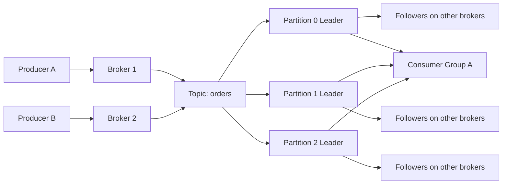
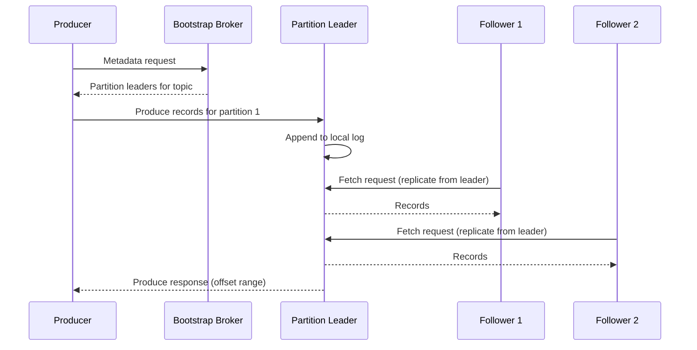
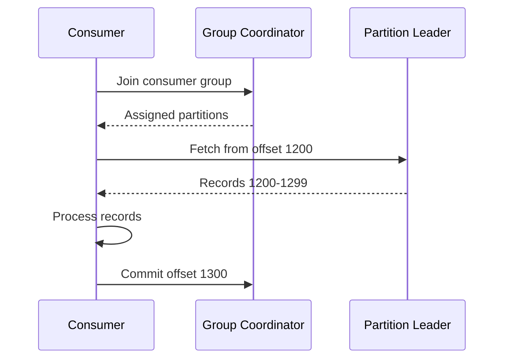
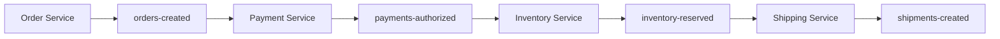
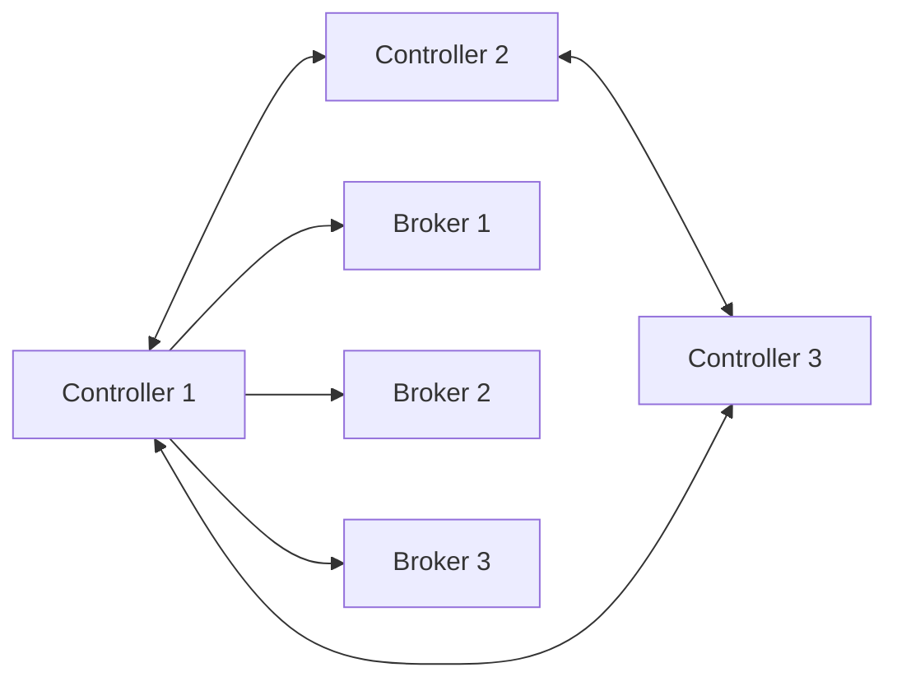
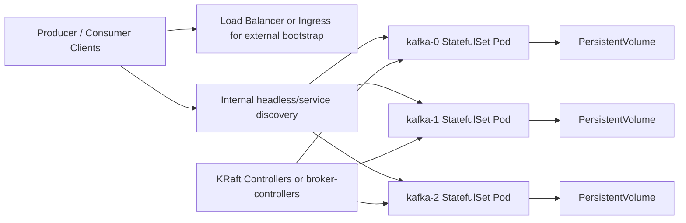

# Kafka Deep Dive

## Overview

Apache Kafka is a distributed event streaming platform designed for high-throughput, durable, ordered, horizontally scalable data pipelines. It is commonly described as a message queue, but that description is incomplete. Kafka is better understood as a **distributed commit log** with retention, replay, partition-based parallelism, and consumer-managed progress.

Kafka is used for:

1. **Event streaming**: publish and subscribe to ordered event streams
2. **Asynchronous decoupling**: producers and consumers do not need to run at the same pace
3. **Data integration**: move data between systems using Kafka Connect or stream processors
4. **Streaming applications**: derive new streams, aggregates, and materialized views in real time

This note explains Kafka from the inside out: topics, partitions, brokers, replication, leaders, ISR, producers, consumers, offsets, consumer groups, delivery guarantees, storage internals, KRaft, and real operational tradeoffs.

---

## 1. What Kafka Really Is

At the core, Kafka is an **append-only distributed log**.

Each partition is an ordered sequence of records:

```text
Partition 0

Offset 0  -> event A
Offset 1  -> event B
Offset 2  -> event C
Offset 3  -> event D
```

Important consequences of this model:

- records are ordered **within a partition**, not across the whole topic
- consumers track their own progress using offsets
- data is retained for a period of time or size threshold, even after being consumed
- consumers can replay old records if retention still keeps them

This is very different from a traditional queue where messages disappear permanently once acknowledged.

---

## 2. Core Concepts

### Broker

A **broker** is a Kafka server that stores partitions and handles produce and fetch requests.

### Topic

A **topic** is a named stream of records.

Examples:

- `orders`
- `payments`
- `user-signups`

### Partition

A **partition** is the unit of ordering, storage, and parallelism.

### Offset

An **offset** is the sequential position of a record inside one partition.

### Producer

A **producer** writes records to Kafka.

### Consumer

A **consumer** reads records from Kafka.

### Consumer Group

A **consumer group** is a set of consumers cooperating to divide partitions of a topic.

### Replication Factor

How many brokers store a copy of the partition.

### Leader and Followers

Each partition replica set has:

- one **leader** replica handling reads and writes
- one or more **follower** replicas replicating from the leader

---

## 3. Kafka Architecture



High-level flow:

1. producers send records to a topic
2. the topic is split into partitions
3. each partition has one leader and follower replicas
4. consumers fetch records from partition leaders
5. consumer groups coordinate who reads which partition

---

## 4. Topic and Partition Model

### Why partitions exist

Partitions are how Kafka scales.

They provide:

- **parallelism**: multiple consumers can read different partitions at the same time
- **distribution**: partitions can live on different brokers
- **ordering boundary**: order is guaranteed only inside one partition

### Example topic

```text
Topic: orders
Partitions: 3

orders-0
orders-1
orders-2
```

If you have 3 partitions and 3 consumers in one group, each consumer can own one partition.

### Ordering rule

Kafka does **not** guarantee global ordering across a topic.

It guarantees:

- order within `orders-0`
- order within `orders-1`
- order within `orders-2`

If strict ordering is required for one key such as `orderId`, records for that key must always land in the same partition.

---

## 5. Producer Partitioning

When a producer writes a record, Kafka needs to decide which partition it belongs to.

Common strategies:

- explicit partition chosen by the producer
- partition selected by hashing the record key
- round-robin if no key is provided

### Key-based partitioning

Example:

```text
key = customer-123
hash(key) % numPartitions = 1
→ record goes to partition 1
```

This is the standard way to preserve per-key ordering.

### Why keys matter

If all records for `customer-123` go to one partition, consumers will see them in order.

If no key is provided, events may land on different partitions and no per-entity ordering is guaranteed.

---

## 6. Produce Request Flow



Important detail:

The producer does not send to an arbitrary broker. It sends to the **leader of the target partition**.

Important replication detail:

Kafka followers do **not** receive data pushed by the leader. Followers pull data from the leader using the same Fetch request mechanism consumers use. The leader appends records and waits; followers poll it on their own fetch interval. With `acks=all`, the produce response is held until all ISR followers have fetched the records up to the produced offset, at which point the high-water mark advances and the leader replies to the producer.

### What actually happens on the network

At a lower level, the producer usually follows this path:

1. bootstrap to one known broker address
2. fetch cluster metadata
3. learn the leader for each partition
4. open or reuse TCP connections to the relevant leaders
5. batch records per partition
6. send `Produce` requests
7. receive offsets and error codes in the response

Important nuance:

- the bootstrap server is only the initial entry point
- after metadata is fetched, the client talks directly to the correct partition leaders
- if leadership changes, the client refreshes metadata and reroutes

### Request path example

```text
Producer starts
	-> connects to broker-2:9092 as bootstrap
	-> asks: who leads orders-0, orders-1, orders-2?
	-> metadata says:
			 orders-0 leader = broker-1
			 orders-1 leader = broker-3
			 orders-2 leader = broker-2
	-> producer sends records for each partition to the matching leader
```

---

## 7. Replication, Leaders, and ISR

Kafka replicates partitions for durability.

Example:

```text
orders-0
	Leader   -> Broker 1
	Follower -> Broker 2
	Follower -> Broker 3
```

### ISR: In-Sync Replicas

The **ISR** is the set of replicas that are sufficiently caught up with the leader.

If a follower falls too far behind, it can drop out of ISR.

Why ISR matters:

- write durability decisions depend on ISR
- leader election usually prefers replicas in ISR

### Failure case

If Broker 1 fails:

- one in-sync follower is elected leader
- clients refresh metadata
- producers and consumers switch to the new leader

---

## 8. `acks` and Durability

Producer durability depends heavily on the `acks` setting.

### `acks=0`

- producer does not wait for broker acknowledgment
- highest throughput
- weakest durability

### `acks=1`

- leader acknowledges after local write
- follower replication may still not have completed
- common but not strongest durability

### `acks=all`

- leader waits for all required in-sync replicas
- strongest durability with proper ISR settings

### Important pairing

For strong durability, `acks=all` is not enough by itself. It should be paired with:

- appropriate replication factor, usually 3 in production
- `min.insync.replicas` > 1

Otherwise a single broker may still be enough to acknowledge under degraded conditions.

---

## 9. Consumer Model

Consumers pull records from Kafka.

Kafka does not push records into consumers like many queue systems.

### Why pull matters

- consumer controls fetch pace
- batching is more efficient
- replay is easier
- backpressure is more natural

### Fetch flow



### Consumer fetch behavior

Consumers usually fetch in batches rather than one message at a time.

This has several effects:

- throughput improves because protocol overhead is amortized
- end-to-end latency may rise slightly if batching thresholds are high
- lag can appear bursty because processing happens batch by batch

Key consumer-side ideas:

- `fetch.min.bytes`: wait for a minimum amount of data before replying
- `fetch.max.bytes`: cap fetch payload size
- `max.poll.records`: cap how many records the client returns to application code in one poll

These settings are part of the tradeoff between throughput, memory usage, and latency.

---

## 10. Consumer Groups

Consumer groups are one of Kafka's most important concepts.

### Rule

Within one consumer group:

- each partition is assigned to at most one consumer at a time

Across different groups:

- the same partition can be read independently by many groups

Example:

```text
Topic: orders (3 partitions)

Consumer Group: billing
	consumer-1 -> orders-0
	consumer-2 -> orders-1
	consumer-3 -> orders-2

Consumer Group: analytics
	consumer-1 -> orders-0
	consumer-2 -> orders-1
	consumer-3 -> orders-2
```

This lets Kafka support both:

- work sharing inside a service
- independent downstream applications reading the same data

---

## 11. Rebalancing

If consumers join or leave a group, Kafka reassigns partitions.

Common triggers:

- new consumer starts
- existing consumer crashes
- topic partition count changes
- session timeout expires

### Why rebalance matters

During rebalance:

- partition ownership changes
- processing can pause briefly
- poorly tuned consumers can thrash and rebalance too often

### Static membership and cooperative rebalancing

Modern Kafka clients can reduce rebalance disruption with:

- static group membership
- cooperative sticky assignment

These are important for stable long-running consumers.

---

## 12. Offsets and Consumer Progress

Kafka stores records independently of consumption. Consumers track progress using **offsets**.

### Offset meaning

If a consumer commits offset `1300`, that means:

- all records before 1300 are considered processed
- next read should start from 1300

### Offset storage

Offsets are usually stored in Kafka itself in the internal topic:

```text
__consumer_offsets
```

This is how Kafka remembers group progress even after consumer restarts.

---

## 13. Commit Strategies

### Auto-commit

The client periodically commits offsets automatically.

Pros:

- simple

Cons:

- may commit progress before processing is truly safe
- can increase duplicate or lost-processing risk depending on app design

### Manual commit after processing

Common safer model:

1. fetch records
2. process records
3. commit offset after success

This helps build at-least-once processing.

---

## 14. Delivery Semantics

Kafka commonly discusses three delivery models.

### At-most-once

- offset committed before processing completes; if processing fails after the commit, the record is skipped rather than retried
- no duplicates
- records may be lost from the application's perspective

### At-least-once

- process first, commit after success
- safest common model
- duplicates are possible after retry or restart

### Exactly-once

Kafka supports stronger semantics using:

- idempotent producers
- transactions
- careful read-process-write design

Important nuance:

"Exactly-once" in Kafka is real but narrow and technical. It applies to carefully designed Kafka workflows, not magically to every side effect such as external database writes or emails.

---

## 15. Idempotent Producers

Kafka producers can be configured to avoid duplicates caused by retries.

Key feature:

- `enable.idempotence=true`

Why it matters:

- if a produce request times out and is retried, the broker detects and drops the duplicate using the producer ID and per-partition sequence number

Important scope limitation:

Idempotence is scoped to a single producer session tracked by the producer ID and its epoch. If the producer process restarts, it receives a new producer ID and starts a fresh epoch. Cross-session duplicate prevention requires transactions, not just idempotence.

This is a major building block for stronger delivery guarantees.

---

## 16. Transactions

Kafka transactions allow a producer to atomically write to multiple partitions and optionally commit consumed offsets as part of the same transaction.

This is especially important for stream processing patterns like:

```text
Read from topic A
Transform
Write to topic B
Commit source offsets atomically
```

This is how Kafka Streams achieves strong end-to-end guarantees in certain topologies.

---

## 17. Retention and Log Cleanup

Kafka does not delete a record immediately after it is read.

Records remain according to retention policy.

### Time-based retention

Example:

- keep data for 7 days

### Size-based retention

Example:

- keep only the most recent 500 GB per topic or partition set

### Log compaction

Compaction keeps the latest value per key rather than every historical update.

Useful for:

- changelog topics
- materialized state reconstruction
- entity latest-state streams

Example:

```text
Key=user-1 value=A
Key=user-1 value=B
Key=user-1 value=C

After compaction, latest value C is retained as the current state representation.
```

Compaction is not the same as immediate deduplication. It is asynchronous background cleanup.

---

## 18. Storage Internals

Kafka stores each partition as a sequence of log segments on disk.

Typical files per partition include:

- `.log` segment files
- `.index` files
- `.timeindex` files

Example mental model:

```text
orders-0/
	00000000000000000000.log
	00000000000000000000.index
	00000000000000000000.timeindex
	00000000000001048576.log
	...
```

### Why segments exist

- easier retention cleanup
- efficient file rolling
- manageable indexes

Kafka relies heavily on sequential disk I/O and the OS page cache, which is a major reason it can be fast even with durable storage.

### Why Kafka can replay old data efficiently

Because data is stored in immutable log segments with indexes, Kafka does not need to reconstruct queue state for every fetch. A consumer asks for:

- topic
- partition
- offset

The broker can then seek to the relevant segment and stream forward from that point.

This is one reason offsets are such a clean abstraction: the client does not ask for "next unconsumed message." It asks for "give me records starting at offset N."

---

## 19. Zero-Copy and Throughput

Kafka performance comes from several design choices:

- append-only logs
- sequential disk access
- batching on producer and broker
- OS page cache usage
- efficient transfer paths such as `sendfile` in relevant paths

Kafka is optimized for large sustained throughput, not per-message low-latency in the style of in-memory message brokers.

One important caveat: the zero-copy path is bypassed when TLS is enabled. With TLS, data must pass through user space for encryption before reaching the network socket, so `sendfile`-style direct transfer from page cache to socket is not applicable. This is relevant because TLS is common in production Kafka deployments.

---

## 20. Topic Example: Order Processing

Assume an e-commerce system.

Topics:

- `orders-created`
- `payments-authorized`
- `inventory-reserved`
- `shipments-created`

Flow:



Why Kafka fits:

- services are decoupled in time
- consumers can retry independently
- analytics can consume the same event stream later
- replay is possible within retention window

### Example event

```json
{
	"eventId": "4f1aa7a2-3a88-46dc-9751-3d6fd53c98c5",
	"eventType": "order.created",
	"orderId": "order-10482",
	"customerId": "customer-123",
	"createdAt": "2026-05-03T10:15:30Z",
	"totalAmount": 249.99,
	"currency": "USD",
	"items": [
		{"sku": "sku-1", "qty": 1},
		{"sku": "sku-2", "qty": 2}
	]
}
```

If the producer uses `customerId` as the message key:

- all events for `customer-123` land in the same partition
- order for that customer is preserved within that partition
- different customers can still be processed in parallel on other partitions

---

## 21. Consumer Group Example

Suppose topic `orders-created` has 4 partitions.

### Two consumers in one group

```text
Group: billing

consumer-a -> partitions 0, 1
consumer-b -> partitions 2, 3
```

### Add a third consumer

Kafka rebalances:

```text
Group: billing

consumer-a -> partition 0
consumer-b -> partition 1
consumer-c -> partitions 2, 3
```

### Add five consumers to a four-partition topic

One consumer will be idle because there are more consumers than partitions.

Important rule:

```text
Maximum useful consumer parallelism in one group = number of partitions
```

---

## 22. Kafka Connect

Kafka Connect is Kafka's integration framework for moving data in and out of Kafka.

Two connector types:

- **source connectors**: pull data into Kafka
- **sink connectors**: push data out of Kafka

Examples:

- MySQL CDC into Kafka using Debezium
- Kafka to Elasticsearch
- Kafka to S3

Why it matters:

- standardized connector runtime
- offset and task management built in
- less custom integration code

---

## 23. Kafka Streams and Stream Processing

Kafka Streams is a Java library for stream processing on Kafka topics.

Typical operations:

- filter
- map
- join
- aggregate
- window

Example flow:

```text
orders topic -> parse -> group by customer -> windowed aggregate -> customer-spend topic
```

It is not a separate cluster like Spark. It runs inside your application instances.

### Typical stream-processing example

```text
orders-created
	-> filter paid orders
	-> re-key by customerId
	-> 5-minute tumbling window
	-> aggregate total spend
	-> write to customer-spend-5m
```

This pattern is useful for:

- near-real-time dashboards
- fraud detection thresholds
- per-customer or per-region aggregation
- streaming joins with reference topics

---

## 24. ZooKeeper vs KRaft

Historically Kafka used ZooKeeper for metadata management and controller coordination.

Modern Kafka uses **KRaft** mode exclusively. ZooKeeper support was fully removed in Kafka 4.0.

### ZooKeeper era (Kafka 3.x and earlier)

- metadata and controller election externalized into ZooKeeper
- extra operational dependency
- ZooKeeper mode is still present in older production clusters that have not yet migrated

### KRaft era (GA from Kafka 3.3, only mode from Kafka 4.0)

- Kafka manages its own metadata quorum using an internal Raft-based controller quorum
- simpler architecture with no external dependency
- no ZooKeeper required
- metadata log replicated across the controller quorum using the same log mechanics Kafka uses for data

### Why this matters

Kafka 4.0 removed ZooKeeper entirely. Any new cluster runs KRaft. Operators on Kafka 3.x should plan migration. ZooKeeper knowledge is only relevant for clusters that have not yet been upgraded.

---

## 25. KRaft Architecture

In KRaft mode, Kafka has a metadata quorum managed by controller nodes or broker-controller combined nodes.



The controllers manage metadata such as:

- topic definitions
- partition assignments
- leader elections
- cluster configuration state

This is conceptually closer to systems like etcd-backed control planes than the old ZooKeeper split model.

---

## 26. Performance Tuning Concepts

Common performance levers include:

- producer batching
- compression
- linger time
- fetch size
- partition count
- replication factor

### Producer batching

Larger batches improve throughput.

Important settings:

- `batch.size`
- `linger.ms`

### Compression

Common codecs:

- gzip
- snappy
- lz4
- zstd

Compression often improves throughput overall by reducing network and disk I/O.

### Partition count tradeoff

More partitions mean:

- more parallelism
- more metadata overhead
- more open files and coordination cost

You should not create partitions blindly just because higher numbers look more scalable.

### Producer tuning example

```properties
acks=all
enable.idempotence=true
compression.type=zstd
linger.ms=10
batch.size=131072
delivery.timeout.ms=120000
max.in.flight.requests.per.connection=5
```

Interpretation:

- `acks=all` aims for stronger durability
- `enable.idempotence=true` reduces duplicate writes during retry
- compression improves network and disk efficiency
- small `linger.ms` allows short batching windows for better throughput
- `delivery.timeout.ms` bounds the total time a record can be held for delivery including all retries; this replaces the older `retries=Integer.MAX_VALUE` pattern, which had no time bound and could stall records indefinitely under certain broker error conditions
- `max.in.flight.requests.per.connection=5` is safe with idempotence enabled; without idempotence, values greater than 1 can cause out-of-order delivery on retry

### Consumer tuning example

```properties
enable.auto.commit=false
max.poll.records=500
fetch.min.bytes=1048576
session.timeout.ms=45000
heartbeat.interval.ms=15000
auto.offset.reset=earliest
```

Interpretation:

- manual commit gives the application control over processing safety
- larger fetch thresholds can improve throughput for batch-style workloads
- timeout values must leave enough room for stable processing and heartbeats

---

## 27. Common Failure Modes

### Message too large

Meaning:

- producer sends a record batch larger than broker, topic, or consumer limits

Common causes:

- oversized payloads
- mismatch between producer and broker max message settings

Typical fix directions:

- reduce message size
- store large blobs outside Kafka and send references
- align producer, broker, and consumer size-related limits

### Under-replicated partitions

Meaning:

- one or more followers are not keeping up

Common causes:

- slow broker disk
- network issues
- overloaded broker

### Consumer lag

Meaning:

- consumer committed offset is far behind the log end offset

Common causes:

- consumer too slow
- downstream dependency slow
- rebalance churn
- partition skew

### Hot partition

Meaning:

- one partition gets disproportionately more traffic than others

Common cause:

- bad partition key choice

### Rebalance storms

Meaning:

- group repeatedly rebalances and processing is unstable

Common causes:

- session timeout too low
- consumers taking too long between polls
- unstable deployments or autoscaling

### Log retention surprises

Meaning:

- expected replay data is gone

Common cause:

- retention policy shorter or smaller than expected

---

## 28. Troubleshooting Workflow

When Kafka is unhealthy, check in this order:

1. broker availability
2. controller or KRaft quorum health
3. under-replicated partitions
4. ISR shrink events
5. producer errors and retries
6. consumer lag by group and partition
7. rebalance frequency
8. retention and disk usage

Useful command patterns vary by deployment, but conceptually you want to inspect:

- topic metadata
- partition leadership
- consumer group lag
- broker logs
- disk usage and network saturation

### Operator questions to ask immediately

1. Is the problem producer-side, broker-side, or consumer-side?
2. Is it isolated to one topic or one partition?
3. Did leadership recently change?
4. Is lag growing uniformly or only on one partition?
5. Are retries or timeout errors increasing?
6. Did a deployment change client group membership or partition counts?

These questions narrow the problem quickly because Kafka issues are often localized to one of:

- a hot key creating partition skew
- a slow consumer instance
- an overloaded broker or disk
- a recent rebalance or leadership move

---

## 29. Operations Appendix

This section is intentionally operational rather than conceptual. The goal is to show what operators usually inspect first and how to reason about the output.

### Topic inspection workflow

When inspecting a topic, verify these properties first:

- partition count
- replication factor
- current leaders for each partition
- ISR membership
- retention configuration
- compaction or delete cleanup policy

What you are looking for:

- unexpected partition growth that changed consumer parallelism
- uneven leader spread across brokers
- ISR count smaller than expected
- retention or cleanup policy drift from intended design

### Partition leadership inspection

Leadership distribution matters because one broker leading too many busy partitions can become a hotspot.

Healthy pattern:

- leaders are spread across brokers fairly evenly
- follower replicas remain in ISR

Unhealthy pattern:

- one broker owns too many active leaders
- many partitions show reduced ISR
- leadership changes happen repeatedly in a short period

Interpretation:

- uneven leadership often shows up as CPU, disk, or network imbalance
- repeated leadership movement suggests broker instability or control-plane churn

### Consumer group lag workflow

Lag is one of the most-used Kafka health signals, but it must be read carefully.

Basic interpretation:

- `log end offset - committed offset = lag`

What to check:

1. which group is lagging
2. which topic partitions are responsible
3. whether lag is uniform or concentrated on one partition
4. whether the consumer is slow or simply temporarily behind after deployment or outage

Useful mental patterns:

- uniform lag across all partitions often points to a generally slow consumer tier
- lag on one partition often points to partition skew, a hot key, or one unhealthy consumer instance
- lag with frequent rebalances often points to group instability rather than pure throughput shortage

### CLI-style examples

These are representative admin workflows. Exact scripts differ by deployment packaging and version, but the concepts are stable.

Describe a topic:

```bash
kafka-topics.sh --bootstrap-server broker-1:9092 --describe --topic orders-created
```

Typical output fields to interpret:

- `PartitionCount`
- `ReplicationFactor`
- per-partition `Leader`
- `Replicas`
- `Isr`

Inspect consumer group lag:

```bash
kafka-consumer-groups.sh --bootstrap-server broker-1:9092 --describe --group billing
```

Typical output fields to interpret:

- `CURRENT-OFFSET`
- `LOG-END-OFFSET`
- `LAG`
- `CONSUMER-ID`
- `HOST`
- `CLIENT-ID`

Check broker API health or metadata path:

```bash
kafka-broker-api-versions.sh --bootstrap-server broker-1:9092
```

This can help confirm that a broker is reachable and speaking the expected protocol versions.

### Lag investigation example

Suppose `billing` is behind on `orders-created`.

```text
Partition 0 lag = 15
Partition 1 lag = 22
Partition 2 lag = 19
Partition 3 lag = 480000
```

This pattern strongly suggests a localized issue, not a cluster-wide throughput shortage.

Likely suspects:

- one hot key pinned to partition 3
- one consumer instance handling partition 3 is unhealthy
- downstream work triggered by partition 3 messages is slower
- partition 3 leader or replica path is degraded

Best next checks:

1. identify which consumer owns partition 3
2. check that instance's logs, CPU, memory, and downstream dependencies
3. verify whether partition 3 has abnormal message size, key skew, or leader churn

### Offset reset reasoning

Offset reset is operationally dangerous because it changes where consumption resumes.

Common cases:

- reset to earliest for replay or backfill
- reset to latest to skip old backlog intentionally
- reset to a timestamp or specific offset for partial replay

Before resetting offsets, verify:

1. whether the application is idempotent
2. whether downstream side effects can tolerate replay
3. whether retention still contains the target data
4. whether the reset should affect the whole group or only specific partitions

### Partition reassignment reasoning

Partition reassignment is used to:

- move load away from hot brokers
- add new brokers and rebalance data
- evacuate a broker for maintenance

What operators watch during reassignment:

- replication traffic spikes
- ISR shrink
- increased disk and network utilization
- client latency if leaders move frequently

Reassignment is not just a metadata action. It creates real replication work and can stress already busy clusters.

### Practical health checklist

For a production Kafka cluster, a compact daily health view usually includes:

- broker up/down state
- active controller or controller quorum health
- under-replicated partition count
- offline partition count
- consumer lag for critical groups
- disk usage per broker
- request latency and error rate
- rebalance frequency for important consumer groups

---

## 30. Kafka on Kubernetes

Running Kafka on Kubernetes is possible and common, but it is not trivial. Kafka is a distributed stateful system that depends on:

- stable broker identity
- persistent disk
- predictable network addressing
- careful rolling updates
- correct listener advertisement for internal and external clients

This is why Kafka on Kubernetes is not just "put brokers in Deployments and expose a Service."

### Why StatefulSets fit Kafka

Kafka brokers need stable identity across restarts.

StatefulSets provide:

- stable pod names such as `kafka-0`, `kafka-1`, `kafka-2`
- stable network identity
- one persistent volume per broker pod
- ordered rollout semantics

This aligns well with Kafka broker expectations because a broker is not a disposable stateless worker.

### Typical Kubernetes architecture



The key operational idea is that each broker keeps its own durable log data on its own persistent volume.

### Headless service and stable DNS

Kafka clients ultimately need to reach specific brokers, not just a generic load-balanced service.

In Kubernetes this usually means:

- a headless service for broker-to-broker and internal broker addressing
- per-broker advertised addresses for clients

Typical internal DNS style:

```text
kafka-0.kafka-brokers.namespace.svc.cluster.local
kafka-1.kafka-brokers.namespace.svc.cluster.local
kafka-2.kafka-brokers.namespace.svc.cluster.local
```

This is important because clients bootstrap once, fetch metadata, then connect directly to partition leaders.

### Listeners and advertised listeners

This is one of the most confusing Kafka topics on Kubernetes.

Kafka must distinguish between:

- the address a broker binds to
- the address it advertises to clients

If `advertised.listeners` is wrong, bootstrap may work but real client traffic will fail after metadata is returned.

Typical pattern:

- internal listener for cluster-local clients
- external listener for clients outside the cluster
- separate controller listener in KRaft mode where required

### Why this breaks so often

Example failure pattern:

1. client connects successfully to an external bootstrap address
2. metadata says partition leader is `kafka-1.kafka.svc.cluster.local:9092`
3. external client cannot resolve or route to that internal DNS name
4. produce and fetch requests fail even though bootstrap initially worked

This is the classic "bootstrap works, Kafka still broken" problem.

### Storage model on Kubernetes

Kafka needs durable block storage with predictable latency.

Important storage expectations:

- one persistent volume per broker
- no shared writable volume across brokers
- storage class behavior understood before production use
- enough IOPS and throughput for replication plus client load

Why this matters:

- slow storage increases replication lag
- replication lag can shrink ISR
- reduced ISR can weaken durability or block writes depending on settings

### Broker restart behavior in Kubernetes

When a broker pod restarts:

- the pod should come back with the same ordinal identity
- it should reattach its original persistent volume
- it should rejoin the cluster as the same logical broker identity

If storage is lost or broker identity changes unexpectedly, the cluster may require data movement, replica catch-up, or manual intervention.

### Rolling updates

Kafka rolling updates must be conservative.

If too many brokers restart together:

- ISR can shrink across many partitions
- leader movement can spike
- producers may fail if `min.insync.replicas` cannot be met
- consumers may see latency spikes or temporary instability

Good Kubernetes operators coordinate rolling restarts carefully rather than treating Kafka like a stateless web app.

### Pod disruption and scheduling concerns

Important Kubernetes considerations:

- use PodDisruptionBudgets carefully
- spread brokers across nodes and zones where possible
- avoid co-locating all brokers on one worker node
- account for node drain behavior during maintenance

This is where Kubernetes scheduling intersects directly with Kafka availability.

If three brokers all land on one node group or one zone and that domain fails, your replication design may not protect you the way you expect.

### External access patterns

External Kafka client access is harder than exposing HTTP.

Common patterns:

- per-broker LoadBalancer services
- NodePort with external DNS mapping
- operator-managed external listeners

Why a single load balancer is not enough by itself:

- Kafka clients need to talk to the specific broker that leads a partition
- generic TCP load balancing without correct advertised listener design often breaks client routing

### Strimzi and operators

In Kubernetes, Kafka is commonly run through an operator such as Strimzi.

Why operators matter:

- they encode Kafka-specific operational workflows
- they manage StatefulSets, services, certificates, listeners, and configuration
- they help with rolling upgrades, scaling workflows, and status reporting

Without an operator, teams often underestimate the amount of platform-specific lifecycle logic they need to manage.

### Example Strimzi-style mental model

```text
Kafka custom resource
	-> operator reconciles StatefulSets, Services, ConfigMaps, Secrets, PVCs
	-> broker pods start with stable identities
	-> listeners and certs are generated
	-> status reflects cluster readiness and issues
```

### Kubernetes-specific failure patterns

#### Wrong advertised listeners

Symptoms:

- bootstrap succeeds
- clients fail on metadata follow-up connections
- only some clients can connect depending on network location

#### Slow persistent volumes

Symptoms:

- replication lag grows
- under-replicated partitions increase
- broker disk latency rises

#### Aggressive rolling restart

Symptoms:

- leader churn
- ISR shrink across many partitions
- producer acks fail intermittently

#### Node drain without enough disruption protection

Symptoms:

- too many brokers restart or move at once
- client errors spike during maintenance windows

#### DNS or service discovery problems

Symptoms:

- brokers cannot resolve peers
- internal clients intermittently fail to connect
- metadata contains addresses unreachable from the client network plane

### Kafka on Kubernetes best practices

1. Use StatefulSets, not Deployments, for brokers.
2. Give each broker its own persistent volume.
3. Design internal and external listeners deliberately before production rollout.
4. Test metadata-based client connectivity, not just bootstrap connectivity.
5. Spread brokers across nodes and zones to match failure-domain goals.
6. Treat storage latency as a first-class Kafka availability signal.
7. Use an operator such as Strimzi unless you have strong reasons not to.
8. Rehearse upgrades, restarts, and node drains before production events force them.

---

## 31. When Kafka Is a Good Fit

Kafka is strong when you need:

- durable event streams
- replayable history
- many independent downstream consumers
- high throughput
- decoupled services and pipelines

Kafka is often the wrong tool when you need:

- strict per-message low latency over simplicity
- tiny operational footprint
- simple in-memory work queue semantics with no replay requirements

It is also a poor fit when teams do not actually need:

- partition-aware scaling
- event retention and replay
- multiple independent consumers of the same stream

In those cases, Kafka can become unnecessary operational weight.

---

## 32. Kafka vs Traditional Queue Mental Model

Kafka and a traditional queue overlap, but the operating model is different.

| Area | Traditional queue | Kafka |
|---|---|---|
| Message lifecycle | Usually removed after ack | Retained after consumption |
| Read model | Broker tracks delivery state | Consumer tracks progress by offset |
| Replay | Often limited or awkward | Natural within retention window |
| Ordering | Often queue-level or weaker semantics | Per-partition ordering |
| Parallelism | Worker count driven | Partition count driven |
| Consumer fan-out | Often requires extra routing | Multiple consumer groups read same topic independently |

---

## 33. Best Practices

1. Choose partition keys deliberately based on ordering and load distribution.
2. Use replication factor 3 for important production topics when possible.
3. Pair `acks=all` with sensible `min.insync.replicas`.
4. Use idempotent producers by default in serious systems.
5. Understand offset commit timing before claiming delivery guarantees.
6. Monitor consumer lag, ISR shrink, and under-replicated partitions continuously.
7. Size retention based on replay needs, not guesswork.
8. Prefer KRaft for modern clusters unless legacy constraints force ZooKeeper.

---

## 34. Short Mental Model

Kafka is easiest to remember like this:

```text
Topic = named stream
Partition = ordered log shard
Offset = record position in a partition
Producer = appends records
Consumer = reads records
Consumer group = shared work across partitions
Replication = durability and failover
Retention = replay window
```

---

## Summary

| Concept | Key Point |
|---|---|
| Topic | Named stream of records |
| Partition | Ordered shard and unit of parallelism |
| Offset | Position of a record within a partition |
| Leader | Replica serving reads and writes for a partition |
| ISR | In-sync replicas used for durability decisions |
| Consumer group | Cooperative partition-sharing model |
| Retention | Data kept after consumption for replay |
| Compaction | Keeps latest value per key over time |
| Idempotence | Reduces duplicates from producer retries |
| KRaft | Modern Kafka metadata quorum replacing ZooKeeper |
