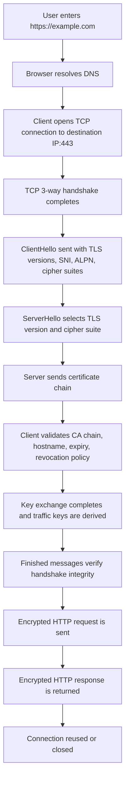
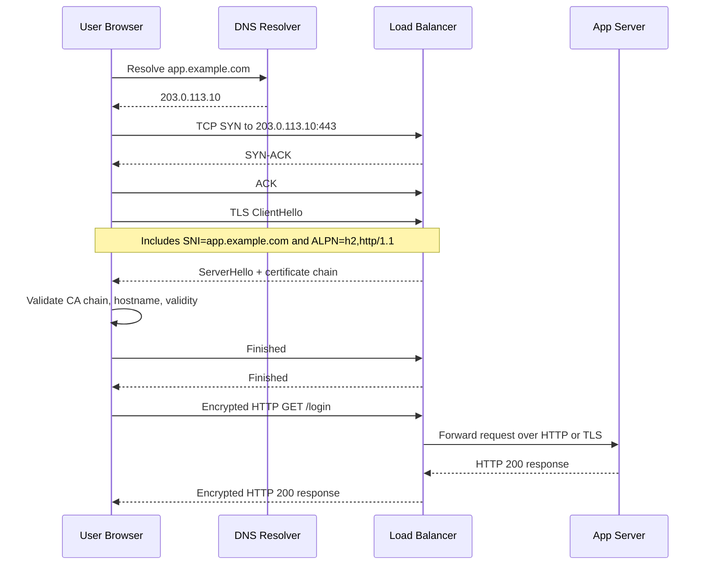
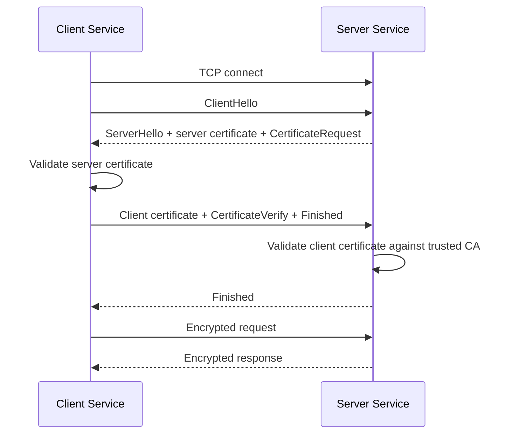
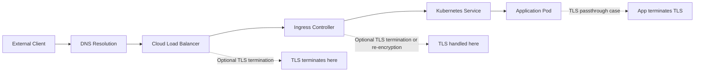

# SSL and TLS Deep Dive

## Overview

SSL and TLS are cryptographic protocols that secure data moving across a network. In practice, people say "SSL" loosely, but modern systems should use **TLS**, not legacy SSL.

At a high level, TLS gives you three properties:

1. **Confidentiality**: traffic is encrypted so intermediaries cannot read it.
2. **Integrity**: packets cannot be modified silently in transit.
3. **Authentication**: the client can verify the server identity, and with mutual TLS the server can verify the client too.

Typical examples:

- `https://example.com` uses HTTP over TLS.
- A database client can use TLS to secure app-to-database traffic.
- A Kubernetes ingress can terminate TLS before forwarding traffic to internal services.
- Service meshes often use mutual TLS between workloads.

---

## 1. SSL vs TLS

### SSL History

**SSL** stands for Secure Sockets Layer.

Versions:

- **SSL 2.0**: obsolete and insecure
- **SSL 3.0**: obsolete and insecure

Major problems in legacy SSL included weak cryptography, poor handshake design, and downgrade vulnerabilities.

### TLS History

**TLS** stands for Transport Layer Security and replaced SSL.

Versions:

- **TLS 1.0**: obsolete for modern production use
- **TLS 1.1**: obsolete for modern production use
- **TLS 1.2**: still widely deployed and acceptable
- **TLS 1.3**: current best practice in most environments

### What changed from SSL to TLS?

- Better cipher negotiation
- Stronger message authentication
- More secure handshake design
- Modern forward secrecy defaults in TLS 1.3
- Fewer legacy options and less downgrade risk

### Practical rule

- Disable SSL entirely
- Disable TLS 1.0 and TLS 1.1 unless you have a hard legacy requirement
- Prefer TLS 1.3 and allow TLS 1.2 for compatibility

---

## 2. Where TLS Sits in the Stack

TLS sits between the application protocol and the transport protocol.

```
Application:   HTTP, SMTP, IMAP, LDAP, MQTT, PostgreSQL
Security:      TLS
Transport:     TCP
Network:       IP
Link:          Ethernet / Wi-Fi / cellular
```

Examples:

- **HTTPS** = HTTP + TLS + TCP + IP
- **SMTPS** = SMTP + TLS + TCP + IP
- **LDAPS** = LDAP + TLS + TCP + IP

TLS normally runs over **TCP** because the handshake and record delivery rely on ordered, reliable transport. The UDP-oriented equivalent is **DTLS**.

---

## 3. Core Building Blocks

TLS is not one algorithm. It combines several cryptographic components.

### Symmetric Encryption

Used after the handshake to encrypt application data efficiently.

Examples:

- AES-128-GCM
- AES-256-GCM
- ChaCha20-Poly1305

Why symmetric crypto is used for bulk data:

- Fast
- Low CPU overhead compared with asymmetric crypto
- Suitable for large traffic volumes

### Asymmetric Cryptography

Used in two distinct roles during the handshake.

**Authentication / Signatures** — prove identity:

- RSA (signing)
- ECDSA
- Ed25519

**Key Exchange** — negotiate a shared secret without transmitting it:

- ECDHE (Elliptic Curve Diffie-Hellman Ephemeral)
- DHE (Diffie-Hellman Ephemeral)

These two roles are negotiated independently in TLS 1.3 and bundled together in TLS 1.2 cipher suite names.

### Hashing and Message Authentication

Used to detect tampering and help derive keys.

Examples:

- SHA-256
- SHA-384
- HMAC in older constructions
- AEAD-integrated integrity in modern cipher suites

### PKI and Certificates

TLS relies heavily on **Public Key Infrastructure (PKI)**.

Important components:

- **Root CA**: trusted anchor
- **Intermediate CA**: signs end-entity certificates
- **Leaf certificate**: presented by the server or client
- **Private key**: kept secret by the owner
- **Public key**: embedded in the certificate

---

## 4. What a Certificate Contains

An X.509 certificate usually includes:

- Subject name
- Subject Alternative Name (SAN)
- Public key
- Issuer
- Valid from / valid to timestamps
- Key usage and extended key usage
- Signature algorithm
- Serial number

### SAN Matters More Than Common Name

Modern clients verify hostnames against the **SAN** extension.

Example:

```text
Subject: CN=example.com
SANs:
	DNS:example.com
	DNS:www.example.com
	DNS:api.example.com
```

If the hostname does not match the SAN, verification fails.

---

## 5. TLS Request Flow: End-to-End View

This is the practical flow when a browser opens `https://example.com`.



---

## 6. Detailed Network Flow

### Step 1: DNS Resolution

The client resolves the server name before the TCP connection starts.

Example:

```bash
dig example.com
```

Possible outcome:

- `A` record for IPv4
- `AAAA` record for IPv6
- CDN edge IPs
- Load balancer VIP

TLS does not replace DNS. DNS happens first unless the client already has the IP cached.

### Step 2: TCP Connection Setup

For HTTPS, the client usually connects to port `443`.

TCP handshake:

```text
Client                           Server
	| ---- SYN ------------------> |
	| <--- SYN-ACK --------------- |
	| ---- ACK ------------------> |
```

Only after TCP is established does the TLS handshake begin.

### Step 3: ClientHello

The client sends a **ClientHello**. This message is critical.

Typical contents:

- Supported TLS versions
- Client random
- Session ID or PSK info
- Cipher suites
- Supported groups such as X25519 or secp256r1
- Signature algorithms
- **SNI**: Server Name Indication
- **ALPN**: Application-Layer Protocol Negotiation

Why SNI matters:

- One IP can host multiple domains
- The server needs to know which certificate to present

Why ALPN matters:

- Negotiates whether the application protocol is HTTP/1.1, HTTP/2, or HTTP/3-related bootstrapping logic

### Step 4: ServerHello and Certificate

The server chooses:

- TLS version
- Cipher suite
- Key share parameters

Then it returns:

- ServerHello
- Certificate chain
- Key exchange data
- Finished after handshake state is established

### Step 5: Certificate Validation on the Client

The client checks:

1. Is the certificate chain signed by a trusted CA?
2. Is the certificate still valid in time?
3. Does the hostname match the SAN?
4. Is the certificate allowed for server authentication?
5. Should revocation data be checked via CRL or OCSP?

If any major check fails, the client warns or blocks the connection.

### Step 6: Key Derivation

The handshake derives shared secrets. Those secrets are expanded into traffic keys.

In TLS 1.3, key scheduling is cleaner and more structured than in TLS 1.2.

### Step 7: Encrypted Application Data

After the handshake:

- HTTP request headers are encrypted
- HTTP body is encrypted
- Cookies, tokens, and API payloads are encrypted in transit

Intermediaries can still see some metadata, depending on architecture:

- Source IP and destination IP
- Destination port
- Packet sizes
- Timing
- In many deployments, SNI unless Encrypted ClientHello is used

---

## 7. Packet-Level Timeline

For a new TLS 1.3 HTTPS connection, a simplified packet timeline looks like this:

```text
1. DNS query/response
2. TCP SYN
3. TCP SYN-ACK
4. TCP ACK
5. TLS ClientHello
6. TLS ServerHello (contains key_share extension) + EncryptedExtensions + Certificate + CertificateVerify + Finished  [server flight]
7. TLS Finished  [client flight]
8. Encrypted HTTP request
9. Encrypted HTTP response
```

### Round-Trip Cost

Very roughly:

- DNS may cost 0 to 1+ RTT
- TCP handshake costs 1 RTT
- TLS 1.2 typically costs more handshake latency than TLS 1.3
- TLS 1.3 reduces latency and supports efficient resumption

This is one reason CDNs and modern edge proxies strongly prefer TLS 1.3.

---

## 8. TLS 1.2 Handshake vs TLS 1.3 Handshake

### TLS 1.2 Simplified Handshake

Shown for an ECDHE or DHE cipher suite (forward-secret path):

```text
→ ClientHello
← ServerHello
← Certificate
← ServerKeyExchange     (only in DHE/ECDHE suites; absent for RSA key exchange)
← ServerHelloDone
→ ClientKeyExchange
→ ChangeCipherSpec
→ Finished
← ChangeCipherSpec
← Finished
```

Characteristics:

- More legacy complexity
- Broader cipher suite combinations
- RSA key exchange mode (no ServerKeyExchange) does not provide forward secrecy
- Higher downgrade and misconfiguration risk compared with TLS 1.3

### TLS 1.3 Simplified Handshake

```text
→ ClientHello  (includes key_share and supported_versions extensions)
← ServerHello  (includes key_share extension; traffic keys derivable from here)
← {EncryptedExtensions}    ← encrypted from this point forward
← {Certificate*}
← {CertificateVerify*}
← {Finished}
→ {Finished}
```

`{…}` denotes messages sent under the derived handshake key — encrypted, unlike TLS 1.2 where Certificate and ServerKeyExchange are sent in plaintext.

Characteristics:

- Forward secrecy by design (ECDHE/DHE key share always used)
- Handshake encryption: server certificate is not visible to passive observers
- 1-RTT to first application data; 0-RTT resumption optionally available
- Removed RSA key exchange, static DH, and all export/weak cipher suites

---

## 9. Forward Secrecy

**Forward secrecy** (also called Perfect Forward Secrecy, PFS) means that if a server's long-term private key is stolen later, previously captured sessions should still remain confidential.

This is achieved by ephemeral Diffie-Hellman key exchange:

- **ECDHE** — Elliptic Curve Diffie-Hellman Ephemeral (preferred; used in TLS 1.3)
- **DHE** — Diffie-Hellman Ephemeral (older; less common but still valid in TLS 1.2)

In both cases, the ephemeral key pair is generated fresh for each session and discarded after use. Compromising the certificate's long-term private key cannot recover past session keys.

Without forward secrecy — for example, TLS 1.2 with RSA key exchange — an attacker who records encrypted traffic today and obtains the private key later can decrypt every past session.

TLS 1.3 mandates ephemeral key exchange for all cipher suites, so forward secrecy is always guaranteed.

---

## 10. Cipher Suites

Cipher suites describe the cryptographic combination used by the connection.

### TLS 1.2 Examples

- `TLS_ECDHE_RSA_WITH_AES_128_GCM_SHA256`
- `TLS_ECDHE_RSA_WITH_AES_256_GCM_SHA384`
- `TLS_ECDHE_ECDSA_WITH_CHACHA20_POLY1305_SHA256`

These names encode multiple pieces:

- Key exchange
- Authentication
- Bulk encryption
- Integrity/hash

### TLS 1.3 Examples

- `TLS_AES_128_GCM_SHA256`
- `TLS_AES_256_GCM_SHA384`
- `TLS_CHACHA20_POLY1305_SHA256`

TLS 1.3 cipher suites are simpler because key exchange and signatures are negotiated separately.

### Which cipher should you prefer?

- AES-GCM is strong and common
- ChaCha20-Poly1305 is often excellent on devices without AES acceleration

---

## 11. Authentication Types

### Server-Authenticated TLS

The standard web model.

- Server proves identity with its certificate
- Client verifies the server
- Client usually does not present its own certificate

Use cases:

- Websites
- APIs
- SaaS applications
- Public endpoints

### Mutual TLS (mTLS)

Both client and server authenticate with certificates.

Use cases:

- Service-to-service traffic
- Zero-trust internal networks
- B2B API integrations
- Kubernetes service mesh
- Financial systems

Benefits:

- Strong machine identity
- Harder credential theft path than shared API keys alone
- Useful for east-west traffic authorization

Tradeoff:

- Certificate issuance, rotation, and revocation become operationally important

---

## 12. Certificate Types and Use Cases

### By Validation Model

#### DV: Domain Validated

- CA verifies control of the domain
- Fast and common
- Standard for most websites

Use cases:

- Public web apps
- Blogs
- APIs
- Internal sites exposed through managed DNS

#### OV: Organization Validated

- CA verifies organization details in addition to domain control
- Higher assurance than DV, though less visible to users than in the past

Use cases:

- Enterprise portals
- Partner-facing applications

#### EV: Extended Validation

- Stronger organizational vetting
- Once emphasized in browsers, now less visually differentiated

Use cases:

- Some regulated industries
- Brand-sensitive public services

### By Scope

#### Single-Domain Certificate

- Covers one FQDN such as `www.example.com`

#### Wildcard Certificate

- Covers `*.example.com`
- Usually does not cover multiple nested levels like `a.b.example.com`

Use cases:

- Large subdomain fleets
- Multi-tenant ingress patterns

Risk:

- One private key may secure many hosts, increasing blast radius if compromised

#### SAN / Multi-Domain Certificate

- Covers multiple names in one certificate

Example:

```text
DNS:example.com
DNS:www.example.com
DNS:api.example.com
DNS:admin.example.net
```

Use cases:

- Shared proxies
- Combined application surfaces

### By Trust Model

#### Public CA Certificate

- Trusted by browsers and public OS trust stores

Use cases:

- Internet-facing websites and APIs

#### Private CA Certificate

- Trusted only by systems that explicitly trust that CA

Use cases:

- Internal services
- Corporate PKI
- mTLS inside a service mesh

#### Self-Signed Certificate

- Certificate signs itself
- No external chain of trust

Use cases:

- Local development
- Labs
- Emergency temporary setups

Risk:

- Poor trust distribution and easy to misuse in production

---

## 13. TLS Deployment Patterns

### End-to-End TLS

Traffic remains encrypted from client to application server.

```text
Client -> TLS -> Load Balancer -> TLS -> App Server
```

Use cases:

- Sensitive workloads
- Regulated environments
- Zero-trust network design

### TLS Termination

TLS is decrypted at a reverse proxy, ingress, or load balancer.

```text
Client -> TLS -> Load Balancer -> HTTP -> Backend
```

Benefits:

- Centralized certificate management
- Offloads crypto from backend apps
- Simpler application configuration

Risk:

- Internal network segment after termination is plaintext unless re-encrypted

### TLS Re-Encryption

TLS is terminated at the edge and then established again to the backend.

```text
Client -> TLS -> Proxy -> TLS -> Backend
```

Use cases:

- Kubernetes ingress to backend services
- Layered trust zones
- Compliance requirements

### TLS Passthrough

The proxy does not decrypt the traffic and forwards it through.

Use cases:

- Backend must handle certificates itself
- Some SNI-based routing cases
- End-to-end client certificate handling

Tradeoff:

- Less L7 visibility for the edge proxy

---

## 14. Protocol Variants and Related Modes

### HTTPS

- HTTP over TLS
- Port `443`

### SMTPS / SMTP with STARTTLS

Email can use TLS in two different patterns:

- **Implicit TLS**: TLS from the first byte
- **STARTTLS**: begin in plaintext, then upgrade to TLS

Relevant ports often include:

- 465 for implicit TLS SMTP submission
- 587 for SMTP submission with STARTTLS

### IMAPS / POP3S / STARTTLS

Mail retrieval protocols also use implicit TLS or upgrade patterns.

### LDAPS and LDAP with STARTTLS

LDAP can run:

- Directly over TLS
- Or upgrade via STARTTLS

### Database TLS

Databases frequently support TLS:

- PostgreSQL
- MySQL
- SQL Server
- MongoDB
- Redis in secured deployments

Use cases:

- App-to-database encryption
- Cross-zone or cross-region database links
- Managed database services

### DTLS

**Datagram TLS** secures UDP-based communication.

Use cases:

- Real-time media
- VoIP
- WebRTC-related scenarios

### QUIC and HTTP/3

HTTP/3 uses QUIC, and QUIC integrates TLS 1.3 concepts into its transport design over UDP.

Important nuance:

- HTTP/3 is not "TLS over TCP"
- It uses QUIC over UDP with TLS 1.3 handshake semantics built in

---

## 15. TLS Extension Types You Should Know

### SNI: Server Name Indication

Lets the client tell the server which hostname it wants before the certificate is sent.

Use case:

- Multiple domains on one IP address

### ALPN: Application-Layer Protocol Negotiation

Lets client and server agree on the application protocol.

Common values over TCP-based TLS:

- `http/1.1`
- `h2`

Note: `h3` is an ALPN token used inside QUIC's TLS 1.3 negotiation, not in standard TCP+TLS connections. HTTP/3 runs over QUIC (UDP), so `h3` will not appear in a regular TLS handshake over TCP.

### OCSP Stapling

Allows the server to send certificate revocation status information.

Benefits:

- Reduces client-side OCSP lookup latency
- Improves privacy compared with direct client revocation checks

### Session Tickets / PSK

Used for session resumption.

Benefits:

- Lower latency
- Reduced CPU usage

---

## 16. Types of Keys Involved

### Long-Term Private Key

- Belongs to the server certificate
- Used for proving identity, not bulk encryption

### Ephemeral Session Keys

- Derived during each handshake
- Used to encrypt the actual data stream

### Why This Distinction Matters

When forward secrecy is used (ECDHE or DHE key exchange), compromise of the long-term certificate private key does **not** reveal past session keys, because those keys were derived from discarded ephemeral values.

When forward secrecy is **not** used — such as TLS 1.2 with RSA key exchange — the session key is encrypted under the server's long-term public key. Anyone who later obtains the private key can decrypt all previously recorded sessions.

TLS 1.3 removes RSA key exchange entirely, so all TLS 1.3 sessions have this protection by design.

---

## 17. What TLS Protects and What It Does Not

### Protected

- HTTP paths and bodies after the handshake
- Cookies and bearer tokens in transit
- API payloads
- Most headers after encryption begins

### Not Fully Hidden

- Source IP and destination IP
- Port number
- Packet timing
- Traffic volume
- TLS fingerprint patterns
- Often SNI in standard deployments

TLS is a transport security protocol, not a full anonymity system.

---

## 18. Common Use Cases

### Public Websites

- HTTPS for browser traffic
- Protects sessions, credentials, forms, APIs

### Public APIs

- Mobile apps and partner integrations typically require TLS
- Prevents interception and tampering in transit

### Internal Service-to-Service Traffic

- mTLS for east-west traffic
- Common in Kubernetes service meshes like Istio or Linkerd

### Load Balancers and Ingress Controllers

- Terminate or pass through TLS
- Centralize certificate lifecycle management

### VPN Alternatives in Zero-Trust Systems

- Strong service identity with mTLS can reduce reliance on flat trusted networks

### Database Security

- Encrypts credentials and query data between application and database

### Messaging and Event Systems

- Kafka, RabbitMQ, and similar systems often support TLS and mTLS

---

## 19. Deep Dive: Example HTTPS Request Flow

Assume a browser calls:

```text
GET /login HTTP/1.1
Host: app.example.com
```

### Full Flow



### Network Details in This Flow

- Destination IP may belong to a CDN or load balancer, not the app server itself
- The certificate usually belongs to the public hostname, not the backend node
- If HTTP/2 is negotiated via ALPN, multiple requests can share one TCP/TLS connection
- The backend may receive plain HTTP, re-encrypted HTTPS, or pass-through TLS depending on architecture

---

## 20. Example: Mutual TLS Flow

This is common in internal APIs.



Important operational pieces:

- Both sides need trusted CA roots
- Certificates need correct key usage fields
- Rotation must be automated for scale

---

## 21. Certificate Lifecycle

### Issuance

- Generate private key
- Create CSR (Certificate Signing Request)
- Submit to CA
- Receive signed certificate chain

### Installation

- Install certificate and private key on the server
- Install intermediate chain if needed
- Configure the application or proxy

### Rotation

- Replace before expiry
- Prefer automation such as ACME

### Revocation

Main mechanisms:

- CRL: Certificate Revocation List
- OCSP: Online Certificate Status Protocol

Practical note:

Revocation checking on the public internet is imperfect, so short-lived certs are often preferred operationally.

---

## 22. TLS in Kubernetes and Cloud Environments

### Kubernetes TLS Architecture Flow

This is the common north-south traffic path when TLS is handled through a cloud load balancer and ingress.



### What Each Hop Does

- **Load Balancer**: exposes the public IP or hostname and may terminate TLS before forwarding traffic to the cluster
- **Ingress Controller**: routes traffic based on host and path, and may terminate TLS, pass it through, or re-encrypt to the backend
- **Service**: provides stable service discovery and load-balances traffic to pods
- **Pod**: runs the actual application and may receive HTTP, HTTPS, or raw passthrough TLS depending on the design

### Ingress TLS Termination

Common pattern:

```text
Internet Client -> Cloud Load Balancer -> Ingress Controller -> Service -> Pod
```

Possible TLS models:

- Terminate at cloud load balancer
- Terminate at ingress controller
- Pass through to app pod
- Re-encrypt from ingress to backend

### Service Mesh mTLS

Pattern:

```text
Pod A sidecar -> mTLS -> Pod B sidecar
```

Benefits:

- Automatic workload identity
- Encrypted east-west traffic
- Policy enforcement by identity

Challenges:

- Certificate rotation complexity
- Debugging handshake failures
- Overhead from proxy layers

### Troubleshooting: Kubernetes Ingress and Service Mesh

This section focuses only on TLS failures in Kubernetes ingress paths and service mesh east-west traffic.

### A. Ingress Troubleshooting Model

Always identify **where TLS actually terminates** before debugging anything else.

Common possibilities:

- Cloud load balancer terminates TLS
- Ingress controller terminates TLS
- Ingress does TLS passthrough to the application
- Ingress terminates and re-encrypts to the backend

If you debug the wrong hop, the symptoms look misleading.

Example path:

```text
Client -> Cloud LB -> Ingress Controller -> Service -> Pod
```

Questions to answer first:

1. Is the certificate presented by the cloud load balancer or by the ingress controller?
2. Is backend traffic HTTP, HTTPS, or raw TLS passthrough?
3. Is hostname routing done at the load balancer, ingress, or the app itself?

### B. Typical Ingress TLS Failure Points

#### 1. Wrong TLS Secret

Symptoms:

- Browser shows unexpected certificate
- Hostname mismatch error
- One host works while another on the same ingress fails

Common causes:

- Wrong secret name in ingress config
- Secret exists in the wrong namespace
- Secret contains certificate for a different hostname
- Wildcard certificate does not match the requested subdomain depth

Checks:

```bash
kubectl get ingress -A
kubectl describe ingress <ingress-name> -n <namespace>
kubectl get secret <tls-secret> -n <namespace> -o yaml
```

#### 2. Certificate Not Rotated or Not Reloaded

Symptoms:

- Secret shows a fresh cert but clients still see an old cert
- Expired cert continues to be served after renewal

Common causes:

- Ingress controller has not reloaded
- cert-manager updated the secret but the controller cache is stale
- External load balancer still uses an older certificate attachment

Checks:

- Compare the certificate served on port `443` with the certificate stored in the Kubernetes secret
- Inspect ingress controller logs for reload events
- Verify whether TLS is terminated before traffic reaches the ingress controller

#### 3. Hostname and SNI Mismatch

Symptoms:

- TLS handshake succeeds for one host but fails for another
- Default certificate is served instead of the expected one

Common causes:

- Client did not send correct SNI
- Ingress host rule does not match the requested hostname
- Certificate SANs do not include the requested DNS name

Checks:

```bash
openssl s_client -connect app.example.com:443 -servername app.example.com
curl -Iv --resolve app.example.com:443:203.0.113.10 https://app.example.com
```

#### 4. TLS Termination vs Re-Encryption Confusion

Symptoms:

- External HTTPS works, but ingress returns `502` or `503`
- Ingress logs show upstream handshake errors

Common causes:

- Ingress expects HTTP backend but service speaks HTTPS
- Ingress expects HTTPS backend but pod serves plain HTTP
- Backend certificate validation fails during re-encryption

Checks:

- Verify ingress annotations or gateway configuration for backend protocol
- Test the service directly from inside the cluster
- Confirm whether the backend certificate CA is trusted by the ingress controller

Example internal checks:

```bash
kubectl run tls-debug --rm -it --image=curlimages/curl -- sh
curl -Iv http://service-name.namespace.svc.cluster.local:8080
curl -Iv https://service-name.namespace.svc.cluster.local:8443
```

#### 5. TLS Passthrough Misconfiguration

Symptoms:

- Ingress routes traffic, but L7 rules do not behave as expected
- Client cert authentication fails unexpectedly
- Backend app never receives the expected SNI or TLS session

Common causes:

- Ingress configured for HTTP termination while app expects passthrough
- Controller does not support the passthrough mode being assumed
- Mixed L7 path routing expectations on a pure passthrough listener

Operational rule:

If TLS passthrough is enabled, many HTTP-layer ingress features stop applying because the proxy is no longer decrypting the traffic.

### C. cert-manager and Secret-Specific Checks

If cert-manager is involved, verify the full issuance chain:

```bash
kubectl get certificate -A
kubectl describe certificate <name> -n <namespace>
kubectl get certificaterequest -A
kubectl get order -A
kubectl get challenge -A
```

Look for:

- Pending ACME challenge failures
- Secret not created
- Secret created in the wrong namespace
- Certificate resource ready but ingress still referencing a different secret

#### cert-manager Deep Dive: ACME HTTP-01 and DNS-01 Failure Patterns

cert-manager usually automates certificate issuance, but most failures cluster around challenge validation, DNS, and ingress routing.

##### HTTP-01 Flow

HTTP-01 proves domain ownership by making the ACME server fetch a challenge file over HTTP.

```text
ACME CA -> http://example.com/.well-known/acme-challenge/<token>
```

Typical path:

```text
ACME Server -> Public DNS -> Load Balancer -> Ingress -> Solver Pod/Service
```

Common HTTP-01 failure patterns:

- Ingress does not route `/.well-known/acme-challenge/` to the solver service
- Global HTTP to HTTPS redirect breaks challenge handling
- Wrong ingress class means the solver ingress is ignored
- Public DNS still points to an old load balancer IP
- Firewall or security group blocks inbound port `80`
- Another ingress rule shadows the solver path
- CDN or WAF caches or rewrites the challenge response

HTTP-01 symptoms:

- Certificate stays in `Pending`
- `Challenge` resources show self-check or propagation failures
- ACME server returns `404`, `301`, `302`, or timeout errors

HTTP-01 checks:

```bash
kubectl get challenge -A
kubectl describe challenge <name> -n <namespace>
kubectl get ingress -A
kubectl describe ingress <solver-ingress> -n <namespace>
curl -I http://example.com/.well-known/acme-challenge/test
```

What to verify:

- The public hostname resolves to the active ingress or load balancer
- Port `80` is reachable from the internet
- The solver ingress uses the correct ingress class
- Redirect logic excludes the ACME challenge path when necessary
- The solver pod and service exist and are healthy

##### DNS-01 Flow

DNS-01 proves domain ownership by creating a TXT record under `_acme-challenge`.

```text
_acme-challenge.example.com TXT "token-value"
```

Typical path:

```text
cert-manager -> DNS provider API -> authoritative DNS -> ACME CA lookup
```

Common DNS-01 failure patterns:

- Wrong DNS provider credentials or permissions
- TXT record created in the wrong hosted zone
- Slow DNS propagation or long TTL delays validation
- Split-horizon DNS causes internal and external views to differ
- Existing TXT records conflict with challenge handling
- Delegated `_acme-challenge` subdomain is misconfigured

DNS-01 symptoms:

- Challenge remains pending even though cert-manager attempted record creation
- ACME server reports NXDOMAIN or missing TXT records
- Manual DNS lookup shows different answers from expected authoritative servers

DNS-01 checks:

```bash
kubectl get challenge -A
kubectl describe challenge <name> -n <namespace>
dig TXT _acme-challenge.example.com
dig TXT _acme-challenge.example.com @<authoritative-dns-server>
```

What to verify:

- The TXT record appears on authoritative name servers, not just recursive caches
- cert-manager has permission to write to the correct DNS zone
- `_acme-challenge` delegation is correct if using a delegated zone
- There is no mismatch between the requested hostname and the zone being updated

##### Practical Rule for Choosing HTTP-01 vs DNS-01

- Use **HTTP-01** when the domain already routes to a reachable ingress and you control port `80`
- Use **DNS-01** when issuing wildcard certificates, dealing with multiple ingress layers, or when HTTP routing is unreliable

##### Fast cert-manager Triage Order

1. Check `Certificate`, `CertificateRequest`, `Order`, and `Challenge` resources.
2. Decide whether the failure is HTTP reachability, DNS propagation, or credentials.
3. Confirm the solver resource matches the intended ingress class or DNS zone.
4. Validate from outside the cluster using `curl` or `dig` against authoritative servers.
5. Only after challenge success, debug secret injection and ingress reload behavior.

### D. Service Mesh mTLS Troubleshooting Model

In service meshes, TLS problems are often **identity or policy problems**, not just certificate file problems.

Typical path:

```text
App A -> Sidecar A -> mTLS -> Sidecar B -> App B
```

Important distinction:

- Application may be speaking plain HTTP to its local sidecar
- Sidecars establish mTLS between workloads
- A failed call may therefore come from mesh policy, identity mismatch, or sidecar health rather than app TLS code

### E. Typical Service Mesh Failure Points

#### 1. Sidecar Missing or Not Injected

Symptoms:

- One workload can call others, another cannot
- Mesh policy expects mTLS but one pod sends plain traffic

Checks:

```bash
kubectl get pod <pod-name> -n <namespace> -o yaml
kubectl describe pod <pod-name> -n <namespace>
```

Look for:

- Sidecar container missing
- Injection label absent or incorrect
- Init container or iptables redirect setup missing

#### 2. Identity or SPIFFE Mismatch

Symptoms:

- Handshake fails even though certificates exist
- Authorization policies deny traffic after connection attempts

Common causes:

- Workload identity does not match expected namespace or service account
- PeerAuthentication or AuthorizationPolicy expects a different principal
- Service account changed but policy did not

What to verify:

- Source workload namespace
- Source service account
- Destination expected principal
- Mesh-issued certificate identity format

#### 3. Strict mTLS with Non-Mesh Clients

Symptoms:

- Calls from jobs, debug pods, or external clients fail
- In-mesh calls work, ad hoc curl tests fail

Common cause:

- Destination enforces strict mTLS and rejects plaintext or non-mesh traffic

This is common when debugging from a temporary pod that has no sidecar.

#### 4. Certificate Rotation or Trust Bundle Drift

Symptoms:

- Traffic worked earlier and suddenly started failing cluster-wide or namespace-wide
- Sidecar logs show trust or certificate verification errors

Common causes:

- Mesh CA rotated
- Trust bundle not propagated cleanly
- Nodes or sidecars have stale xDS or SDS state

Checks:

- Inspect control plane and sidecar logs
- Compare cert validity windows on affected workloads
- Look for synchronization issues after control plane restart or upgrade

#### 5. Policy Layer Blocking Traffic

Symptoms:

- Looks like a TLS problem from the app side
- Mesh returns reset, denied, or handshake-style errors

Common causes:

- PeerAuthentication mode mismatch
- DestinationRule TLS mode mismatch
- AuthorizationPolicy denies the identity after successful transport setup

Practical rule:

In a service mesh, transport security and authorization are tightly coupled. A failure can look cryptographic even when it is actually policy enforcement.

### F. Kubernetes-Focused Troubleshooting Sequence

Use this order for ingress and mesh issues:

1. Identify the TLS termination point or mTLS boundary.
2. Verify DNS and external routing point to the expected load balancer or ingress.
3. Inspect the served certificate with `openssl s_client`.
4. Confirm ingress host rules, secret names, and namespaces.
5. Verify whether backend traffic is HTTP, HTTPS, re-encrypted TLS, or passthrough.
6. Test the backend service directly from inside the cluster.
7. If a mesh is involved, confirm sidecar injection and workload identity.
8. Check mesh policy objects for strict mTLS or principal mismatches.
9. Inspect ingress-controller, sidecar, and control-plane logs.
10. Only after these checks, treat it as a generic TLS problem.

### G. High-Value Commands for Kubernetes TLS Debugging

```bash
kubectl get ingress -A
kubectl describe ingress <ingress-name> -n <namespace>
kubectl get secret <tls-secret> -n <namespace> -o yaml
kubectl logs deployment/<ingress-controller> -n <ingress-namespace>
openssl s_client -connect app.example.com:443 -servername app.example.com
kubectl run tls-debug --rm -it --image=curlimages/curl -- sh
curl -Iv https://service-name.namespace.svc.cluster.local:8443
kubectl logs <pod-name> -n <namespace> -c <sidecar-container>
```

### H. Fast Mental Model

For ingress problems, ask:

- Which component is presenting the certificate?
- Which component is decrypting the traffic?
- Which protocol is used between ingress and backend?

For service mesh problems, ask:

- Does the workload have a sidecar?
- What identity does the mesh think this workload has?
- Is the failure transport-level, trust-level, or policy-level?

---

## 23. Common Misconfigurations

### Using Old Protocols

- SSL 3.0, TLS 1.0, TLS 1.1 should generally be disabled

### Weak Ciphers

- Avoid RC4, 3DES, export ciphers, NULL ciphers, MD5-based legacy constructions

### Hostname Mismatch

- Certificate for `api.example.com` will fail for `www.example.com` unless SAN includes both

### Missing Intermediate Certificates

- Browser or client may fail to build a trusted chain

### Expired Certificates

- Causes immediate trust failures

### Poor Private Key Handling

- Storing private keys in repos or images is a severe operational error

### TLS Termination Without Internal Protection

- Edge traffic may be secure while backend traffic is plaintext

### Blindly Trusting Self-Signed Certs

- Common in dev, dangerous if normalized in production pipelines

---

## 24. Attack Classes and Risks

### Man-in-the-Middle (MITM)

TLS mitigates MITM by authenticating the endpoint and protecting integrity.

### Downgrade Attacks

Attackers try to force weaker protocols or ciphers.

Mitigations:

- Disable old protocol versions
- Prefer strong server configuration

### Certificate Theft

If the private key is stolen, the attacker can impersonate the server until the certificate is revoked or expires.

Mitigations:

- Hardware security modules where appropriate
- Secure secrets management
- Short-lived certificates

### Replay and Resumption Abuse

Mostly handled by protocol design and server-side controls, but architecture still matters.

### TLS Inspection Proxies

Some enterprises terminate TLS in inspection devices. This changes the trust model completely.

---

## 25. Performance Considerations

### Handshake Cost

TLS handshakes consume:

- CPU
- Latency
- Certificate validation work

### Session Resumption

Reduces full handshake overhead for repeat connections.

### HTTP/2 and Connection Reuse

One TLS connection can serve many multiplexed requests, reducing repeated handshake cost.

### Hardware and Cipher Choice

- AES-GCM performs very well on CPUs with AES acceleration
- ChaCha20-Poly1305 performs well on many mobile and low-power systems

---

## 26. Practical Examples

### Example 1: Inspect a Remote Certificate

```bash
openssl s_client -connect example.com:443 -servername example.com
```

What this shows:

- Certificate chain
- Selected protocol
- Selected cipher
- Verification result

### Example 2: Print Certificate Details

```bash
openssl x509 -in server.crt -text -noout
```

### Example 3: Test HTTPS Response Headers

```bash
curl -Iv https://example.com
```

This helps inspect:

- TLS version
- ALPN negotiation
- certificate subject info
- HTTP response headers

### Example 4: Generate a Self-Signed Certificate for Local Testing

```bash
openssl req -x509 -newkey rsa:2048 -keyout key.pem -out cert.pem -days 365 -nodes
```

Use only for:

- local development
- quick lab setups

### Example 5: NGINX TLS Configuration

```nginx
server {
		listen 443 ssl http2;
		server_name app.example.com;

		ssl_certificate     /etc/nginx/tls/fullchain.pem;
		ssl_certificate_key /etc/nginx/tls/privkey.pem;
		ssl_protocols       TLSv1.2 TLSv1.3;
		ssl_ciphers         HIGH:!aNULL:!MD5;

		location / {
				proxy_pass http://app_backend;
		}
}
```

### Example 6: Mutual TLS with curl

```bash
curl \
	--cert client.crt \
	--key client.key \
	--cacert ca.crt \
	https://internal-api.example.local
```

---

## 27. Troubleshooting Checklist

When a TLS connection fails, check these in order:

1. DNS resolution
2. Port reachability on `443` or the expected service port
3. TCP handshake success
4. Server certificate hostname match
5. Certificate chain completeness
6. Expiry dates
7. CA trust on the client
8. Protocol version compatibility
9. Cipher suite compatibility
10. SNI correctness
11. ALPN mismatch for higher-level protocol issues
12. mTLS client certificate trust and usage fields

Useful commands:

```bash
dig app.example.com
nc -vz app.example.com 443
openssl s_client -connect app.example.com:443 -servername app.example.com
curl -Iv https://app.example.com
```

---

## 28. Interview-Style Summary of Important Types

If someone asks for the "types" of SSL/TLS-related things, the answer is usually spread across several categories.

### Protocol Types

- SSL 2.0
- SSL 3.0
- TLS 1.0
- TLS 1.1
- TLS 1.2
- TLS 1.3
- DTLS

### Authentication Types

- Server-authenticated TLS
- Mutual TLS

### Certificate Types

- DV
- OV
- EV
- Single-domain
- Wildcard
- SAN / multi-domain
- Public CA
- Private CA
- Self-signed

### Deployment Types

- End-to-end TLS
- TLS termination
- TLS re-encryption
- TLS passthrough

### Handshake/Session Types

- Full handshake
- Session resumption
- PSK-based resumption
- 0-RTT in supported TLS 1.3 scenarios

---

## 29. Best Practices

1. Use TLS 1.3 where possible and TLS 1.2 for compatibility.
2. Disable SSL, TLS 1.0, and TLS 1.1.
3. Use strong certificates and secure key storage.
4. Prefer forward secrecy.
5. Automate certificate issuance and rotation.
6. Use mTLS for sensitive internal service-to-service communication.
7. Validate certificate chains and hostnames strictly.
8. Monitor expiry dates proactively.
9. Protect internal traffic after edge termination if the network is not fully trusted.
10. Test with `openssl` and `curl`, not assumptions.

---

## 30. Short Mental Model

You can think of TLS like this:

- TCP builds a reliable pipe.
- TLS authenticates the far end and turns that pipe into a secure encrypted channel.
- HTTP, database queries, API calls, and service messages then travel inside that secure channel.

Or even shorter:

```text
DNS finds the target.
TCP opens the path.
TLS proves identity and derives keys.
Application data flows encrypted.
```

---

## 31. Final Takeaway

SSL is legacy history. TLS is the modern standard for transport security.

To understand TLS deeply, you need to see it from four angles at once:

- **Protocol angle**: handshake, versions, cipher suites
- **PKI angle**: certificates, trust chains, hostname validation
- **Network angle**: DNS, TCP, RTT, SNI, ALPN, packet flow
- **Architecture angle**: termination, passthrough, re-encryption, mTLS, service meshes

Once these four pieces connect, most real-world TLS designs become much easier to reason about.
