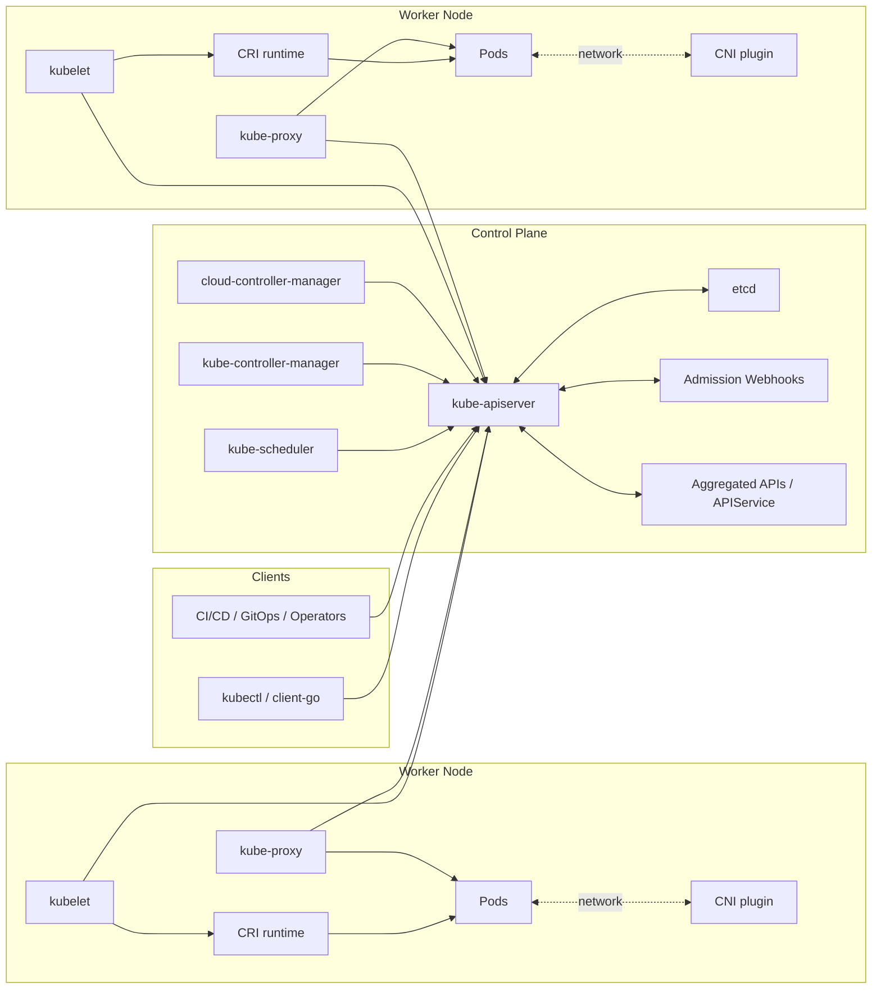
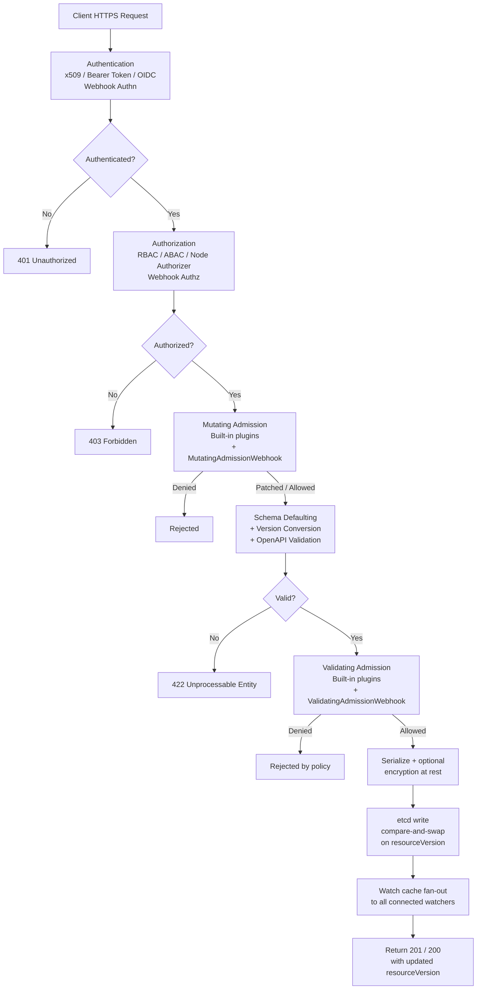
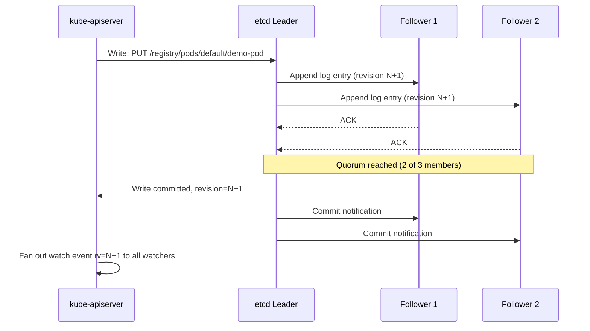
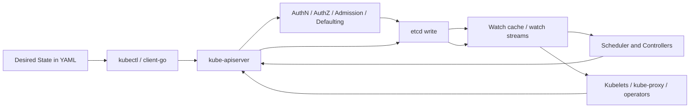
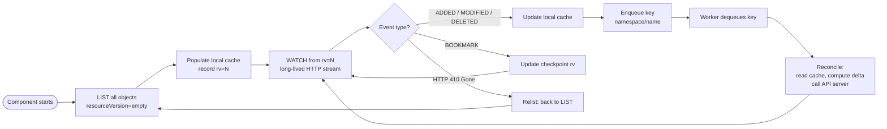
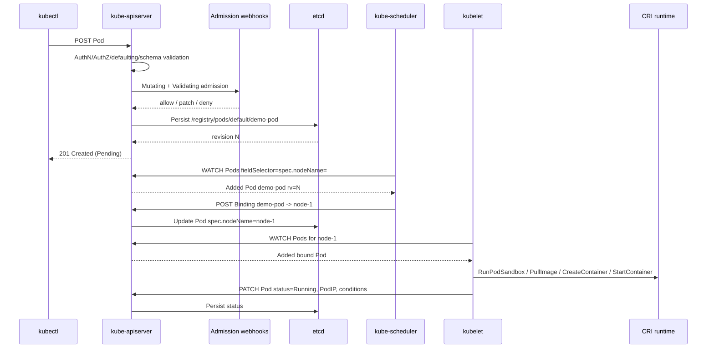
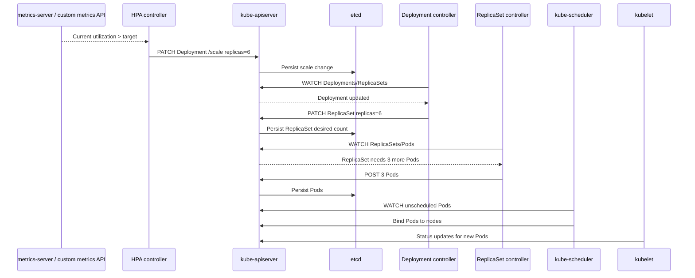
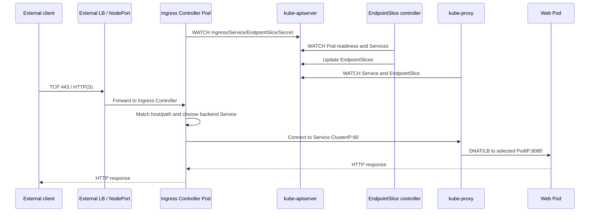
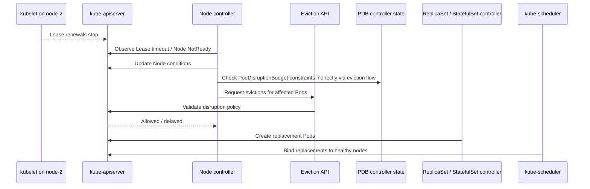

# Kubernetes Architecture (v1.32+)

Kubernetes is a distributed control system. Its architecture is built around a single source of truth, an API-driven control plane, and a set of independent controllers and node agents that continuously reconcile actual cluster state toward declared intent.

At a high level:

- The user declares desired state through the Kubernetes API.
- `kube-apiserver` validates, mutates, authorizes, and persists that state.
- `etcd` stores cluster objects durably and orders all writes.
- Controllers and schedulers watch for changes, compute the next action, and write updates back through the API.
- Node agents such as `kubelet` and `kube-proxy` realize those changes on machines.

## Architecture Overview



## Component Comparison

| Component | Plane | Core role | Talks to | Writes to etcd directly? | HA pattern |
| --- | --- | --- | --- | --- | --- |
| `kube-apiserver` | Control plane | Front door and policy enforcement point | clients, controllers, kubelets, etcd, webhooks | Yes, on behalf of all clients | Active-active behind LB |
| `etcd` | Control plane | Durable strongly consistent key-value store | apiserver peers, etcd peers | N/A | Odd-number RAFT cluster |
| `kube-scheduler` | Control plane | Assigns unscheduled Pods to Nodes | apiserver | No | Leader election |
| `kube-controller-manager` | Control plane | Runs built-in reconciliation loops | apiserver | No | Leader election |
| `cloud-controller-manager` | Control plane | Reconciles cloud resources and node metadata | apiserver, cloud APIs | No | Leader election |
| `kubelet` | Node | Makes Pods run on a specific node | apiserver, CRI, CNI, CSI | No | One per node |
| `kube-proxy` | Node | Programs service virtual IP forwarding | apiserver, kernel dataplane | No | One per node |
| CRI runtime | Node | Pulls images and runs containers | kubelet, OCI runtime | No | Runtime-specific |

## 1. Core Components Deep Dive

### Control Plane Components

#### `kube-apiserver`

**Responsibility:** The authoritative API endpoint that validates, persists, exposes, and arbitrates all cluster state transitions.

**What it does**

- Serves the Kubernetes REST API over HTTPS.
- Performs authentication, authorization, admission control, schema validation, defaulting, and field management.
- Converts between API versions and internal types.
- Persists objects in `etcd`.
- Maintains watch streams for controllers, kubelets, and clients.
- Exposes subresources such as `/status`, `/scale`, `/binding`, `/eviction`, `/exec`, `/log`, and `/portforward`.
- Hosts the API aggregation layer so extension API servers can appear under the same API surface.

**How it works**

1. A client sends an HTTPS request, typically HTTP/2 for reused connections.
2. The request passes through authentication modules such as x509 client certs, bearer tokens, OIDC, service account tokens, or webhook authn.
3. Authorization evaluates RBAC, ABAC, Node authorizer, or webhook authz.
4. Admission executes in two phases:
	 - Mutating chain: built-in plugins and `MutatingAdmissionWebhook`
	 - Validating chain: built-in plugins and `ValidatingAdmissionWebhook`
5. The API server defaults missing fields, validates against the OpenAPI schema, and converts the external version to the internal version.
6. Storage layer code maps the object to an etcd path such as `/registry/pods/default/my-pod`.
7. The API server writes through its storage backend to etcd, then returns the persisted object with `metadata.resourceVersion`.
8. Watch cache and storage watchers fan out change notifications to connected watchers.




Important internal behaviors:

- **Watch cache:** The API server usually serves list and watch from an in-memory watch cache to reduce direct etcd pressure.
- **ResourceVersion semantics:** Clients use `resourceVersion` to request monotonic progress through object history.
- **Server-side apply:** The field manager tracks ownership in `managedFields` and merges intent per field.
- **Priority and fairness:** API Priority and Fairness prevents noisy clients from starving system traffic.
- **Storage transformers:** Secret data can be encrypted at rest before persistence.

**Key APIs/CRDs it manages**

- Core resources: `Pod`, `Service`, `Node`, `ConfigMap`, `Secret`, `Namespace`, `Event`
- Workloads: `Deployment`, `ReplicaSet`, `StatefulSet`, `DaemonSet`, `Job`, `CronJob`
- Policy and coordination: `Lease`, `PodDisruptionBudget`, `NetworkPolicy`, `PriorityClass`
- Extension plumbing: `CustomResourceDefinition`, `APIService`, admission registration resources

Examples:

- `GET /api/v1/pods`
- `POST /apis/apps/v1/namespaces/default/deployments`
- `GET /apis/coordination.k8s.io/v1/namespaces/kube-node-lease/leases`

**Failure modes and HA**

- If one API server instance fails, others continue serving behind a load balancer.
- API server unavailability blocks all writes and eventually degrades controllers and kubelets because watches and heartbeats fail.
- Admission webhook latency or failure can stall object creation.
- Watch cache staleness does not violate correctness, but it can increase latency or force relists.
- HA pattern is active-active stateless API servers with shared access to the same etcd cluster and identical cert/key trust roots.

#### `etcd`

**Responsibility:** The linearizable persistence layer that stores the entire cluster state and serializes all durable control-plane writes.

**What it does**

- Stores Kubernetes objects as key-value entries.
- Replicates state across peers using the RAFT consensus algorithm.
- Provides linearizable reads and serialized writes when requested.
- Maintains a revision counter used by watches and `resourceVersion` mapping.
- Supports watches so the API server can stream changes.
- Performs snapshots and log compaction to control disk usage.

**How it works**

- Kubernetes stores objects under prefixes such as:

```text
/registry/pods/default/my-pod
/registry/deployments/default/web
/registry/services/specs/default/api
/registry/leases/kube-node-lease/node-1
```

- Each change increments the global etcd revision.
- RAFT elects a leader; followers replicate the leader's append-only log.
- A write is committed once a majority quorum persists the entry.
- The API server uses etcd transactions and compare-and-swap semantics to avoid lost updates.
- Compaction discards old history before a chosen revision. Watches that fall behind compaction must relist.

Consistency model details:

- **Writes:** Strongly ordered through the RAFT leader.
- **Linearizable reads:** Fresh but more expensive.
- **Serializable reads:** Potentially served from follower state, lower cost but weaker freshness guarantees.
- Kubernetes relies on the API server to mediate semantics, not direct component access to etcd.



**Key APIs/CRDs it manages**

etcd does not understand Kubernetes kinds semantically; it stores serialized API objects under keys managed by the API server.

**Failure modes and HA**

- Loss of quorum makes durable writes impossible.
- High fsync latency directly increases API write latency.
- Compaction that is too aggressive causes watcher `410 Gone` errors and frequent relists.
- Corruption or split-brain prevention requires careful peer management and snapshot restore discipline.
- HA requires an odd-sized cluster, commonly 3 or 5 members, spread across failure domains.

#### `kube-scheduler`

**Responsibility:** Selects the best node for each unscheduled Pod.

**What it does**

- Watches for Pods with empty `.spec.nodeName`.
- Filters nodes that cannot run the Pod.
- Scores feasible nodes using plugin-based algorithms.
- Optionally reserves resources and performs preemption if enabled.
- Binds the Pod to a node by writing a `Binding` or patching `.spec.nodeName` via the API.

**How it works**

Modern scheduler flow is plugin-based and split into extension points:

1. **Queueing:** The scheduling queue receives pending Pods from informers.
2. **PreFilter:** Precomputes Pod data such as requested resources.
3. **Filter:** Rejects nodes that violate hard constraints.
4. **PostFilter:** Attempts preemption if no nodes are feasible.
5. **PreScore / Score:** Calculates node scores.
6. **NormalizeScore:** Adjusts plugin score ranges.
7. **Reserve / Permit:** Temporarily reserves state and optionally waits for approval.
8. **PreBind / Bind / PostBind:** Final API binding and bookkeeping.

Typical filter checks:

- Node readiness and schedulability
- Taints and tolerations
- Node affinity and selector match
- Resource fit for CPU, memory, ephemeral storage, hugepages, extended resources
- Volume binding constraints
- Inter-pod affinity / anti-affinity
- Topology spread constraints
- Port conflicts

Typical scoring plugins:

- `NodeResourcesFit` and `NodeResourcesBalancedAllocation`
- `ImageLocality`
- `InterPodAffinity`
- `PodTopologySpread`
- `TaintToleration`
- `NodeAffinity`

**Key APIs/CRDs it manages**

- Reads: `Pod`, `Node`, `PersistentVolumeClaim`, `PersistentVolume`, `CSINode`, `StorageClass`, `PriorityClass`
- Writes: `Binding`, `Event`, Pod `.spec.nodeName`

Example bind path:

```text
POST /api/v1/namespaces/default/pods/my-pod/binding
```

**Failure modes and HA**

- If the active scheduler fails, unscheduled Pods remain pending until another scheduler leader takes over.
- Misconfigured plugin weights can produce poor placement or hotspotting.
- Stale informer caches can delay but not permanently break scheduling.
- HA uses leader election with `Lease` objects in `kube-system`.

#### `kube-controller-manager`

**Responsibility:** Runs the built-in controllers that continuously reconcile Kubernetes objects toward desired state.

**What it does**

- Hosts dozens of controllers in one process.
- Common controllers include:
	- Deployment controller
	- ReplicaSet controller
	- StatefulSet controller
	- DaemonSet controller
	- Job and CronJob controllers
	- Node controller
	- EndpointSlice controller
	- ServiceAccount token controller
	- Namespace controller
	- PV/PVC binder and attach-detach controller
	- Resource quota and garbage collector

**How it works**

- Each controller uses shared informers, a local cache, and a rate-limited workqueue.
- A reflector performs an initial `LIST`, then a long-lived `WATCH`.
- On object add, update, or delete, the controller enqueues a key, usually `namespace/name`.
- Worker threads pop keys, compare desired vs observed state, and perform idempotent API operations.
- Retries are rate-limited with exponential backoff.

Example: Deployment reconciliation

1. Watch Deployment changes.
2. Compute target ReplicaSet template hash.
3. Create or scale ReplicaSets.
4. Update rollout status conditions.
5. Coordinate max surge and max unavailable during rolling update.

**Key APIs/CRDs it manages**

- `Deployment`, `ReplicaSet`, `Pod`, `Node`, `EndpointSlice`, `PersistentVolumeClaim`, `ServiceAccount`, `Namespace`, `Lease`, `Event`, `Job`
- Writes status subresources and conditions extensively.

**Failure modes and HA**

- If the controller manager is down, desired state stops converging, but existing Pods may continue running.
- Workqueue buildup increases reconciliation latency.
- Bad watch recovery after compaction causes relist storms.
- HA uses leader election; only the leader actively reconciles most controllers.

#### `cloud-controller-manager`

**Responsibility:** Decouples cloud provider integration from core Kubernetes binaries and reconciles cloud-backed infrastructure state.

**What it does**

- Populates node addresses and cloud metadata.
- Manages external load balancers for `Service` objects of type `LoadBalancer`.
- Manages routes in cloud networking implementations that require them.
- Handles volume-related interactions when implemented in-tree or bridging to CSI-era workflows.

**How it works**

- Watches Nodes and Services through the API server.
- Calls cloud provider APIs such as AWS ELB/NLB, GCP forwarding rules, Azure Load Balancer, or route tables.
- Reconciles annotations, service status, node conditions, and external IPs.
- Often cooperates with CSI and external cloud-provider components rather than owning every storage function directly.

**Key APIs/CRDs it manages**

- `Node`
- `Service`
- Provider-specific annotations on services and nodes

**Failure modes and HA**

- Cloud API throttling delays load balancer provisioning.
- Incorrect cloud node identity breaks route or address population.
- HA uses leader election; controllers are active on one leader at a time.

### Node Components

#### `kubelet`

**Responsibility:** The per-node agent that ensures the containers described in bound PodSpecs are running and healthy.

**What it does**

- Watches PodSpecs assigned to its node.
- Creates and manages Pod sandboxes and containers via CRI.
- Mounts volumes through CSI or local plugins.
- Invokes CNI through the runtime to set up pod networking.
- Runs liveness, readiness, and startup probes.
- Reports Pod status, Node status, allocated resources, and heartbeats.
- Enforces eviction decisions for local resource pressure.

**How it works**

- Watches the API server for Pods where `.spec.nodeName` matches the node.
- Maintains a local desired state cache and compares it to actual runtime state from the CRI.
- For a new Pod:
	1. Creates the pod sandbox.
	2. Configures networking through runtime-triggered CNI ADD.
	3. Pulls images.
	4. Creates and starts init containers, then app containers.
	5. Runs probes and posts status transitions.
- Updates `Lease` objects frequently for lightweight heartbeats and updates full Node status less frequently.
- Uses the cgroup manager to enforce resource isolation according to QoS class.

Important internals:

- **PLEG:** Pod Lifecycle Event Generator detects runtime changes.
- **Pod workers:** Each Pod has a serialized worker loop to avoid conflicting mutations.
- **Eviction manager:** Reacts to disk, memory, and inode pressure.
- **Static pods:** Local manifest files create mirror pods in the API.

**Key APIs/CRDs it manages**

- Reads: `Pod`, `Secret`, `ConfigMap`, `ServiceAccountTokenProjection`, `RuntimeClass`, `CSINode`
- Writes: `Pod/status`, `Node/status`, `Lease`, `Event`

**Failure modes and HA**

- If kubelet fails, workloads may keep running temporarily but status and reconciliation stop.
- Image pull or CNI failures leave Pods in `ContainerCreating` or `CrashLoopBackOff`-adjacent states.
- Certificate rotation failure can cut the kubelet off from the API server.
- There is no per-node HA kubelet; node replacement is the HA unit.

#### `kube-proxy`

**Responsibility:** Programs the node dataplane so Service virtual IPs and ports route to the correct backend Pods.

**What it does**

- Watches `Service` and `EndpointSlice` objects.
- Programs packet forwarding rules using `iptables`, `ipvs`, or `nftables` depending on mode and platform support.
- Implements ClusterIP, NodePort, and parts of LoadBalancer local delivery behavior on the node.

**How it works**

- Performs `LIST/WATCH` on Services and EndpointSlices.
- Computes the desired ruleset.
- In `iptables` mode, writes NAT and filter chains that DNAT service VIP traffic to backend Pod IPs.
- In `ipvs` mode, configures the kernel IPVS virtual server table and uses iptables only for packet steering into IPVS.
- Applies session affinity, external traffic policy, and health-check node ports as needed.

Dataplane details:

- `ClusterIP`: destination VIP is translated to one endpoint.
- `NodePort`: traffic to a node port is redirected to the service.
- `ExternalTrafficPolicy=Local`: only node-local endpoints are eligible; source IP can be preserved.
- Topology hints from EndpointSlices can bias endpoint selection in supporting implementations.

**Key APIs/CRDs it manages**

- Reads: `Service`, `EndpointSlice`, `Node`
- Writes: none to cluster state under normal operation

**Failure modes and HA**

- If kube-proxy stops, existing rules may continue working but will become stale.
- Endpoint churn can make large iptables rule updates expensive on very large clusters.
- IPVS state drift or kernel module mismatch causes service reachability failures.
- HA is per-node; service availability depends on enough healthy nodes having correct rules.

#### CRI runtime

**Responsibility:** Executes container lifecycle operations requested by kubelet and bridges Kubernetes abstractions to OCI runtimes.

**What it does**

- Pulls images.
- Creates pod sandboxes and containers.
- Starts, stops, restarts, and removes containers.
- Exposes container logs, status, filesystem metrics, and exec/attach support.
- Invokes or coordinates networking and sandbox setup.

**How it works**

- Kubelet speaks gRPC over the Container Runtime Interface.
- A runtime such as `containerd` handles images, snapshots, and container lifecycle.
- The runtime launches an OCI runtime such as `runc` to create Linux namespaces and cgroups.
- Sandboxes map to the pod-level network and namespace boundary; containers join that sandbox.
- Image pulls honor registry auth, caching, and content-addressable layers.

Representative CRI calls:

- `RunPodSandbox`
- `CreateContainer`
- `StartContainer`
- `StopContainer`
- `ListContainers`
- `ContainerStatus`

**Key APIs/CRDs it manages**

The CRI runtime does not manage Kubernetes APIs directly. It services kubelet gRPC requests.

**Failure modes and HA**

- Runtime deadlock or crash blocks new Pods and container restarts on that node.
- Snapshotter or image store corruption breaks image pulls and container creation.
- CRI socket permission or version mismatch isolates kubelet from the runtime.

### Component Interaction Notes

| Interaction | Protocol | Typical pattern |
| --- | --- | --- |
| Client to API server | HTTPS/JSON over HTTP/1.1 or HTTP/2 | Short request/response, occasional watches |
| API server to etcd | gRPC over TLS | Strongly ordered writes, watched revisions |
| Controller to API server | HTTPS `LIST/WATCH/PATCH/UPDATE` | Shared informer cache + workqueue |
| kubelet to API server | HTTPS watch + status patch + lease update | Continuous reconciliation |
| kubelet to CRI runtime | gRPC over Unix socket | Local RPC |
| kube-proxy to kernel | netlink, iptables, ipvs syscalls | Rule programming |

## 2. Overall Architecture Flow

Kubernetes uses a declarative reconciliation model rather than an imperative execution chain. The API stores intent, and independent control loops keep moving the system toward that intent.

### End-to-End Reconciliation Loop



### Detailed Control Loop Mechanics

1. A user submits YAML through `kubectl`, GitOps tooling, an operator, or an application using client-go.
2. The API server authenticates and authorizes the caller.
3. Admission plugins and webhooks mutate or reject the object.
4. The object is serialized and written to etcd.
5. Informers observing that resource see the new `resourceVersion` through watch streams.
6. A controller or scheduler enqueues work.
7. The reconciling component computes the next delta, such as creating Pods, updating status, or binding a Pod to a Node.
8. That component writes a new object or status update back through the API server.
9. Node agents converge the machine state.
10. Observed state and conditions flow back to the API server.
11. The cycle repeats until actual state matches desired state.

### Timings and Resync Behavior

There is no single global interval; different loops have different timings.

| Mechanism | Typical behavior |
| --- | --- |
| Informer initial list | Full object list at startup or relist |
| Watch stream | Near-real-time incremental events after list |
| Informer resync period | Often disabled (`0`) or set to minutes; forces periodic enqueue, not a fresh full watch protocol |
| Node lease heartbeat | Usually every 10s by kubelet |
| Node status update | Usually less frequent than lease updates |
| Controllers workqueue retry | Exponential backoff |
| HPA sync period | Commonly around 15s by configuration |

### etcd Consistency and Why It Matters

- All durable writes funnel through the API server into etcd.
- etcd's RAFT quorum gives the control plane a single ordered history of accepted changes.
- Watchers consume a monotonic stream of changes using `resourceVersion`.
- If a watcher misses history due to compaction, it receives a `410 Gone` and must relist.
- This makes controllers eventually consistent on their local caches, while the API persists the authoritative state.

### Informer / Reflector Lifecycle



### API Aggregation Layer

The API server can proxy requests for extension APIs to aggregated API servers registered through `APIService` objects.

Flow:

1. Client requests an aggregated group such as `metrics.k8s.io`.
2. The main API server authenticates and authorizes the request.
3. The aggregation layer resolves the backing service from the `APIService` registration.
4. The API server proxies the request to the extension API server.
5. The response is returned under the same Kubernetes API surface.

This is how metrics-server and many extension servers integrate without bypassing the cluster's authn/authz front door.

### Webhook Chains

Admission webhook order matters:

1. Built-in mutating admission plugins
   `MutatingAdmissionWebhook` (The patcher or Auto-Fixer)
	This controller is triggered when a request matches the rules in a MutatingWebhookConfiguration. It sends an AdmissionReview object to your external webhook service.
	- Behavior: It receives the raw object and returns a JSON Patch (operations like add, replace, remove).
    - The "Serial" Constraint: Because one mutation might affect the next (e.g., Webhook A adds a label, Webhook B checks for that label), mutating webhooks are run sequentially.
    - Reinvocation Policy: If a webhook makes changes, Kubernetes can optionally re-run other webhooks to ensure the final object is consistent.

	Example: Sidecar Injection
	- When you deploy a Pod in an Istio-enabled namespace, the Mutating Webhook sees the Pod request and patches the spec.containers list to add the istio-proxy container before the API server even validates the object.      


3. Built-in validating admission plugins
  `ValidatingAdmissionWebhook` ( Gatekeeper )
   This is the final guardrail. It is triggered by a ValidatingWebhookConfiguration. Since it cannot modify the object, these webhooks can run in parallel to reduce latency.
   - Behavior: It receives the final object (after all mutations and schema checks). It returns a simple Boolean decision.
   - Drift Prevention: This is strictly for governance. It ensures that no object enters the cluster that violates your corporate or security standards.

  Example: OPA / KyvernoYou want to ban all images from the docker.io registry. The Validating Webhook inspects spec.containers[].image. If it sees docker.io, it returns allowed: false with a message "Use internal registry only."


Properties:
- Mutating webhooks may be reinvoked if earlier mutations change later matching conditions.
- Validating webhooks never modify; they only allow or deny.
- Failure policy of `Ignore` vs `Fail` changes cluster availability vs policy strictness tradeoffs.

## 3. Detailed Scenarios with Component Flows

### Scenario 1: Pod Creation (`kubectl apply -f pod.yaml`)

#### Example YAML

```yaml
apiVersion: v1
kind: Pod
metadata:
  name: demo-pod
  namespace: default
  labels:
    app: demo
spec:
  serviceAccountName: default
  containers:
    - name: app
      image: nginx:1.27
      ports:
        - containerPort: 80
      resources:
        requests:
          cpu: 100m
          memory: 128Mi
        limits:
          cpu: 500m
          memory: 256Mi
  tolerations:
    - key: "node.kubernetes.io/not-ready"
      operator: Exists
      effect: NoExecute
      tolerationSeconds: 30
```

#### Sequence Diagram



#### Numbered Flow

1. `kubectl apply` performs a `PATCH` with server-side apply or a `POST` if the Pod does not exist.
2. `kube-apiserver` authenticates the user and authorizes the verb on `pods` in `default`.
3. Mutating admission may inject defaults such as projected service account volumes or sidecars.
4. Validating admission and schema checks ensure the PodSpec is legal.
5. API server persists the Pod to etcd under `/registry/pods/default/demo-pod` with no `.spec.nodeName`.
6. Scheduler's informer receives the add event and enqueues the Pod.
7. Scheduler filters nodes by allocatable resources, taints/tolerations, node affinity, topology constraints, and volume limits.
8. Scheduler scores feasible nodes and posts a binding.
9. API server persists the binding by updating `.spec.nodeName`.
10. The selected node's kubelet sees the Pod through its node-specific watch.
11. Kubelet requests the runtime to create a pod sandbox, which results in network namespace setup and CNI invocation.
12. Runtime pulls the image layers if needed and starts containers.
13. Kubelet runs probes and posts Pod conditions and container statuses to `/status`.
14. Once the Pod has an IP, endpoint-related controllers can include it in EndpointSlices when matched by a Service selector.

#### APIs Called

- `POST /api/v1/namespaces/default/pods`
- `POST /api/v1/namespaces/default/pods/demo-pod/binding`
- `PATCH /api/v1/namespaces/default/pods/demo-pod/status`
- `GET /api/v1/pods?watch=1&fieldSelector=spec.nodeName%3D`

#### etcd Keys Touched

- `/registry/pods/default/demo-pod`
- `/registry/events/default/...` if events are generated

#### Network Hops

1. Client to API server over HTTPS
2. API server to admission webhook service over HTTPS if configured
3. API server to etcd over mTLS gRPC
4. Scheduler to API server watch and bind HTTPS
5. Kubelet to API server watch and status patch HTTPS
6. Kubelet to CRI over local Unix socket gRPC
7. Runtime to registry over HTTPS for image pulls

#### Sample `kubectl describe pod`

```text
Name:             demo-pod
Namespace:        default
Priority:         0
Service Account:  default
Node:             node-1/10.0.0.21
Start Time:       Fri, 02 May 2026 10:15:07 +0000
Labels:           app=demo
Status:           Running
IP:               10.244.1.23
Containers:
  app:
    Container ID:   containerd://8fa1...
    Image:          nginx:1.27
    Port:           80/TCP
    State:          Running
    Ready:          True
Conditions:
  Type              Status
  PodScheduled      True
  Initialized       True
  ContainersReady   True
  Ready             True
Events:
  Type    Reason     Age   From               Message
  ----    ------     ----  ----               -------
  Normal  Scheduled  12s   default-scheduler  Successfully assigned default/demo-pod to node-1
  Normal  Pulling    11s   kubelet            Pulling image "nginx:1.27"
  Normal  Pulled      9s   kubelet            Successfully pulled image "nginx:1.27"
  Normal  Created     9s   kubelet            Created container app
  Normal  Started     8s   kubelet            Started container app
```

### Scenario 2: Deployment Scale-Up (HPA trigger)

#### Example YAML

```yaml
apiVersion: apps/v1
kind: Deployment
metadata:
  name: web
  namespace: default
spec:
  replicas: 3
  selector:
    matchLabels:
      app: web
  template:
    metadata:
      labels:
        app: web
    spec:
      containers:
        - name: web
          image: nginx:1.27
          resources:
            requests:
              cpu: 100m
              memory: 128Mi
---
apiVersion: autoscaling/v2
kind: HorizontalPodAutoscaler
metadata:
  name: web
  namespace: default
spec:
  scaleTargetRef:
    apiVersion: apps/v1
    kind: Deployment
    name: web
  minReplicas: 3
  maxReplicas: 10
  metrics:
    - type: Resource
      resource:
        name: cpu
        target:
          type: Utilization
          averageUtilization: 70
```

#### Sequence Diagram



#### Numbered Flow

1. Metrics are exposed by `metrics-server` through aggregated APIs such as `metrics.k8s.io`.
2. HPA controller periodically queries target metrics.
3. It computes desired replicas using the ratio of observed to target metric.
4. HPA writes to the target's `/scale` subresource.
5. Deployment controller notices the new desired replica count.
6. Deployment controller reconciles the owned ReplicaSet replica count.
7. ReplicaSet controller creates additional Pods to satisfy the new replica count.
8. Scheduler binds the new Pods.
9. Kubelets start them.
10. EndpointSlice controller adds ready Pods to service backends.

#### APIs Called

- `GET /apis/metrics.k8s.io/v1beta1/namespaces/default/pods`
- `PATCH /apis/apps/v1/namespaces/default/deployments/web/scale`
- `PATCH /apis/apps/v1/namespaces/default/replicasets/web-...`
- `POST /api/v1/namespaces/default/pods`

#### etcd Keys Touched

- `/registry/deployments/default/web`
- `/registry/replicasets/default/web-<hash>`
- `/registry/pods/default/web-<suffix>`
- EndpointSlice keys if a Service selects these Pods

#### Network Hops

1. HPA controller to API server
2. API server to aggregated metrics API or metrics-server path via aggregation
3. Deployment and ReplicaSet controllers to API server
4. Scheduler and kubelet paths same as Pod creation

### Scenario 3: Service + Ingress Networking Flow

#### Example YAML

```yaml
apiVersion: v1
kind: Service
metadata:
  name: web
  namespace: default
spec:
  selector:
    app: web
  ports:
    - port: 80
      targetPort: 8080
  type: ClusterIP
---
apiVersion: networking.k8s.io/v1
kind: Ingress
metadata:
  name: web
  namespace: default
spec:
  ingressClassName: nginx
  rules:
    - host: web.example.com
      http:
        paths:
          - path: /
            pathType: Prefix
            backend:
              service:
                name: web
                port:
                  number: 80
```

#### Sequence Diagram



#### Numbered Flow

1. The ingress controller watches `Ingress`, `Service`, `EndpointSlice`, `Secret`, and often `IngressClass`.
2. It builds or reloads its proxy configuration when routes or certificates change.
3. Service controller logic and EndpointSlice controller create EndpointSlice objects for ready Pods selected by the Service.
4. kube-proxy on each node watches Service and EndpointSlice state and updates local forwarding rules.
5. An external client connects through a cloud load balancer, node port, or host network path to the ingress controller.
6. Ingress controller terminates TLS if configured, evaluates host and path rules, and selects the backend Service.
7. The ingress controller sends traffic either to the Service ClusterIP or directly to endpoints, depending on implementation.
8. If it uses ClusterIP, kube-proxy DNATs the VIP to one Pod endpoint.
9. The packet reaches the selected Pod IP through node routing and the CNI network.

#### APIs Called

- `GET /apis/networking.k8s.io/v1/ingresses?watch=1`
- `GET /api/v1/services?watch=1`
- `GET /apis/discovery.k8s.io/v1/endpointslices?watch=1`
- Possibly `GET /api/v1/namespaces/default/secrets/...` for TLS certs

#### etcd Keys Touched

- `/registry/services/specs/default/web`
- `/registry/ingresses/default/web`
- `/registry/endpointslices/default/...`

#### Network Hops

1. External client to cloud load balancer or node
2. Load balancer to ingress controller Pod or node port
3. Ingress controller to Service VIP or Pod IP
4. kube-proxy and CNI route to backend Pod
5. Response returns symmetrically or according to external traffic policy

#### EndpointSlices and Topology-Aware Routing

- EndpointSlices scale better than legacy Endpoints by partitioning backends.
- EndpointSlices may carry topology hints that help prefer same-zone endpoints.
- Consumers such as kube-proxy or service meshes can bias routing to reduce cross-zone cost and latency.

### Scenario 4: Node Failure + Eviction

#### Sequence Diagram



#### Numbered Flow

1. A node becomes unreachable or kubelet stops renewing its `Lease`.
2. Node controller notices lease expiry or stale node status and marks the Node `NotReady` or `Unknown`.
3. Pods on that node remain in cluster state, but their readiness effectively degrades.
4. After configured grace periods, node lifecycle logic triggers pod eviction decisions.
5. Eviction requests are checked against `PodDisruptionBudget` availability constraints.
6. Controllers such as ReplicaSet or StatefulSet notice fewer healthy replicas and create replacements.
7. Scheduler places replacement Pods on healthy nodes.
8. When the failed node returns, kubelet may reconcile orphaned local containers and the control plane decides which Pods remain authoritative.

#### APIs Called

- `GET /apis/coordination.k8s.io/v1/namespaces/kube-node-lease/leases/node-2`
- `PATCH /api/v1/nodes/node-2/status`
- `POST /api/v1/namespaces/default/pods/<name>/eviction`
- `POST /api/v1/namespaces/default/pods` for replacement Pods

#### etcd Keys Touched

- `/registry/leases/kube-node-lease/node-2`
- `/registry/minions/node-2` or equivalent node object path
- `/registry/pods/<ns>/<pod>` entries for deleted or replacement Pods

#### Network Hops

1. Missing network hop is itself the signal: kubelet can no longer reach the API server or the machine is down.
2. Controllers continue via API server and etcd.
3. New Pods follow the standard scheduler and kubelet startup path on healthy nodes.

## 4. API Server Communication Patterns

This section focuses on how components repeatedly go back and forth with the API server in steady state.

### Watchers

Most Kubernetes components do not poll individual objects repeatedly. They use `LIST` followed by `WATCH`.

Typical pattern:

1. Component performs an initial `LIST`.
2. API server returns current objects and a `resourceVersion`.
3. Component starts `WATCH` from that version.
4. API server streams `ADDED`, `MODIFIED`, `DELETED`, and `BOOKMARK` events.
5. Component updates its cache and enqueues reconciliation keys.

Example watch request:

```text
GET /api/v1/pods?watch=1&resourceVersion=183294&allowWatchBookmarks=true&labelSelector=app%3Dweb
```

Important properties:

- Watches are long-lived HTTP responses, commonly over HTTP/2.
- Informers share one watch among many local handlers.
- Bookmarks reduce relist pressure by letting clients checkpoint progress.
- If the requested `resourceVersion` is too old due to compaction, the client relists.

### List/Watch Optimizations

- Shared informer factories avoid opening duplicate watches for the same resource type.
- API server watch cache serves many watches without hammering etcd directly.
- Selectors reduce payload size.
- Partial object metadata and chunked list calls reduce memory pressure for large object sets.

Representative client-go flow:

```text
LIST pods rv=""
receive rv="183294"
WATCH pods rv="183294"
enqueue changed keys
worker reconciles key
PATCH status/spec as needed
```

### Leader Election

Many control-plane components coordinate through `Lease` objects.

How it works:

1. Each contender tries to update the same lease object, often in `kube-system`.
2. The holder records `holderIdentity`, `renewTime`, and duration fields.
3. The active leader renews before timeout.
4. Others observe expiry and attempt takeover.

Example lease path:

```text
/registry/leases/kube-system/kube-scheduler
```

Typical participants:

- `kube-scheduler`
- `kube-controller-manager`
- `cloud-controller-manager`
- Many custom controllers and operators

### When API Server Calls Are Invoked

Calls are triggered by cache events and queue processing, not by arbitrary loops alone.

Typical triggers:

- Reflector receives watch event and updates informer cache.
- Informer handler enqueues object key.
- Worker dequeues key.
- Reconciler computes delta and issues API calls.
- Failure causes rate-limited requeue.

Rate limiting example in controllers:

- Base client QPS and burst might be configured near `qps:50` and `burst:100` for busy controllers.
- Workqueue backoff prevents hot-looping on persistent errors.

### Direct vs Proxied Paths

| Path | Description |
| --- | --- |
| Direct API | Standard clients talk directly to `kube-apiserver` |
| Aggregated API | API server proxies to extension API servers via `APIService` |
| Kubelet API proxy | API server can proxy requests to kubelet subresources for logs, exec, port-forward, attach |
| Node authorizer path | kubelets are restricted to node-scoped objects and pod secrets/configmaps they need |

Examples:

- `kubectl logs` often reaches kubelet through the API server proxy path.
- `kubectl exec` upgrades a connection through the API server to the kubelet and then into the container runtime streaming layer.

### Packet Trace Examples

Capture API server traffic on a control-plane node:

```bash
sudo tcpdump -i any host 10.0.0.10 and port 6443
```

Capture etcd traffic:

```bash
sudo tcpdump -i any host 10.0.0.11 and port 2379
```

Observe kubelet to runtime local CRI calls indirectly with socket tracing tools:

```bash
sudo ss -xl | grep containerd
sudo crictl ps
```

### Example `--v=6` Style Log Snippets

API server handling a watch:

```text
I0502 10:15:06.123456 1 trace.go:236] Trace[178245678]: "Reflector ListAndWatch" url:/api/v1/pods?watch=1&resourceVersion=183294 (02-May-2026 10:15:06.120) (total time: 3001ms)
I0502 10:15:06.124789 1 wrap.go:47] GET /api/v1/pods?watch=1&resourceVersion=183294 200 OK in 3004 milliseconds
```

Scheduler bind operation:

```text
I0502 10:15:07.441221 1 schedule_one.go:109] "Successfully bound pod to node" pod="default/demo-pod" node="node-1" evaluatedNodes=12 feasibleNodes=5
```

Kubelet status update:

```text
I0502 10:15:09.017332 1 kubelet_node_status.go:540] "Updating node status" node="node-1"
I0502 10:15:09.213005 1 kubelet_pods.go:1510] "SyncLoop UPDATE" source="api" pods=[default/demo-pod]
```

### Back-and-Forth Summary

The API server is not pushing work in the RPC sense. Components watch, decide locally, then write the next desired or observed change back. That means most flows are:

1. `LIST/WATCH` from component to API server
2. Event delivered from API server watch cache
3. Component computes intent
4. Component sends `PATCH`, `UPDATE`, `POST`, or subresource request
5. API server persists to etcd
6. New watch event fans out to all interested components

## Visuals and Examples

### Real etcd Key Examples

```text
/registry/pods/default/demo-pod
/registry/deployments/default/web
/registry/services/specs/default/web
/registry/leases/kube-system/kube-scheduler
/registry/leases/kube-node-lease/node-1
```

### Useful Inspection Commands

```bash
kubectl get --raw=/metrics
kubectl get --raw=/readyz?verbose
kubectl get --raw /apis/metrics.k8s.io/v1beta1/nodes
kubectl get endpointslices -A
kubectl describe node node-1
kubectl debug node/node-1 -it --image=busybox
kubectl get events --sort-by=.lastTimestamp
kubectl logs -n kube-system deploy/metrics-server
```

### Declarative Flow Checklist

When debugging any architecture path, ask these in order:

1. Did the object reach the API server?
2. Did admission mutate or reject it?
3. Was it persisted in etcd and assigned a new `resourceVersion`?
4. Did the relevant watcher receive the event?
5. Did the controller or scheduler enqueue and reconcile it?
6. Did kubelet or kube-proxy realize the change on the node?
7. Did status and conditions flow back?

## Troubleshooting

### Certificate Rotation Failures

Symptoms:

- Kubelet cannot post node status or renew lease.
- API server logs show TLS handshake errors.
- `kubectl logs` or `exec` through kubelet proxy fail.

Flow break:

- Node agent to API server communication breaks before reconciliation can continue.

What to inspect:

- Kubelet client cert expiration
- API server client CA bundle
- Bootstrap and rotated kubeconfig files
- `kubectl get csr`

### etcd Compaction Problems

Symptoms:

- Controllers log `too old resource version` or `410 Gone`.
- Informers relist frequently.
- API server latency spikes under relist storms.

Flow break:

- Watch continuity breaks; clients must re-list and rebuild caches.

What to inspect:

- etcd compaction interval
- watch cache pressure
- controller restarts causing many full relists
- etcd disk latency and defragmentation needs

### Scheduler Filter Failures

Symptoms:

- Pods remain `Pending`.
- `kubectl describe pod` shows `0/X nodes are available`.

Common causes:

- Insufficient CPU or memory
- Taints without tolerations
- Affinity or anti-affinity rules impossible to satisfy
- PVC not bindable in the requested topology
- Topology spread constraints too strict

Flow break:

- Pod exists and is watched, but no feasible node passes the filter phase.

What to inspect:

- `kubectl describe pod`
- scheduler logs
- node labels and taints
- PVC and StorageClass binding mode

### Service Routing Failures

Symptoms:

- Service VIP exists but traffic times out.
- Ingress routes but returns `503`.

Common causes:

- No ready endpoints
- kube-proxy rules stale or broken
- CNI routing issue between nodes
- Ingress controller config not reloaded or backend service mis-specified

What to inspect:

- `kubectl get svc,ep,endpointslices -A`
- node iptables or IPVS state
- ingress controller logs
- pod readiness probes

### Node Failure and Stuck Evictions

Symptoms:

- Node is `NotReady`, but replacement Pods do not appear.
- Pods remain terminating for a long time.

Common causes:

- `PodDisruptionBudget` blocks eviction
- finalizers prevent object deletion
- Stateful workload constraints serialize replacement
- volume detach delays

What to inspect:

- `kubectl get pdb -A`
- pod finalizers
- attach-detach controller events
- node controller logs

## Closing Model

The most important architectural point is that Kubernetes is not one monolithic orchestrator calling components in sequence. It is a set of loosely coupled, watch-driven control loops around a consistent API. The API server and etcd define the authoritative state boundary. Everything else observes, computes, and writes the next delta back through that boundary.

If you understand these three ideas, most Kubernetes behavior becomes predictable:

1. Every state change enters through the API server.
2. Every durable change is serialized through etcd.
3. Every controller, scheduler, kubelet, and proxy advances the system by watching state and reconciling one delta at a time.
